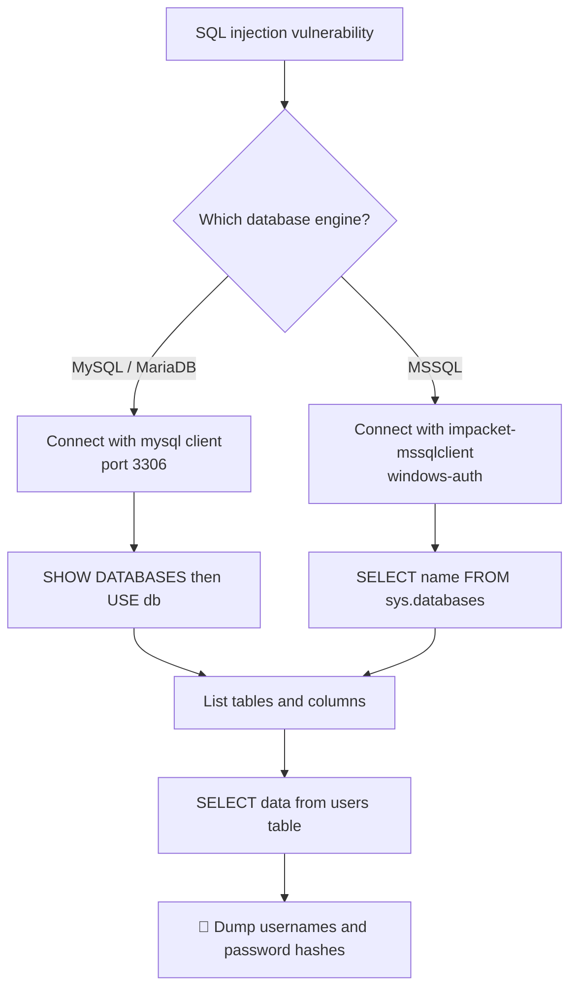

---
tags:
  - phase/exploitation
  - sqli
  - web
---

# SQL theory and databases

10.1.1. SQL theory refresher
Structured Query Language (SQL) has been developed specifically to manage and interact with data stored inside relational databases. SQL can be employed to query, insert, modify, or even delete data, and, in some cases, execute operating system commands. Since the SQL instance offers so many administrative privileges, we'll soon observe how arbitrary SQL queries can pose a significant security risk.

We can use the SELECT statement to instruct the database that we want to retrieve all (*) the records from a specific location defined via the FROM keyword and followed by the target, in this case, the users table. Finally, we'll direct the database to filter only for records belonging to the user leon.

A basic query to fetch the record for user `leon`:

```sql
SELECT * FROM users WHERE user_name='leon';
```

Web apps often embed such queries in their source code. This backend PHP verifies login credentials:

```php
$uname = $_POST["uname"];
$passwd = $_POST["password"];
$sql_query = "SELECT * FROM users WHERE user_name='$uname' AND password='$passwd'";
$result = mysqli_query($con, $sql_query);
```

Highlighted above is a semi-precompiled SQL query that searches the users table for the provided username and its respective password, which are saved into the $uname and $passwd variables. The query string is then stored in sql_query and used to perform the query against the local database through the mysqli_query function, which saves the result of the query in $result.

Let's consider an example. When the user types leon, the SQL server searches for the username "leon" and returns the result. To search the database, the SQL server runs the query SELECT * FROM users WHERE user_name= leon. If, instead, the user enters "leon '+!@#$", the SQL server will run the query SELECT * FROM users WHERE user_name= leon'+!@#$. Nothing in our code block checks for these special characters, and it's this lack of filtering that causes the vulnerability.

We'll discover how these types of scenarios can be abused in the next sections.

10.1.2. DB types and characteristics

MySQL is one of the most deployed database variants, along with MariaDB, an open-source fork of MySQL.

To explore MySQL basics, we can connect to the remote MySQL instance from our local Kali machine.

Using the mysql command, we'll connect to the remote SQL instance by specifying root as username and password, along with the default MySQL server port 3306.

Connect to the remote MySQL instance from Kali. A successful connect drops you into the `MySQL [(none)]>` prompt.

```sh
mysql -u root -p'root' -h 192.168.50.16 -P 3306 --skip-ssl-verify-server-cert
```

> [!info] TLS error on connect
> If `ERROR 2026 (HY000)` (TLS/SSL) appears, append `--skip-ssl` to the command.


From the console, retrieve the version and the current session user:

```sql
SELECT version();       -- e.g. 8.0.21
SELECT system_user();   -- e.g. root@192.168.20.50 (username@host)
```

This confirms we are logged in as the database `root` user over a remote connection. Note this is the database-specific root user, not the system-wide administrative root.

After listing databases with:
SQLSHOW DATABASES;Show more lines
you switch to one using the USE command:
SQLUSE mysql;Show more lines
If successful, MySQL will respond:
Database changed

Now your prompt will look like:
MySQL [mysql]>

That’s how the example got into the mysql database before running the SELECT.

List all databases with `SHOW DATABASES;` — a default MySQL install returns `information_schema`, `mysql`, `performance_schema`, `sys`, and `test`. To retrieve the `offsec` user's password hash, query the `user` and `authentication_string` columns of `mysql.user`, filtered to that user:

```sh
SELECT user FROM mysql.user;
SELECT user, authentication_string FROM mysql.user WHERE user = 'offsec';
```

To improve its security, the user's password is stored in the authentication_string field as a Caching-SHA-256 algorithm.

A password hash is a ciphered representation of the original plain-text password. In later Learning Modules, we'll learn how password hashing is performed and how a hash can be reversed or cracked to obtain the original password.

MSSQL is a database management system that natively integrates into the Windows ecosystem.

Windows has a built-in command-line tool named SQLCMD, that allows SQL queries to be run through the Windows command prompt or even remotely from another machine.

Kali Linux includes Impacket, a Python framework that enables network protocol interactions. Among many other protocols, it supports Tabular Data Stream (TDS), the protocol adopted by MSSQL that is implemented in the impacket-mssqlclient tool.

We can run impacket-mssqlclient to connect to the remote Windows machine running MSSQL by providing a username, a password, and the remote IP, together with the -windows-auth keyword. This forces NTLM authentication (as opposed to Kerberos). We'll explore Windows authentication in more depth in upcoming Learning Modules.

Connect to the remote MSSQL instance with Impacket. A successful connect drops you into the `SQL (SQLPLAYGROUND\Administrator dbo@master)>` prompt.

```sh
impacket-mssqlclient Administrator:Lab123@192.168.50.18 -windows-auth
```

> [!info] DBMS syntax differs
> Each database engine has its own syntax — account for those differences when enumerating a target.


`SELECT @@version;` returns the MSSQL build (e.g. Microsoft SQL Server 2019, 15.0.2000.5) plus the underlying Windows Server version and build number.

> [!info] GO terminator
> With a local tool like `sqlcmd` you end each statement with a semicolon and `GO` on its own line. Running remotely over the TDS protocol (impacket), `GO` is not needed.

List all databases from the system catalog — the defaults are `master`, `tempdb`, `model`, `msdb`, plus any custom DB (here `offsec`):

```sh
SELECT name FROM sys.databases;
```

Since master, tempdb, model, and msdb are default databases, we want to explore the custom offsec database because it might contain data belonging to our target. We can review this database by querying the tables table in the corresponding information_schema.

Enumerate tables in the `offsec` database via its `information_schema`, then dump the discovered `users` table (qualify it with the `dbo` schema as `database.schema.table`):

```sql
SELECT * FROM offsec.information_schema.tables;   -- reveals: dbo.users
SELECT * FROM offsec.dbo.users;                   -- admin/lab, guest/guest
```

The users table contains the columns, user, and password, and two rows. Our query returned the clear text password for both usernames.

Having covered the basic syntax peculiarities for MySQL and MSSQL databases, next, we'll learn how to manually exploit SQL injection vulnerabilities.

## EXAMPLE:

QUESTION:
From your Kali Linux VM, connect to the remote MySQL instance on VM 1 and replicate the steps to enumerate the MySQL database. Then explore all values assigned to the user offsec. Which plugin value is used as a password authentication scheme?

-- Connect to MySQL remotely
mysql -h <target-ip> -u <username> -p
i.e

## mysql -h 192.168.105.16 -P 3306 -u root -p'root' --skip-ssl-verify-server-cert

-- Enumerate databases
SHOW DATABASES;

-- Select mysql system DB
USE mysql;

-- List tables
SHOW TABLES;

-- List users
SELECT user FROM mysql.user;

-- Inspect specific user
SELECT user, authentication_string, plugin 
FROM mysql.user 
WHERE user = 'offsec';

+--------+------------------------------------------------------------------------+-----------------------+
| user   | authentication_string                                                  | plugin                |
+--------+------------------------------------------------------------------------+-----------------------+
| offsec | $A$005$?qvo▒rPp8#lTKH1j54xuw4C5VsXe5IAa1cFUYdQMiBxQVEzZG9XWd/e6 | caching_sha2_password |
+--------+------------------------------------------------------------------------+-----------------------+

## EXAMPLE:

QUESTION:
From your Kali Linux VM, connect to the remote MSSQL instance on VM 2 and replicate the steps to enumerate the MSSQL database. Then explore the records of the sysusers table inside the master database. What is the value of the first user listed?

✅ Step 1 — Connect to MSSQL from Kali
impacket-mssqlclient <username>:<password>@<target-ip>

✅ Step 2 — Enumerate databases
SELECT name FROM sys.databases

✅ Step 3 — Switch to the master database
USE master

✅ Step 4 — (Optional but good practice) List tables
SQLSELECT name FROM sys.tables
👉 Confirms accessible tables (though sysusers is a system table)

✅ Step 5 — Enumerate users from sysusers
SQLSELECT * FROM sysusers

✅ Step 6 — Identify the first user listed
Look at the first row of the output, for example:
uid   status   name
----  ------   -----
0     0        public   ← FIRST USER


✅ ✅ Final Answer

SQL (SQLPLAYGROUND\Administrator  dbo@master)> select uid,status,name from sysusers;
  uid   status   name                                
-----   ------   ---------------------------------   
    0        0   public                              
    1        0   dbo           

The value of the first user listed is:
public


⚠️ Important Exam Notes

✅ Always use SELECT * when asked for “first entry”
❌ Do NOT rely on:
SELECT name FROM sysusers;
Any output without guaranteed order
✅ SQL Server does not guarantee ordering unless ORDER BY is used

## EXAMPLE:

QUESTION:
From your Kali Linux VM, connect to the remote MySQL instance on VM 3 and explore the users table present in one of the databases to get the flag.

=== MySQL Enumeration – Exam Workflow ===

# Step 1 – Connect to MySQL
mysql -h <target-ip> -u <username> -p

## mysql -h 192.168.105.16 -P 3306 -u root -p'root' --skip-ssl-verify-server-cert

# Step 2 – List all databases
SHOW DATABASES;

# Step 3 – Identify non-system databases
# Ignore:
# information_schema
# mysql
# performance_schema
# sys
# Focus on:
# test (or any custom DB)

# Step 4 – Switch to target database
USE test;

# Step 5 – List tables
SHOW TABLES;

# Step 6 – Look for interesting tables
# Common names:
# users
# accounts
# credentials

# Step 7 – Dump table contents
SELECT * FROM users;

# Step 8 – Identify the flag in output

=== Example Result ===
OS{d00bd704b17b3259660c4ed38876da07}

=== Final Answer ===
OS{d00bd704b17b3259660c4ed38876da07}

## Visual Flow



> [!success] What success looks like
> You connect to the DB, list databases, switch into a non-system one, and `SELECT * FROM users;` returns rows of usernames and passwords (or a flag like `OS{...}`). On MySQL, the offsec user's hash sits in `authentication_string`; on MSSQL the users table may even hold clear-text passwords.

> [!danger] Common errors
> - `ERROR 2026 (HY000)` TLS/SSL error on MySQL connect → append `--skip-ssl` (or `--skip-ssl-verify-server-cert`).
> - "No database selected" → you forgot `USE <db>;` before your `SELECT`.
> - On MSSQL, asking for the "first" row without `ORDER BY` is unreliable — SQL Server does not guarantee row order; always use `SELECT *` and read the first listed row.
> - Quote/special-character issues when pasting payloads → see [[🔣 Encoding Reference]].
> Full list: [[⚠️ Common Errors & Troubleshooting]]

> [!tip] Beginner note
> A **database** holds **tables** (like spreadsheets), each table has **columns** (fields) and **rows** (records). SQL is just the language you use to ask the database for those rows. The four default MySQL databases (`information_schema`, `mysql`, `performance_schema`, `sys`) are system DBs — the interesting data usually lives in a custom database the app created.

---
%% graph-links %%
## Related
- [[UNION-based payloads]]
- [[Identifying SQLi via error-based payloads]]
- [[Blind SQL injections]]

> [!info] Navigation
> Section: [[SQL Injection Attacks/_index|SQL Injection Attacks]] · Home: [[🏠 Home]]

