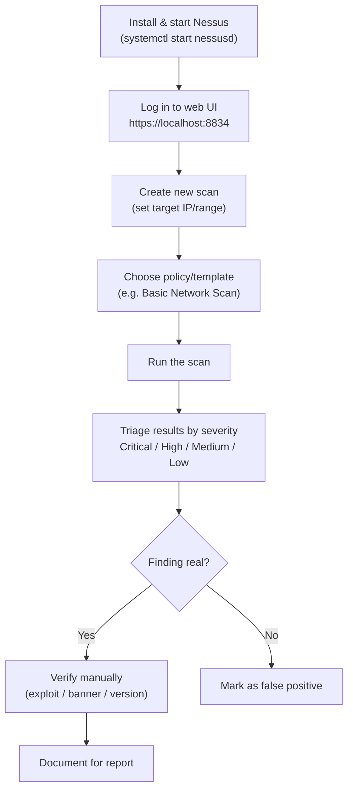

---
tags:
  - phase/enumeration
  - nessus
  - vulnerability-scanning
---

# Nessus

> [!tip] Quick Reference — Nessus
> | Goal | Command |
> |------|---------|
> | Start the service | `sudo systemctl start nessusd.service` |
> | Check service status | `sudo systemctl status nessusd.service` |
> | Watch startup/plugin-compile logs | `sudo journalctl -u nessusd -f` |
> | Web UI | `https://localhost:8834` |
> | Confirm the port is actually listening | `ss -tlnp \| grep 8834` |
> | Manually refresh the plugin feed | `sudo /opt/nessus/sbin/nessuscli update --all` |
> | List available built-in fixes | `sudo /opt/nessus/sbin/nessuscli fix --list` |
> | Reset a broken/stuck install | `sudo /opt/nessus/sbin/nessuscli fix --reset` |

[https://www.tenable.com/downloads/nessus](https://www.tenable.com/downloads/nessus)
sudo apt install ./Nessus-10.5.0-debian10_amd64.deb

sudo systemctl start nessusd.service

> [!info] Installing Nessus
> Nessus is not in the Kali repositories, so install it manually from the Tenable website. Download the `.deb` for your architecture (Debian/amd64 for x64 Kali, Ubuntu/aarch64 for ARM), verify the SHA256/MD5 checksum, then install and start the service. Activation needs an internet connection and a business email address. Tenable recommends 4 CPU cores / 8GB RAM, but 2 cores / 4GB is enough for lab use.

## Policy Templates

> [!info] Choosing a scan policy
> - **Basic Network Scan** — balanced default; good unauthenticated first pass over a host/subnet.
> - **Advanced Scan** — full manual control over which plugin families and ports run; use when Basic misses something or is too slow/noisy for the target.
> - **Credentialed Patch Audit** — supply SSH/SMB/local creds so Nessus reads real patch levels instead of guessing from banners; far fewer false positives.
> - **Web Application Tests** — points web-specific plugins at an HTTP(S) target.
> Start with Basic Network Scan, then re-run Credentialed once you have valid creds for deeper, more accurate results.

> [!tip] Exporting and filtering results
> From the scan results page, **Export** saves findings as `.nessus` (re-importable XML), `HTML`, `PDF`, or `CSV` — use CSV/`.nessus` to grep/filter outside the UI, HTML/PDF for the report. Use the **Filters** control (e.g. `Severity is equal to Critical`) to cut noise fast when triaging a large scan.

## Visual Flow

> [!success] What success looks like
> The scan completes and shows a color-coded list of findings (red = Critical, orange = High, etc.). Clicking a finding gives you the CVE, the affected service/port, and a plugin output that explains why Nessus flagged it.

> [!danger] Common errors
> - Web UI won't load → the service isn't running. Start it with `sudo systemctl start nessusd.service` and wait for plugin compilation to finish (can take 5-20 minutes on first launch — watch progress with `sudo journalctl -u nessusd -f`).
> - "No results" / host shows as down → target may be blocking pings. Enable "scan unresponsive hosts" or confirm the IP is reachable first with `ping` / `nmap`.
> - Activation fails → Nessus needs an internet connection and a valid (business) email for the activation code.
> - Service reports as running but `https://localhost:8834` still refuses to connect → confirm it's actually listening with `sudo ss -tlnp | grep 8834`, and check local firewall/ufw rules aren't blocking it.
> - Browser shows "connection not private" / cert warning on the web UI → expected, Nessus serves a self-signed cert; accept it and continue.
> - Scan sits at "Running" indefinitely → a full-port/all-plugins Advanced Scan against a subnet can genuinely take hours; scope the port range and plugin families down, or confirm the target isn't dropping packets under load.
> Full list: [[⚠️ Common Errors & Troubleshooting]]

> [!tip] Beginner note
> Nessus tells you what *might* be vulnerable based on detected versions, but it does not prove exploitability. A **false positive** is a finding the scanner reports that isn't actually exploitable (e.g. a CVE that was back-patched). Always verify a finding yourself before relying on it.

---
%% graph-links %%
## Related
- [[NMAP]]
- [[Nmap Scripting Engine (NSE)]]
- [[Shodan]]

> [!info] Navigation
> Section: [[Vulnerability Scanning/_index|Vulnerability Scanning]] · Home: [[🏠 Home]]

