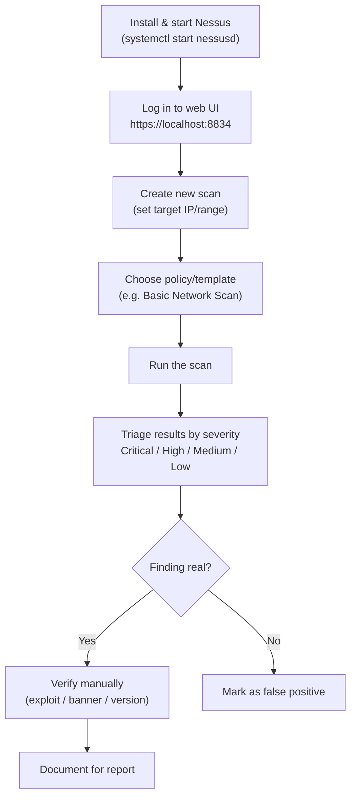

---
tags:
  - phase/enumeration
  - nessus
  - vulnerability-scanning
---

# Nessus

[https://www.tenable.com/downloads/nessus](https://www.tenable.com/downloads/nessus)
sudo apt install ./Nessus-10.5.0-debian10_amd64.deb

sudo systemctl start nessusd.service

> [!note]- Screenshot
> ```
> 7.2.1. Installing Nessus
> 
> For this Learning Unit, we'll install Nessus on our Kali Linux VM used to connect to the
> PEN-200 lab environment. Downloading and activating Nessus requires an internet
> connection and a business email address. The minimum hardware requirements Tenable
> recommends are 4 CPU cores and 8GB of RAM. However, we don't need to meet those
> requirements for our exercises. 2 CPU cores and 4GB of RAM are sufficient for our
> needs.
> 
> Nessus is not available in the Kali repositories and needs to be installed manually. We
> can download the current version of Nessus as a 64-bit .deb file for Kali from the
> Tenable website. There, we also get the SHA256 and MD5 checksums for the installer.
> Learners using a Kali VM with an ARM-based chip should select the Linux - Ubuntu -
> aarch64 platform.
> 
> Learners using an x64 based Kali VM should select the Linux - Debian
> 
> * amd64 platform.
> ```

## Visual Flow



> [!success] What success looks like
> The scan completes and shows a color-coded list of findings (red = Critical, orange = High, etc.). Clicking a finding gives you the CVE, the affected service/port, and a plugin output that explains why Nessus flagged it.

> [!danger] Common errors
> - Web UI won't load → the service isn't running. Start it with `sudo systemctl start nessusd.service` and wait for plugin compilation to finish (can take several minutes on first launch).
> - "No results" / host shows as down → target may be blocking pings. Enable "scan unresponsive hosts" or confirm the IP is reachable first with `ping` / `nmap`.
> - Activation fails → Nessus needs an internet connection and a valid (business) email for the activation code.
> Full list: [[⚠️ Common Errors & Troubleshooting]]

> [!tip] Beginner note
> Nessus tells you what *might* be vulnerable based on detected versions, but it does not prove exploitability. A **false positive** is a finding the scanner reports that isn't actually exploitable (e.g. a CVE that was back-patched). Always verify a finding yourself before relying on it.

---
%% graph-links %%
## Related
- [[NMAP]]
- [[Nmap Scripting Engine (NSE)]]
- [[Shodan]]

> [!info] Navigation
> Section: [[Vulnerability Scanning/_index|Vulnerability Scanning]] · Home: [[🏠 Home]]

