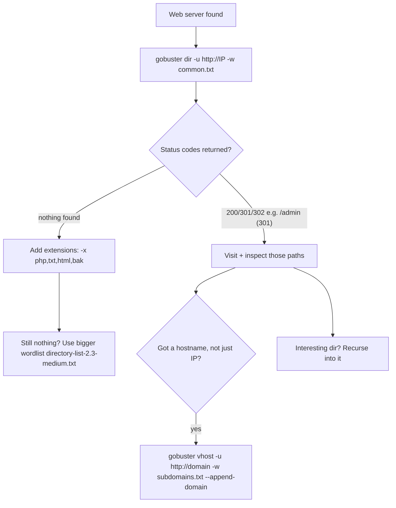

---
tags:
  - enumeration
  - gobuster
  - phase/enumeration
  - web
---

# Directory Brute Force with Gobuster

> [!tip] Quick Reference — Gobuster
> | Goal | Command |
> |------|---------|
> | Dir brute force | `gobuster dir -u http://<IP>/ -w /usr/share/seclists/Discovery/Web-Content/common.txt` |
> | With extensions | `gobuster dir -u http://<IP>/ -w common.txt -x php,txt,html,bak` |
> | Vhost fuzzing | `gobuster vhost -u http://<domain>/ -w subdomains.txt --append-domain` |
> | DNS subdomains | `gobuster dns -d <domain> -w subdomains.txt` |
> | With auth | `gobuster dir -u http://<IP>/ -w common.txt -U admin -P password` |
> | Quiet + output | `gobuster dir -u http://<IP>/ -w common.txt -q -o gobuster.txt` |

## Decision Tree

```
Web server found?
├── Start with common wordlist
│   └── gobuster dir -u http://<IP>/ -w /usr/share/seclists/Discovery/Web-Content/common.txt -x php,html,txt
├── Found /admin, /login, /api etc → investigate manually
├── Got a domain name (not just IP)?
│   └── Try vhost enumeration
│       └── gobuster vhost -u http://<domain>/ -w subdomains-top1million-5000.txt --append-domain
├── Interesting directory found → recurse into it
│   └── gobuster dir -u http://<IP>/<dir>/ -w big.txt -x php,txt
└── API endpoint found?
    └── gobuster dir -u http://<IP>/api/ -w api-endpoints.txt
```

## Useful Wordlists (SecLists)
- `Discovery/Web-Content/common.txt` — quick, covers most basics
- `Discovery/Web-Content/directory-list-2.3-medium.txt` — thorough
- `Discovery/Web-Content/raft-large-files.txt` — file-focused
- `Discovery/DNS/subdomains-top1million-5000.txt` — vhost/dns

## Visual Flow



> [!success] What success looks like
> Gobuster prints found paths with their status, e.g. `/css (Status: 301)`, `/index.php (Status: 302) [--> /login.php]`, `/uploads (Status: 301)`. The 200/301/302 entries are real pages — those are your next targets.

> [!danger] Common errors
> - `wordlist file does not exist` → point `-w` at a real path, e.g. `/usr/share/wordlists/dirb/common.txt` or a SecLists file.
> - HTTPS target: `unknown certificate` / TLS error → add `-k` to skip cert checks.
> - Every path returns the same status (false positives) → blacklist it, e.g. `-b 301,404`, or filter by size with `--exclude-length`.
> - Missing scheme error → include `http://` (or `https://`) in the `-u` URL on newer Gobuster versions.
> Full list: [[⚠️ Common Errors & Troubleshooting]]

> [!tip] Beginner note
> **Directory brute forcing** guesses hidden pages and folders from a wordlist, one request per word. Most web wins start by finding an unlinked page like `/admin` or `/backup` that the site never links to.

## Resources
- [HackTricks — Web Fuzzing](https://book.hacktricks.xyz/network-services-pentesting/pentesting-web#directories-and-files)
- [SecLists](https://github.com/danielmiessler/SecLists)
- [ffuf (faster alternative)](https://github.com/ffuf/ffuf)


Once we have discovered an application running on a web server, our next step is to map all its publicly accessible files and directories. To do this, we would need to perform multiple queries against the target to discover any hidden paths. Gobuster is a tool (written in Go language) that can help us with this sort of enumeration. It uses wordlists to discover directories and files on a server through brute forcing.
[https://www.kali.org/tools/gobuster/](https://www.kali.org/tools/gobuster/)

> [!note]- Screenshot
> ```
> © Caution
> Due to its brute forcing nature, Gobuster may be noisy and unsuitable for stealth
> engagements.
> ```

Gobuster supports various enumeration modes, including fuzzing and DN
S, but for now, we’ll focus solely on the dir mode, which enumerates files and directories. 
We need to specify the target IP using the

## -u

parameter and a wordlist with

## -w

. The default running threads are 10; we can reduce the amount of traffic by setting a lower number via the

## -t

parameter.


gobuster dir -u 192.168.165.16 -w /usr/share/wordlists/dirb/common.txt -b 301 -t 5   

> Used -b 301 to ignore results for 301's

> [!note]- Screenshot
> ```
> | kali@kali:~$ gobuster dir -u 192.168.50.20 -w /usr/share/wordlists/dirb/common.txt -t 6 i
> is H
> | Gobuster v3.1.0 i
> | by 03 Reeves (@TheColonial) & Christian Mehlmauer (@firefart) {
> | [+] uri: http://192.168.50.28 i
> | [+] Method: GET {
> | [+] Threads: 5 {
> | [+] Wordlist: /usr/share/wordlists/dirb/common.txt {
> | [+] Negative Status codes: 404 {
> | [4] User agent: gobuster/3.1.0 I
> | [+] Timeout: es {
> | 2022/03/30 05:16:21 Starting gobuster in directory enumeration mode i
> 1 /shta (Status: 403) [Size: 278] {
> | /.htaccess (Status: 403) [Size: 278] {
> | /.htpasswd (Status: 403) [Size: 278] {
> | /css (Status: 301) [Size: 312] [--> http://192.168.50.20/css/] H
> | /db (Status: 301) [Size: 311] [--> http://192.168.50.20/db/] H
> | /images (Status: 301) [Size: 315] [--> http://192.168.50.20/images/] i
> | /index.php (Status: 302) [Size: @] [--> -/login.php] i
> | is (Status: 301) [Size: 311] [--> http://192.168.50.20/js/] i
> | /server-status (Status: 403) [Size: 278] i
> | suploads (Status: 301) [Size: 316] [--> http://192.168.5@.20/uploads/] i
> | 2022/03/36 @5:18:08 Finished i
> ——— 6 |
> Under the /usr/share/wordlists/dirb/ folder we selected the common.txt wordlist,
> which found ten resources. Four of these resources are inaccessible due to insufficient
> privileges (Status: 403). However, the remaining six are accessible and deserve further
> investigation.
> ```


```sh
gobuster dir -u 192.168.50.20 -w /usr/share/wordlists/dirb/common.txt -t 5
```

---
%% graph-links %%
## Related
- [[Security Testing with Burp Suite]]
- [[Inspecting HTTP Response Headers and Sitemaps]]
- [[Local file inclusion (LFI)]]

> [!info] Navigation
> Section: [[Web Applications/Application Assesment Tools/_index|Application Assesment Tools]] · Home: [[🏠 Home]]

