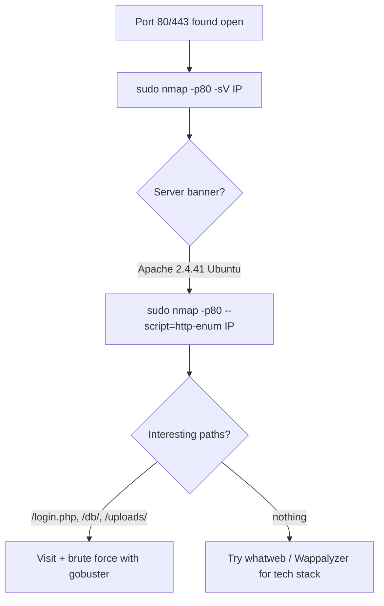

---
tags:
  - enumeration
  - fingerprinting
  - nmap
  - phase/enumeration
  - web
---

# FingerPrinting with Nmap

As covered in a previous Module, Nmap is the go-to tool for initial active enumeration. We should start web application enumeration from its core component, the web server, since this is the common denominator of any web application that exposes its services.

Since we found port 80 open on our target, we can proceed with service discovery. To get started, we'll rely on the nmap service scan (-sV) to identify the web server (-p80) banner.

> [!note]- Screenshot
> ```
> | kali@kali:~$ sudo nmap -p8@ -sV 192.168.50.20 a)
> | Starting Nmap 7.92 ( https://nmap.org ) at 2022-03-29 @5:13 EDT i
> | imap scan report for 192.168.50.20 i
> | Host is up (@.11s latency). i
> |eam come cannes emi
> { 8@/tcp open http Apache httpd 2.4.41 ((Ubuntu)) |
> ME La =>SSS
> Our scan shows that Apache version 2.4.41 is running on the Ubuntu host.
> ```


```sh
sudo nmap -p80  -sV 192.168.50.20
```


> [!note]- Screenshot
> ```
> To take our enumeration further, we can use service-specific Nmap NSE scripts, like
> http-enum, which performs an initial fingerprinting of the web server.
> | kali@kali:~$ sudo nmap -p8@ --script-http-enum 192.168.50.20 a)
> | Starting Nmap 7.92 ( https://nmap.org ) at 2022-03-29 @6:3@ EDT {
> | Nmap scan report for 192.168.50.2@ {
> | Host is up (8.15 latency). {
> | PORT STATE SERVICE H
> | 8@/tcp open http t
> | | http-enum: t
> | | /login.php: Possible admin folder i
> | | /db/: BlogWorx Database i
> | | /css/: Potentially interesting directory w/ listing on ‘apache/2.4.41 (ubuntu) * E
> | | /db/: Potentially interesting directory w/ listing on ‘apache/2.4.41 (ubuntu)* E
> | | /images/: Potentially interesting directory w/ listing on ‘apache/2.4.41 (ubuntu)* E
> { | /js/: Potentially interesting directory w/ listing on ‘apache/2.4.41 (ubuntu)* :
> | |_ /uploads/: Potentially interesting directory w/ listing on ‘apache/2.4.41 (ubuntu)’
> | nmap done: 1 IP address (1 host up) scanned in 16.82 seconds i
> Listing 2 - Running Nmap NSE http enumeration script against the target
> As shown above, we discovered several interesting folders that could lead to further
> details about the target web application.
> By using Nmap scripts, we managed to discover more application-specific information
> that we can add to the web server enumeration we performed earlier.
> ```


```sh
sudo nmap -p80 --script=http-enum 192.168.50.20
```

## Visual Flow



> [!success] What success looks like
> `-sV` prints a service line like `80/tcp open http Apache httpd 2.4.41 ((Ubuntu))` — you now know the exact web server and version. `--script=http-enum` then lists folders such as `/login.php: Possible admin folder` to investigate next.

> [!danger] Common errors
> - `Failed to resolve` / no results → wrong IP or the host blocks ICMP; add `-Pn` to skip host discovery.
> - HTTPS site shows little on port 80 → scan the right port, e.g. `-p443` (and `-sV` will note `ssl/http`).
> - NSE script not found → update scripts with `sudo nmap --script-updatedb`.
> - Banner says nothing useful → servers can hide versions; confirm with `whatweb` or response headers.
> Full list: [[⚠️ Common Errors & Troubleshooting]]

> [!tip] Beginner note
> **Fingerprinting** just means "figuring out what software the target runs." Knowing it is Apache 2.4.41 on Ubuntu lets you search for known exploits for that exact version instead of guessing blindly.

---
%% graph-links %%
## Related
- [[Technology Stack Identification with Wappalyzer]]
- [[Nmap Scripting Engine (NSE)]]
- [[NMAP]]

> [!info] Navigation
> Section: [[Web Applications/Application Assesment Tools/_index|Application Assesment Tools]] · Home: [[🏠 Home]]

