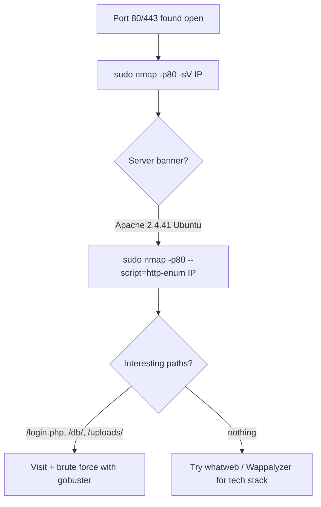

---
tags:
  - enumeration
  - fingerprinting
  - nmap
  - phase/enumeration
  - web
---

# FingerPrinting with Nmap

> [!tip] Quick Reference — Nmap Web Fingerprinting
> | Goal | Command |
> |------|---------|
> | Service/version banner | `sudo nmap -p80 -sV <IP>` |
> | Default scripts + version | `sudo nmap -p80 -sC -sV <IP>` |
> | Enumerate common web paths | `sudo nmap -p80 --script=http-enum <IP>` |
> | Title + headers | `sudo nmap -p80 --script=http-title,http-headers <IP>` |
> | Allowed HTTP methods | `sudo nmap -p80 --script=http-methods <IP>` |
> | TLS cert + cipher info | `sudo nmap -p443 --script=ssl-cert,ssl-enum-ciphers <IP>` |
> | Update NSE script DB | `sudo nmap --script-updatedb` |

As covered in a previous Module, Nmap is the go-to tool for initial active enumeration. We should start web application enumeration from its core component, the web server, since this is the common denominator of any web application that exposes its services.

Since we found port 80 open on our target, we can proceed with service discovery. To get started, we'll rely on the nmap service scan (-sV) to identify the web server (-p80) banner.

```sh
sudo nmap -p80  -sV 192.168.50.20
```


The `http-enum` NSE script fingerprints the web server and enumerates common paths, revealing folders like `/login.php` (possible admin folder), `/db/`, `/css/`, `/images/`, `/js/`, and `/uploads/` to investigate further.

```sh
sudo nmap -p80 --script=http-enum 192.168.50.20
```

## Visual Flow



> [!success] What success looks like
> `-sV` prints a service line like `80/tcp open http Apache httpd 2.4.41 ((Ubuntu))` — you now know the exact web server and version. `--script=http-enum` then lists folders such as `/login.php: Possible admin folder` to investigate next.

> [!danger] Common errors
> - `Failed to resolve` / no results → wrong IP or the host blocks ICMP; add `-Pn` to skip host discovery.
> - HTTPS site shows little on port 80 → scan the right port, e.g. `-p443` (and `-sV` will note `ssl/http`).
> - NSE script not found → update scripts with `sudo nmap --script-updatedb`.
> - Banner says nothing useful → servers can hide versions; confirm with `whatweb` or response headers.
> - `http-enum` (or other NSE scripts) hangs on a slow/filtered target → cap it with `--script-timeout 30s`, or drop to a single script instead of a whole category.
> - HTTPS site but only plain `-sV` was run → also fingerprint the cert: `sudo nmap -p443 --script=ssl-cert <IP>` often leaks a hostname, org name, or self-signed CN worth noting.
> Full list: [[⚠️ Common Errors & Troubleshooting]]

> [!tip] Beginner note
> **Fingerprinting** just means "figuring out what software the target runs." Knowing it is Apache 2.4.41 on Ubuntu lets you search for known exploits for that exact version instead of guessing blindly.

---
%% graph-links %%
## Related
- [[Technology Stack Identification with Wappalyzer]]
- [[Nmap Scripting Engine (NSE)]]
- [[NMAP]]

> [!info] Navigation
> Section: [[Web Applications/Application Assesment Tools/_index|Application Assesment Tools]] · Home: [[🏠 Home]]

