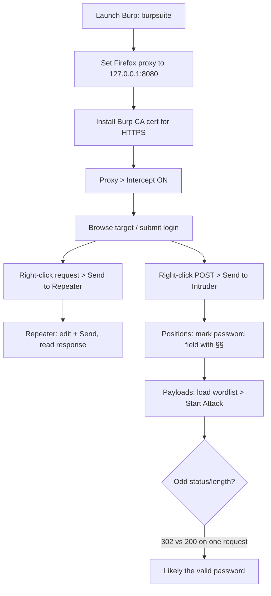

---
tags:
  - burp-suite
  - phase/enumeration
  - web
---

# Security Testing with Burp Suite

> [!tip] Quick Reference — Burp Suite
> | Feature | Shortcut / How |
> |---------|----------------|
> | Send to Repeater | Ctrl+R |
> | Send to Intruder | Ctrl+I |
> | Forward request | Ctrl+F (in Intercept) |
> | Toggle intercept | Ctrl+T |
> | Search in response | Ctrl+F (in Repeater) |
> | Decode selection | Right-click → Send to Decoder |

## Workflow

```
Set up proxy → Firefox uses 127.0.0.1:8080
├── Intercept ON → modify requests on the fly
├── HTTP History → review all past requests
├── Repeater → replay + tweak individual requests
│   └── Best for: manual SQLi, XSS, auth testing
└── Intruder → automated fuzzing
    ├── Positions → mark injection points with §§
    ├── Payload sets → wordlist / numbers / brute
    └── Attack types:
        ├── Sniper    → one position, one payload list
        ├── Battering ram → same payload in all positions
        ├── Pitchfork → parallel lists per position
        └── Cluster bomb → all combinations (slow)
```

## Visual Flow



> [!success] What success looks like
> In Intruder, the wrong passwords all return the same `Status 200` / `Length 6462`, but the correct one stands out with a different `Status 302` / `Length 1097`. That outlier is your hit — confirm by logging in.

> [!danger] Common errors
> - Browser hangs / pages never load → Intercept is ON; click Forward repeatedly or toggle Intercept OFF (Ctrl+T).
> - HTTPS shows certificate warnings → install Burp's CA cert from `http://burpsuite` (Proxy running) into Firefox.
> - No traffic in HTTP History → Firefox proxy not set to `127.0.0.1:8080`, or "Use system proxy" still selected.
> - Closed Burp and Firefox stopped working → the proxy is gone; switch Firefox back to No proxy.
> Full list: [[⚠️ Common Errors & Troubleshooting]]

> [!tip] Beginner note
> Burp sits **between your browser and the server** as a proxy, so you can pause, read, and change every request. **Repeater** is for hand-editing one request over and over; **Intruder** automates the same edit across a wordlist (e.g. password guessing).

## Resources
- [PortSwigger Web Academy](https://portswigger.net/web-security) — free labs
- [HackTricks — Burp](https://book.hacktricks.xyz/network-services-pentesting/pentesting-web/burp-suite)


Burp Suite is a GUI-based integrated platform for web application security testing. It provides several different tools via the same user interface.

While the free Community Edition mainly contains tools used for manual testing, the commercial versions include additional features, including a formidable web application vulnerability scanner. Burp Suite has an extensive feature list and is worth investigating, but we will only explore a few basic functions in this section.

An important feature of Burp Suite is the ability to intercept HTTPS traffic. This requires using the Burp certificate, which is beyond the scope of this discussion.


Let's start with the Proxy tool. In general terms, a web proxy is any dedicated hardware or software meant to intercept requests and/or responses between the web client and the web server. This allows administrators and testers alike to modify any requests that are intercepted by the proxy, both manually and automatically.

With the Burp Proxy tool, we can intercept any request sent from the browser before it is passed on to the server. We can change almost anything about the request at this point, such as parameter names or form values. We can even add new headers. This lets us test how an application handles unexpected arbitrary input. For example, an input field might have a size limit of 20 characters, but we could use Burp Suite to modify a request to submit 30 characters.

To set up a proxy, we will first click the Proxy tab to reveal several sub-tabs. We'll also disable the Intercept tool, found under the Intercept tab.


By default, Burp Suite enables a proxy listener on localhost:8080. This is the host and port that our browser must connect to in order to proxy traffic through Burp Suite.


Let’s walk through configuring the Firefox browser on our local Kali machine to use Burp Suite as a proxy.

In Firefox, we can do this by navigating to about:preferences#general, scrolling down to Network Settings, then clicking Settings.

Let's choose the Manual option, setting the appropriate IP address and listening port. In our case, the proxy (Burp) and the browser reside on the same host, so we'll use the loopback IP address 127.0.0.1 and specify port 8080.


Finally, we also want to enable this proxy server for all protocol options to ensure that we can intercept every request while testing the target application.


By clicking on one of the requests, the entire dump of client requests and server responses is shown in the lower half of the Burp UI.


Besides the Proxy feature, the Repeater is another fundamental Burp tool. With the Repeater, we can craft new requests or easily modify the ones in History, resend them, and review the responses. To observe this in action, we can right-click a request from Proxy > HTTP History and select Send to Repeater.


The last feature we will cover is Intruder. First, we'll need to configure our local Kali's /etc/hosts file to statically assign the IP to the offsecwp website we are going to test.


This allows us to access the VM by hostname while bypassing DNS.


The Intruder Burp feature, as its name suggests, is designed to automate a variety of attack angles, from the simplest to more complex web application attacks. To learn more about this feature, let's simulate a password brute forcing attack.

Since we are dealing with a new target, we can start a new Burp session and configure the Proxy as we did before. Next, we'll navigate to
[http://offsecwp/wp-login.php](http://offsecwp/wp-login.php)
from Firefox. Then, we will type "admin" and "test" as respective username and password values, and click Log in.


We have now instructed the Intruder to modify only the password value on each new request. Before starting our attack, let's provide Intruder with a wordlist. Knowing that the correct password is "password", we can grab the first 10 values from the rockyou wordlist on Kali.


Moving to the Payloads sub-tab, we can paste the above wordlist into the Payload Options: [Simple list] area.


With everything ready to start the Intruder attack, let's click on the top right Start Attack button.

We can move past the Burp warning about restricted Intruder features, as this won't impact our attack. After we let the attack complete, we can observe that apart from the initial probing request, it performed 10 requests, one for each entry in the provided wordlist.


We'll notice that the WordPress application replied with a different Status code on the 4th request, hinting that this might be the correct password value. Our hypothesis is confirmed once we try to log in to the WordPress administrative console with the discovered password.

In Kali, launch Burp Suite Community Edition from the menu under **Applications > 03 Web Application Analysis > burpsuite**, or from a terminal:

```sh
burpsuite
```


On first launch Burp may warn that it has not been fully tested on your JRE. Kali ships a tested Java version, so this warning can be safely ignored (click OK).


At startup, choose **Temporary project** and click Next, then leave **Use Burp defaults** selected and click **Start Burp**.


Once the UI loads, the four panes on the Dashboard mainly summarize the Pro-version scanner and can be ignored. Focus instead on the feature tabs in the upper bar (Proxy, Repeater, Intruder, etc.).


> [!tip] Intercept: Forward vs Drop
> When Intercept is enabled you must click **Forward** to send each request to its destination, or **Drop** to discard it. This is useful when you want to modify traffic, but tedious for plain browsing — toggle Intercept off (Ctrl+T) when you just need to browse.


Burp's embedded browser is pre-wired to the proxy, so there is no need to configure proxy settings when using it. In this course we use Kali's Firefox instead for flexibility.


Under **Proxy > Options**, the Proxy Listeners section shows which ports are listening. By default Burp listens on `127.0.0.1:8080` — the host and port your browser must proxy through.


> [!info] Burp browser vs Firefox
> Burp ships a Chromium-based browser preconfigured for all of Burp's features. This course uses Kali's Firefox instead because it is a more flexible and modular option.


> [!info] Proxying remote machines
> To capture traffic from multiple machines, run Burp's listener on a reachable (non-loopback) IP and point each browser at that external proxy address instead of `127.0.0.1`.


In Firefox's Network Settings, select **Manual proxy configuration** and set the HTTP proxy to `127.0.0.1` port `8080`. With Burp set as the proxy, browse to a target such as `http://www.megacorpone.com`; the captured traffic then appears under **Proxy > HTTP History**.


The HTTP History tab lists every request the browser made to the target, ready for review.


> [!warning] Browser hangs
> If the browser hangs while loading a page, Intercept is probably enabled — switch it off (Ctrl+T) so traffic flows freely. As you browse, more requests appear in HTTP History.


Selecting a request shows the client request on the left pane and the server response on the right, letting you inspect every detail of both.


> [!tip] Silence detectportal.firefox.com noise
> Firefox's captive-portal check keeps hitting `detectportal.firefox.com`, cluttering the proxy history. To stop it, open `about:config`, accept the warning, search for `network.captive-portal-service.enabled`, and set it to `false`.


In **Proxy > HTTP History**, right-click a request and choose **Send to Repeater** (Ctrl+R). The same context menu also offers Send to Intruder, Send to Comparer, and Copy as curl.


In Repeater, each request opens in its own sub-tab with the request on the left. Click **Send** to fire it; Burp shows the raw server response (headers and un-rendered body) on the right, where you can tweak and resend the request repeatedly.


> [!info] Add the target to /etc/hosts
> Web apps often put their hostname in links and redirects. Without a matching `/etc/hosts` entry, your browser and tools can't follow those links — so map the hostname to its IP first.


Add the target hostname to `/etc/hosts` (e.g. `192.168.50.16    offsecwp`), then verify:

```sh
cat /etc/hosts
```


Browse to `http://offsecwp/wp-login.php` and submit a test login (username `admin`, any password) so Burp captures the POST request to `/wp-login.php`.


In **Proxy > HTTP History**, right-click the `POST /wp-login.php` request and choose **Send to Intruder** (Ctrl+I).


In the **Intruder > Positions** sub-tab, click **Clear §** to remove the auto-marked positions. Since the `admin` username is known, only the password needs brute forcing: select the value of the `pwd` parameter and click **Add §** to mark it as the single injection point.


Grab the first 10 passwords from the rockyou wordlist to use as the Intruder payload:

```sh
cat /usr/share/wordlists/rockyou.txt | head
```


In the **Payloads** sub-tab, set Payload type to **Simple list** and paste the 10 rockyou passwords into the payload options list.


Click **Start Attack**. In the results, every wrong password returns `Status 200` / `Length 6462`, but `password` stands out with `Status 302` / `Length 1097` — the redirect marks it as the correct credential:
> ```
> Payload      Status  Length
> 123456       200     6462
> password     302     1097   <-- valid
> iloveyou     200     6462
> ```


Confirm the finding by logging in at `wp-login.php` with `admin` / `password` — you reach the WordPress admin Dashboard.


> [!warning] Caution
> If Firefox is set to use Burp as its proxy and you close Burp, Firefox will stop loading pages — switch Firefox back to "No proxy" when you're done.

---
%% graph-links %%
## Related
- [[Directory Brute Force with Gobuster]]
- [[Enumerating and Abusing APIs]]
- [[Identifying XSS Vulnerabilities]]
- [[UNION-based payloads]]

> [!info] Navigation
> Section: [[Web Applications/Application Assesment Tools/_index|Application Assesment Tools]] · Home: [[🏠 Home]]

