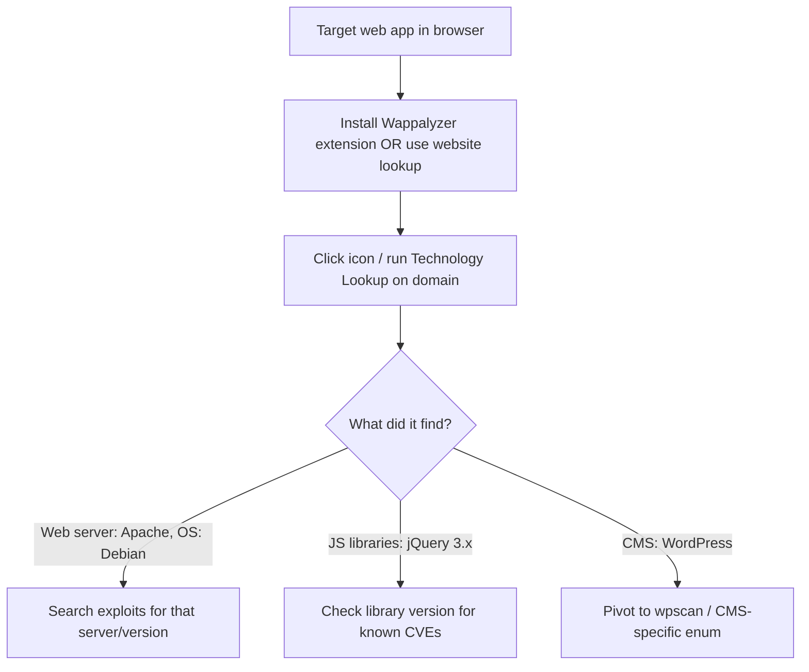

---
tags:
  - fingerprinting
  - phase/enumeration
  - web
---

# Technology Stack Identification with Wappalyzer

> [!tip] Quick Reference — Tech Fingerprinting
> | Goal | Command / Where |
> |------|-----------------|
> | Browser extension | Install Wappalyzer add-on, browse to target, click the toolbar icon |
> | Online lookup (no browser needed) | https://www.wappalyzer.com/lookup/ |
> | CLI equivalent (Kali) | `whatweb -v http://<target>` |
> | Aggressive CLI scan | `whatweb -a 3 http://<target>` |
> | Check `Server` / `X-Powered-By` headers manually | `curl -sI http://<target>` |
> | Grep the HTML `generator` meta tag | `curl -s http://<target> \| grep -i generator` |

Along with the active information gathering we performed via Nmap, we can also passively fetch a wealth of information about the application technology stack via Wappalyzer.
[https://www.wappalyzer.com/](https://www.wappalyzer.com/)
This quick external analysis reveals information about the OS, UI framework, web server, and more. The findings also provide information about JavaScript libraries used by the web application - this can be valuable data, as some versions of JavaScript libraries are known to be affected by several vulnerabilities.

> [!example] Sample Technology Lookup (megacorpone.com)
> Running a lookup on a domain returns a grouped technology stack, for example:
> ```
> Operating systems:    Debian
> UI frameworks:        Bootstrap
> Web servers:          Apache
> CDN:                  Google Hosted Libraries
> Font scripts:         Font Awesome
> JavaScript libraries: jQuery, prettyPhoto
> ```

## Visual Flow



> [!success] What success looks like
> Wappalyzer shows a clean breakdown like `Web servers: Apache`, `Operating systems: Debian`, `JavaScript libraries: jQuery, prettyPhoto`. Old library versions are leads — e.g. an outdated jQuery may have a known XSS issue.

> [!danger] Common errors
> - Extension shows nothing → reload the page after install; Wappalyzer only reads what the current page loaded.
> - Results look thin → it is passive, so it only sees what the site reveals; combine with `whatweb`, headers, and Nmap.
> - Website lookup needs a login → the free browser extension works offline without an account.
> - No GUI / browser handy on the attack box → skip the extension entirely and run `whatweb -v http://<target>` from the terminal for an equivalent fingerprint.
> Full list: [[⚠️ Common Errors & Troubleshooting]]

> [!tip] Beginner note
> **Technology stack** = the layers of software a site is built on (OS, web server, framework, JS libraries). Wappalyzer is *passive* — it just reads the page, it does not attack the target, so it is safe and quiet.

---
%% graph-links %%
## Related
- [[FingerPrinting with Nmap]]
- [[Debugging Page Content]]
- [[Inspecting HTTP Response Headers and Sitemaps]]

> [!info] Navigation
> Section: [[Web Applications/Application Assesment Tools/_index|Application Assesment Tools]] · Home: [[🏠 Home]]

