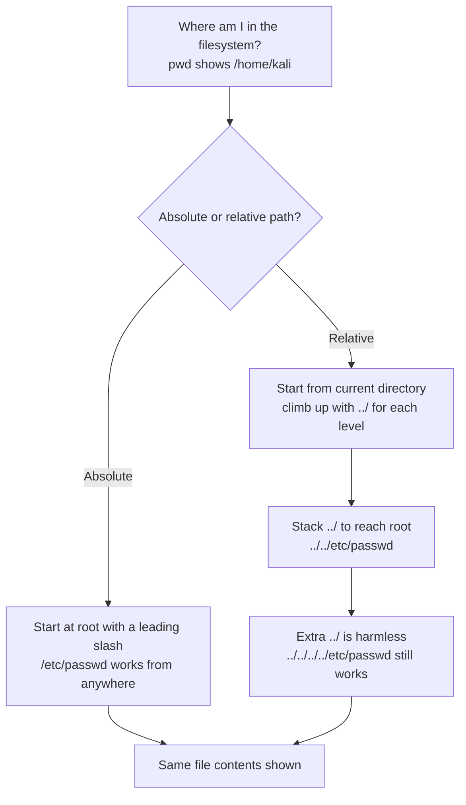

---
tags:
  - phase/exploitation
---

# Absolute vs relative paths


> [!note]- Screenshot
> ```
> We'll begin in the home directory of the kali user with the pwd command. Our second
> command, Is /, lists all files and directories in the root file system. The output showing
> etc is located there. By specifying the / before etc in the third command, we use an
> absolute path originating from the root file system. This means we can use /etc/passwd
> from any location in the filesystem. If we were to omit the leading slash, the terminal
> would search for the ete directory in the home directory of the kali user, since this is our
> current directory in the terminal.
> 
> kali@kali:~$ pwd
> 
> Thome/kali
> 
> kali@kali:~$ 1s /
> 
> bin home 1ib32 media root sys vmlinuz
> 
> boot initrd. img 1ib6s mot run tmp vmlinuz.old
> 
> dev initrd.img.old 1ibx32 opt sbin usr
> 
> etc lib lost+found proc srv var
> 
> kali@kali:~$ cat /etc/passwd
> 
> root:x:@:0:root: /root: /usr/bin/zsh
> 
> daemon: x:1:1:daemon: /usr/sbin: /usr/sbin/nologin
> 
> bin:x:2:2:bin:/bin:/usr/sbin/nologin
> 
> sys:x:3:3:sys:/dev:/usr/sbin/nologin
> 
> king-phisher:x:133:141: : /var/1ib/king-phisher: /usr/sbin/nologin
> 
> kali :x:1000:1000:Kali, ,, : /home/kali:/usr/bin/zsh
> 
> Listing 1 Display content of /etc/passwd with an absolute path
> ```


> [!note]- Screenshot
> ```
> Next, let's use relative pathing to achieve the same goal. We'll display the contents of
> /etc/passwd using relative paths from the home directory of the kali user. To move back
> one directory, we can use ../. To move more than one directory backwards, we can
> combine multiple ../ sequences.
> We can use the Is command combined with one ../ sequence to list the contents of the
> /home directory, since ../ specifies one directory back. We'll then use two ../
> sequences to list the contents of the root file system, which contains the ete directory.
> 
> kali@kali:~$ pad
> 
> home/kali
> 
> kali@kali:~$ 1s ../
> 
> kali
> 
> kali@kali:~$ 1s ../.-/
> 
> bin home 1ib32 media root sys vmlinuz
> 
> boot initrd. img 1ib6s mot run tmp vmlinuz.old
> 
> dev initrd.img.old 1ibx32 opt sbin usr
> 
> etc lib lost+found proc srv var
> Listing 2= Using../ to get tothe root filesystem =
> ```


> [!note]- Screenshot
> ```
> From this point, we can navigate as usual through the file system. We can add ete to
> two ../ sequences to list all files and directories in the absolute path /ete. In the last
> command, we use cat to display the contents of the passwd file by combining the
> relative path (../../etc/passwd).
> 
> kali@kali:~$ 1s ../../etc
> 
> adduser..conf debian_version hostname logrotate.d passwd
> 
> logrotate.conf pam.d emt sudoers zsh
> 
> kali@kali:~$ cat ../../etc/passwd
> 
> root:x:@:0:root: /root: /usr/bin/zsh
> 
> daemon: x:1:1:daemon: /usr/sbin: /usr/sbin/nologin
> 
> bin:x:2:2:bin:/bin:/usr/sbin/nologin
> 
> sys:x:3:3:sys:/dev:/usr/sbin/nologin
> 
> king-phisher:x:133:141: : /var/1ib/king-phisher: /usr/sbin/nologin
> 
> kali :x:1000:1000:Kali, ,, : /home/kali:/usr/bin/zsh
> 
> Listing 3 - Display contents of /etc/passwd with a relative path
> 
> Let's analyze another example. While we can use the cat ../../etc/passwd command
> shown in listing 3 to display the contents of /etc/passwd, we can achieve the same
> results using extra ../ sequences.
> 
> kali@kaliz~$ cat 0./e0/ee/ee/ee/eeL/ee/eo/ee/oe/«./etc/passud
> 
> root:x:@:0:root: /root: /usr/bin/zsh
> 
> daemon: x:1:1:daemon: /usr/sbin: /usr/sbin/nologin
> 
> bin:x:2:2:bin:/bin:/usr/sbin/nologin
> 
> sys:x:3:3:sys:/dev:/usr/sbin/nologin
> 
> king-phisher:x:133:141: : /var/1ib/king-phisher: /usr/sbin/nologin
> 
> kali :x:1000:1000:Kali, ,, : /home/kali:/usr/bin/zsh
> 
> Listing 4 - Adding more "./ to the relative path
> ```

## Visual Flow



> [!success] What success looks like
> Both `cat /etc/passwd` (absolute) and `cat ../../etc/passwd` (relative, from /home/kali) print the same file, with lines like `root:x:0:0:root:/root:/usr/bin/zsh`.

> [!danger] Common errors
> - File not found with a relative path → you started counting `../` from the wrong directory; check `pwd` first.
> - Too few `../` → you never reach `/`; adding more `../` than needed is safe because `/..` just stays at root.
> - Leading slash where you wanted relative (or vice versa) → a leading `/` means absolute (from root); no slash means relative (from here).
> Full list: [[⚠️ Common Errors & Troubleshooting]]

> [!tip] Beginner note
> An **absolute path** starts at the root `/` and is the same no matter where you are. A **relative path** is directions from your current folder, where each `../` means "go up one level." Directory traversal exploits relative paths to climb out of the web root.

---
%% graph-links %%
## Related
- [[Identifying and exploiting directory traversals]]
- [[Encoding special characters]]

> [!info] Navigation
> Section: [[Web Applications/Common Web Application Attacks/Directory Traversal/_index|Directory Traversal]] · Home: [[🏠 Home]]

