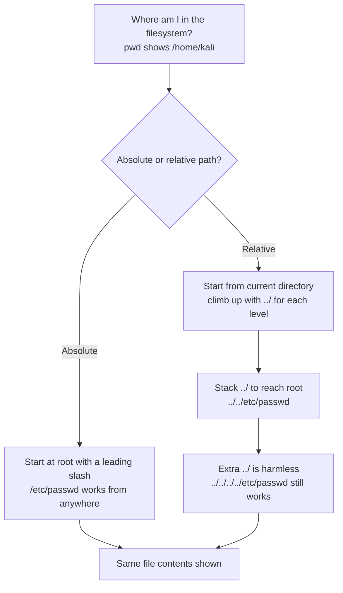

---
tags:
  - phase/exploitation
---

# Absolute vs relative paths

> [!tip] Quick Reference — Absolute vs Relative Paths
> | Task | Command |
> |------|---------|
> | Show current directory | `pwd` |
> | List root filesystem | `ls /` |
> | Absolute path read | `cat /etc/passwd` |
> | Relative path climb (2 levels) | `cat ../../etc/passwd` |
> | Resolve what a relative path really points to | `readlink -f ../../etc/passwd` |
> | Over-climbing is harmless | `cat ../../../../../../../../etc/passwd` |

> [!example] Absolute path
> Starting in `/home/kali`, the leading `/` in `/etc/passwd` makes it an absolute path — resolved from the root of the filesystem, so it works from any directory. Without the leading slash, the shell would look for `etc` inside the current directory instead.
> ```sh
> pwd            # /home/kali
> ls /           # bin  etc  home  root  usr  var ...
> cat /etc/passwd
> # root:x:0:0:root:/root:/usr/bin/zsh
> # ...
> ```


> [!example] Climbing up with ../
> Each `../` moves one directory back; stack them to climb further. From `/home/kali`, one `../` reaches `/home`, and two reach the root filesystem (which contains `etc`).
> ```sh
> pwd            # /home/kali
> ls ../         # kali        (contents of /home)
> ls ../../      # bin  etc  home  root  usr ...  (contents of /)
> ```


> [!example] Reading the file relatively (and extra ../ is harmless)
> From `/home/kali`, `../../etc/passwd` reaches the same file as the absolute `/etc/passwd`:
> ```sh
> ls  ../../etc          # ... hostname  passwd  sudoers ...
> cat ../../etc/passwd   # root:x:0:0:root:/root:/usr/bin/zsh ...
> ```
> Adding more `../` than needed still works — once you hit the root `/`, further `../` just stays at root:
> ```sh
> cat ../../../../../../../../etc/passwd   # same output
> ```

## Visual Flow



> [!success] What success looks like
> Both `cat /etc/passwd` (absolute) and `cat ../../etc/passwd` (relative, from /home/kali) print the same file, with lines like `root:x:0:0:root:/root:/usr/bin/zsh`.

> [!danger] Common errors
> - File not found with a relative path → you started counting `../` from the wrong directory; check `pwd` first.
> - Too few `../` → you never reach `/`; adding more `../` than needed is safe because `/..` just stays at root.
> - Leading slash where you wanted relative (or vice versa) → a leading `/` means absolute (from root); no slash means relative (from here).
> Full list: [[⚠️ Common Errors & Troubleshooting]]

> [!tip] Beginner note
> An **absolute path** starts at the root `/` and is the same no matter where you are. A **relative path** is directions from your current folder, where each `../` means "go up one level." Directory traversal exploits relative paths to climb out of the web root.

> [!tip] Not sure how many ../ you need?
> Don't just guess-and-check blindly against the target. Test the same relative path locally first with `readlink -f ../../etc/passwd` (or `realpath ../../etc/passwd`) to see exactly which absolute path it resolves to — then adjust the `../` count before firing it at the web app.

---
%% graph-links %%
## Related
- [[Identifying and exploiting directory traversals]]
- [[Encoding special characters]]

> [!info] Navigation
> Section: [[Web Applications/Common Web Application Attacks/Directory Traversal/_index|Directory Traversal]] · Home: [[🏠 Home]]

