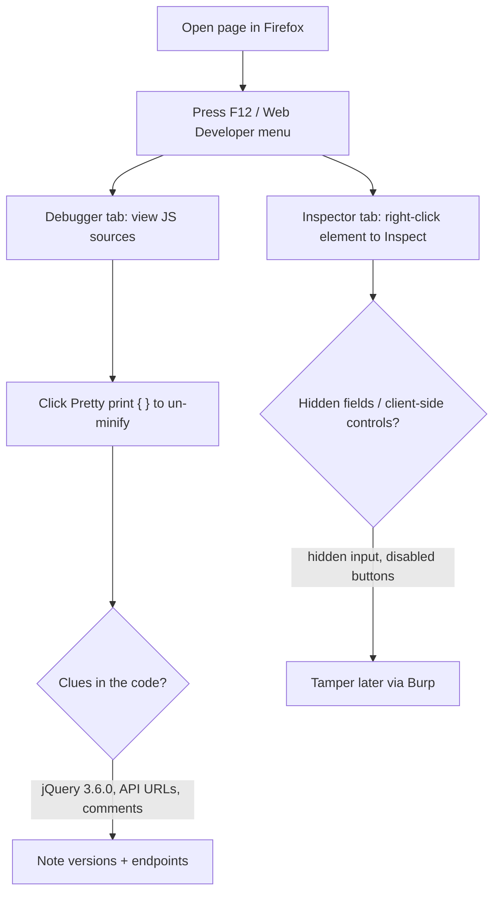

# Debugging Page Content

A good place to start our web application information mapping is with a URL address. File extensions, which are sometimes part of a URL, can reveal the programming language the application was written in. Some extensions, like .php, are straightforward, but others are more cryptic and vary based on the frameworks in use. For example, a Java-based web application might use .jsp, .do, or .html.

File extensions on web pages are becoming less common, however, since many languages and frameworks now support the concept of routes, which allow developers to map a URI to a section of code. Applications leveraging routes use logic to determine what content is returned to the user, making URI extensions largely irrelevant.

Although URL inspection can provide some clues about the target web application, most context clues can be found in the source of the web page. The Firefox Debugger tool (found in the Web Developer menu) displays the page's resources and content, which varies by application. The Debugger tool may display JavaScript frameworks, hidden input fields, comments, client-side controls within HTML, JavaScript, and much more.


We'll notice that the application uses jQuery version 3.6.0, a common JavaScript library. In this case, the developer minified the code, making it more compact and conserving resources, which also makes it somewhat difficult to read. Fortunately, we can "prettify" code within Firefox by clicking on the Pretty print source button with the double curly braces:


We can also use the Inspector tool to drill down into specific page content. Let's use Inspector to examine the search input element from the WordPress home page by scrolling, right-clicking the search field on the page, and selecting Inspect.

> [!note]- Screenshot
> ```
> Let's test this out by opening Debugger while browsing the offsecwp app:
> Ortsec-We Love Security > x | + - 2 x
> «> ca © B offsecwp e 2o=
> 
> BEKaliLinux WE KaiToots WR Kali Forums} KaliDocs BENetHunter Ik Offensive Security LMSFU «& Expoit-08. # GHDB
> 
> S
> 
> RO inspector ©) conte HH nero CO) SyieEstor D Peromance OE Memory EQ Stonge FF Aesshty BE Appcaion > f] w+ x
> ontne 1B. jveremasoneymin > oi om
> 
> 0 tne ——
> 
> ap comettbenestrnatasurcss eR Designs
> ances Event tener iis 5
> 
> Oe
> ee ssomen (DOM Mutation reakpis
> Figure 16: Using Developer Tools to Inspect JavaScript Sources
> ```


> [!note]- Screenshot
> ```
> CRO topetor ED Console TH Network CO) Sylesstor OD Petomance OE Memory Stooge of Aceniy >> Oo x
> nti 5 ai o %
> rated . = sores | + Wheres i
> © ota sont respite
> Danse secneuepte
> Cap cceitenestradheser Resse :
> Ove Event isterer shin 23
> on
> 25 ey igen DOM Mutation restpints
> Figure 17: Pretty Print Source
> After clicking the icon, Firefox will display the code in a format that is easier to read and
> follow:
> GRO inspector) Const TH reware C SnieFator OD Pertomance OF Memory Stange Acessiy >> O: a x
> oxtine rey eryniniher 26 a om
> ° Segoe
> Figure 18: Viewing Prettified Source in Firefox
> ```


> [!note]- Screenshot
> ```
> onsec-We Love SecrityTo x | + 2
> 7 @ © 8 offsecup et 36 =
> BWkaiLinac Aka Tools KLKoU Forums Kab Doce GNetHunter AL OffensveSecrty LMSFU #Eplot-0B #:GHOB
> About Us
> Re
> me to put stutt r a
> Re_ A 2xewordtor tis sare
> Dicheckspeting
> Clee Aces Prope
> Figure 19: Selecting E-mail Input Element
> This will open the Inspector tool and highlight the HTML for the element we right-clicked
> on.
> eee WeloveSeciny To | + ax
> < 5 @ © B offseenp o eo:
> BIKGiLne ATKelTools APKaliForums I KaliDocs ENetHunter Offensive Secrty LMSFU ef Exploi- D8 « GHOS
> About Us
> Recent Posts
> R here Je
> e Doone Dosage tH rerwon (Sekar resemance D weney Gstase ot Accrbiny HE Apter Cntr Dex
> : +e mw + * OO B Conpted Cheges Fors Bint «
> — |
> Figure 20: Using the Inspector Too!
> This tool can be especially useful for quickly finding hidden form fields in the HTML
> source.
> ```

## Visual Flow



> [!success] What success looks like
> Pretty-printed source reveals readable JavaScript, library versions (e.g. `jQuery 3.6.0`), HTML comments developers left behind, and hidden `<input type="hidden">` fields the page never shows you. Each is a lead.

> [!danger] Common errors
> - Code is one unreadable line → it is minified; click the `{ }` Pretty print button in the Debugger.
> - You only see rendered HTML, not the original → use View Source (Ctrl+U) for the raw server response vs. Inspector for the live DOM.
> - Dynamic content missing → some HTML is built by JS after load; watch the Debugger/Network while interacting.
> Full list: [[⚠️ Common Errors & Troubleshooting]]

> [!tip] Beginner note
> **View Source** shows what the server originally sent; the **Inspector** shows the live page after JavaScript changed it. Comparing the two often exposes hidden fields and client-side-only validation you can bypass.

---
%% graph-links %%
## Related
- [[Inspecting HTTP Response Headers and Sitemaps]]
- [[Technology Stack Identification with Wappalyzer]]
- [[JavaScript Refresher]]

> [!info] Navigation
> Section: [[Web Applications/Enumeration/_index|Enumeration]] · Home: [[🏠 Home]]

