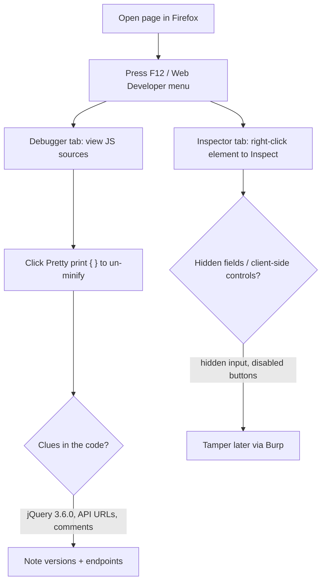

---
tags:
  - phase/enumeration
---

# Debugging Page Content

> [!tip] Quick Reference — Page Content Inspection
> | Goal | Shortcut / Command |
> |------|---------------------|
> | Open dev tools | F12 or Ctrl+Shift+I |
> | Raw page source (as server sent it) | Ctrl+U, or `curl -s http://<IP>/` |
> | JS sources (Debugger tab) | Web Developer menu → Debugger |
> | Pretty-print minified JS | `{ }` button in Debugger |
> | Inspect a specific element | Right-click element → Inspect |
> | Grep a JS file for endpoints/secrets (CLI) | `curl -s http://<IP>/app.js \| grep -iE 'api\|key\|token\|secret\|http'` |
> | Mirror all JS/CSS for offline grepping | `wget -r -l1 -A.js,.css http://<IP>/` |

A good place to start our web application information mapping is with a URL address. File extensions, which are sometimes part of a URL, can reveal the programming language the application was written in. Some extensions, like .php, are straightforward, but others are more cryptic and vary based on the frameworks in use. For example, a Java-based web application might use .jsp, .do, or .html.

File extensions on web pages are becoming less common, however, since many languages and frameworks now support the concept of routes, which allow developers to map a URI to a section of code. Applications leveraging routes use logic to determine what content is returned to the user, making URI extensions largely irrelevant.

Although URL inspection can provide some clues about the target web application, most context clues can be found in the source of the web page. The Firefox Debugger tool (found in the Web Developer menu) displays the page's resources and content, which varies by application. The Debugger tool may display JavaScript frameworks, hidden input fields, comments, client-side controls within HTML, JavaScript, and much more.


We'll notice that the application uses jQuery version 3.6.0, a common JavaScript library. In this case, the developer minified the code, making it more compact and conserving resources, which also makes it somewhat difficult to read. Fortunately, we can "prettify" code within Firefox by clicking on the Pretty print source button with the double curly braces:


We can also use the Inspector tool to drill down into specific page content. Let's use Inspector to examine the search input element from the WordPress home page by scrolling, right-clicking the search field on the page, and selecting Inspect.

> [!info] Inspecting JavaScript sources
> Open the Debugger tab (Web Developer menu) while browsing the target app. It lists the page's loaded JavaScript sources, letting you review the libraries and code the application ships.


> [!info] Pretty-printing minified source
> Minified code sits on one dense line. Click the Pretty print source button (the `{ }` double-curly-braces icon) in the Debugger to reformat it into readable, indented code.


> [!info] Inspecting a specific element
> Right-click an element on the page (e.g. a search or e-mail input) and choose Inspect. The Inspector opens with that element's HTML highlighted — a fast way to spot hidden form fields in the source.

> [!tip] Automating the search with grep
> Manually scrolling through the Debugger doesn't scale once a page loads several JS bundles. Pull the files with curl/wget and grep them for anything interesting instead:
> ```sh
> curl -s http://<IP>/js/app.js | grep -iE 'api[_-]?key|token|secret|password|/api/|endpoint'
> ```
> This regularly turns up hardcoded API keys, internal endpoint paths, or debug flags developers forgot to strip from a production build.

## Visual Flow



> [!success] What success looks like
> Pretty-printed source reveals readable JavaScript, library versions (e.g. `jQuery 3.6.0`), HTML comments developers left behind, and hidden `<input type="hidden">` fields the page never shows you. Each is a lead.

> [!danger] Common errors
> - Code is one unreadable line → it is minified; click the `{ }` Pretty print button in the Debugger.
> - You only see rendered HTML, not the original → use View Source (Ctrl+U) for the raw server response vs. Inspector for the live DOM.
> - Dynamic content missing → some HTML is built by JS after load; watch the Debugger/Network while interacting.
> Full list: [[⚠️ Common Errors & Troubleshooting]]

> [!tip] Beginner note
> **View Source** shows what the server originally sent; the **Inspector** shows the live page after JavaScript changed it. Comparing the two often exposes hidden fields and client-side-only validation you can bypass.

---
%% graph-links %%
## Related
- [[Inspecting HTTP Response Headers and Sitemaps]]
- [[Technology Stack Identification with Wappalyzer]]
- [[JavaScript Refresher]]

> [!info] Navigation
> Section: [[Web Applications/Enumeration/_index|Enumeration]] · Home: [[🏠 Home]]

