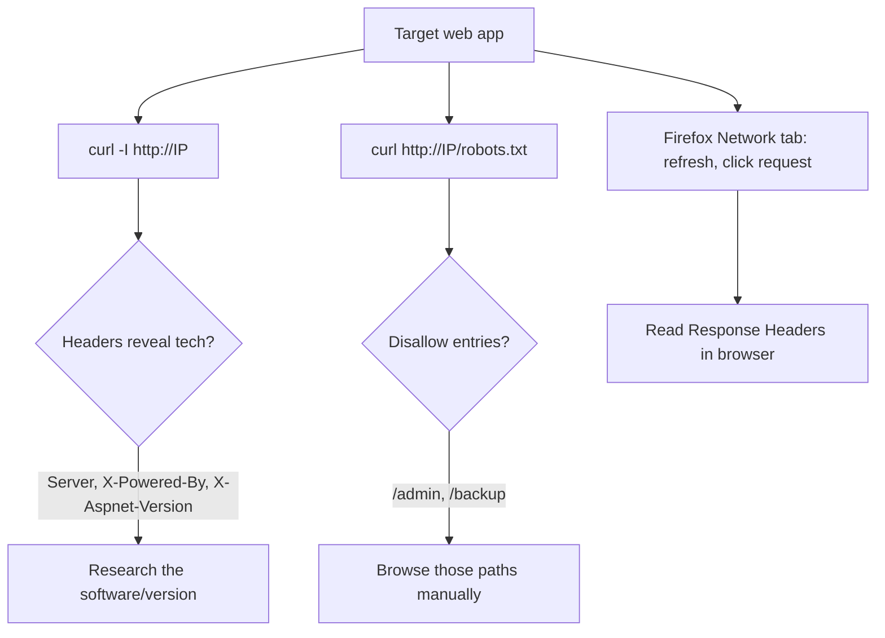

---
tags:
  - phase/enumeration
  - enumeration
  - http
  - nmap
  - nse
  - web
---

# Inspecting HTTP Response Headers and Sitemaps

We can also search server responses for additional information. There are two types of tools we can use to accomplish this task. The first type is a proxy, like Burp Suite, which intercepts requests and responses between a client and a web server, and the other is the browser's own Network tool.

We can launch it from the Firefox Web Developer menu to review HTTP requests and responses. This tool shows network activity that occurs after it launches, so we must refresh the page to display traffic.


Historically, headers that started with "X-" were called non-standard HTTP headers. However, RFC6648 now deprecates the use of "X-" in favor of a clearer naming convention.

The names or values in the response header often reveal additional information about the technology stack used by the application. Some examples of non-standard headers include X-Powered-By, x-amz-cf-id, and X-Aspnet-Version. Further research into these names could reveal additional information, such as that the "x-amz-cf-id" header indicates the application uses Amazon CloudFront.

Sitemaps are another important element we should take into consideration when enumerating web applications.

Web applications can include sitemap files to help search engine bots crawl and index their sites. These files also include directives of which URLs not to crawl - typically sensitive pages or administrative consoles, which are exactly the sort of pages we are interested in.

Inclusive directives are performed with the sitemaps protocol, while robots.txt excludes URLs from being crawled.

For example, we can retrieve the robots.txt file from
[www.google.com](http://www.google.com)
with curl:


Allow and Disallow directives inform “polite” web crawlers which pages or directories may be accessed or should be avoided. In most cases, the listed pages and directories may not be interesting, and some may even be invalid. Nevertheless, sitemap files should not be overlooked because they may contain clues about the website layout or other interesting information, such as yet-unexplored portions of the target.

> [!note]- Screenshot
> ```
> <> co © nipiosecwnl E oo=
> ola Offsee Pre sae
> [2 O meron lcm © Deane fs het Suntier Prien _O.Menoy El Some f AaB Akan > Od x
> ar
> 7 : f
> mM ‘ I
> 7 : |
> a . }
> 7M . : ‘.
> a .
> mM a : :
> a .
> 7m :
> oa .
> mom « =n . : z
> Figure 21: Using the Network Tool to View Requests
> ```


> [!note]- Screenshot
> ```
> Clicking a request reveals additional details—in this case, we're interested in the
> response headers. Response headers are a subset of HTTP headers that are sent in
> response to an HTTP request.
> 3 @ © B oteecup e o=
> 
> Kal Lue ERKal'Tools UKaiForums [9 KabDoce TANetHunter IL OffensveSecrty LMSFU #Explot-08 4: GHOB
> 
> oa tft os |
> 
> We Love Security Too
> 
> CE Chssaier Deena D owooe ttn CO Sweater, CD Potomne Deveney EDsirae  xcenoacy Bi Awatin @ cones OF Do X
> 8 1 © al nm tom mage Meds ¥5 0 secahe WoThsings
> >
> = =
> > -
> ‘oD epg bs
> = : ee mas
> 7 Figure 22: Viewing Response Headers in the Network Too!
> The Server header displayed above will often reveal at least the name of the web server
> software. In many default configurations, it also reveals the version number.
> ```


> [!note]- Screenshot
> ```
> Q Tip
> 
> HTTP headers are not always generated solely by the web server. For instance, web
> proxies actively insert the X-Forwarded-For header to signal the web server about
> the original client IP address.
> ```


> [!note]- Screenshot
> ```
> kali@kali:~$ curl https: //www. google. com/robots.txt
> User-agent: *
> Disallow: /search
> Allow: /search/about
> Allow: /search/static
> Allow: /search/howsearchworks
> Disallow: /sdch
> Disallow: /groups
> Disallow: /index.html?
> Disallow: /?
> Allow: /2h1=
> Listing 7 - https://www.google.com/robots.txt
> ```

## Visual Flow



> [!success] What success looks like
> `curl -I` returns headers such as `Server: Apache/2.4.41 (Ubuntu)` or `X-Powered-By: PHP/7.4`. `robots.txt` lists `Disallow:` paths like `/admin` — exactly the "hidden" pages worth visiting.

> [!danger] Common errors
> - `curl: (60) SSL certificate problem` on HTTPS labs → add `-k` to skip cert verification: `curl -Ik https://IP`.
> - `-I` shows nothing useful → some servers reject HEAD; try `curl -i http://IP` (lowercase, full GET with headers).
> - robots.txt returns 404 → not every site has one; that is fine, move on to gobuster.
> - Network tab empty → it only records after it opens; refresh the page (F5).
> Full list: [[⚠️ Common Errors & Troubleshooting]]

> [!tip] Beginner note
> `-I` (capital i) asks only for the **headers**, not the page body — a fast way to see the `Server` line and other tech hints. `robots.txt` is a public file websites use to tell crawlers what to skip, which conveniently points you straight at sensitive areas.

---
%% graph-links %%
## Related
- [[Debugging Page Content]]
- [[Directory Brute Force with Gobuster]]
- [[Security Headers and SSLTLS]]

> [!info] Navigation
> Section: [[Web Applications/Enumeration/_index|Enumeration]] · Home: [[🏠 Home]]

