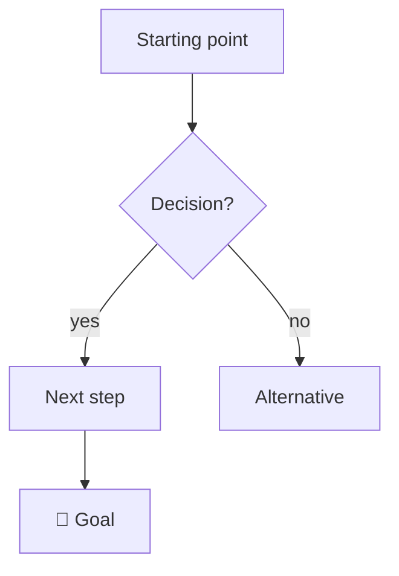

---
tags:
  - TOPIC-TAG
  - phase/PHASE        # phase/recon | phase/enumeration | phase/exploitation | phase/post-exploitation
---

# NOTE TITLE

> [!tip] Quick Reference — TOPIC
> | Goal | Command / Payload |
> |------|-------------------|
> | ... | `command here` |
> | ... | `command here` |

## Visual Flow

%% MERMAID RULES: wrap any label with ( ) / : " # < > in "double quotes" or reword.
%% Keep raw payloads OUT of mermaid labels — describe them, put real syntax in code blocks. %%

## [Content from your notes goes here]

<!-- paste converted CherryTree content, commands, screenshots as callouts -->

> [!success] What success looks like
> Describe the concrete output/result that proves it worked.

> [!danger] Common errors
> - `error string` → cause → fix.
> - `error string` → cause → fix.
> Full list: [[⚠️ Common Errors & Troubleshooting]]

> [!tip] Beginner note
> Plain-English explanation of one concept a newcomer wouldn't know.

## Resources
- [HackTricks — TOPIC](https://book.hacktricks.xyz/)
- [PayloadsAllTheThings](https://github.com/swisskyrepo/PayloadsAllTheThings)

---
%% graph-links %%
## Related
- [[Related Note 1]]
- [[Related Note 2]]

> [!info] Navigation
> Section: [[FOLDER/_index|Section Name]] · Home: [[🏠 Home]]
