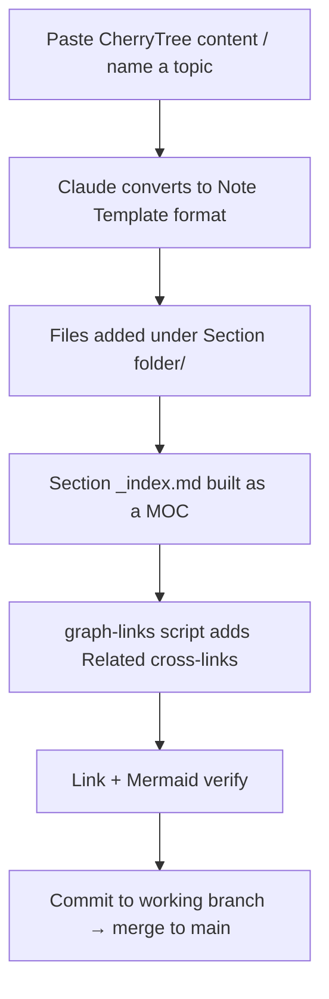

---
tags:
  - meta
  - conventions
  - index
---

# 🧱 Vault Conventions

> [!abstract] Purpose
> The format standard for this vault. Follow it for every new note so the whole vault stays consistent, searchable, and graph-connected. Two starter files live next to this one: [[Note Template]] and [[Section MOC Template]].

---

## 📐 Every note has this structure (in order)

1. **Frontmatter tags** — topic tag + a `phase/*` tag
2. **`# Title`**
3. **`> [!tip] Quick Reference`** — a command/payload table at the top
4. **`## Visual Flow`** — a Mermaid `flowchart` of the attack/enum flow
5. **Content** — the actual notes (commands, theory, screenshots)
6. **Three callouts:** `[!success]` what worked · `[!danger]` common errors · `[!tip]` beginner note
7. **`## Resources`** — external links (HackTricks, PayloadsAllTheThings…)
8. **`## Related`** under `%% graph-links %%` — cross-links + section/Home navigation

## 🎨 Callout colour legend (use consistently)

| Callout | Colour | Use for |
|---------|--------|---------|
| `[!tip]` | 🟢 green | shortcuts, "do this first", beginner notes |
| `[!info]` | 🔵 blue | background / theory / navigation |
| `[!example]` | 🟣 purple | worked command + real output |
| `[!success]` | 🟢 green | what a "win" looks like |
| `[!warning]` | 🟠 orange | gotchas, common mistakes |
| `[!danger]` | 🔴 red | errors + fixes |
| `[!note]-` | grey (folded) | OCR'd screenshots (the `-` makes it collapsed) |
| `[!abstract]` | cyan | MOC / section summaries |

## 🏷️ Tag convention

- **Phase:** `phase/recon`, `phase/enumeration`, `phase/exploitation`, `phase/post-exploitation`
- **Tool:** `nmap`, `gobuster`, `burp-suite`, `sqlmap`, `metasploit`, `hashcat` …
- **Vuln:** `sqli`, `xss`, `lfi`, `rfi`, `rce`, `command-injection`, `file-upload` …
- **Lab writeups:** add `lab` and/or `exam-practice`

## 📊 Mermaid rules (so diagrams don't break)

> [!warning] These break Mermaid rendering
> - Special chars in a label → **wrap the label in `"double quotes"`**: `A["nmap -sCV (versions)"]`
> - Never put raw `< > " ' ( )` payloads in a label — **describe** them, keep real syntax in code blocks.
> - Use ` ` for line breaks inside a node.
> - Start every diagram with `flowchart TD` (top-down) or `flowchart LR` (left-right).

---

## ➕ How to add a NEW SECTION (today's workflow)

> [!tip] What you do vs what I do
> **You:** paste the raw content (CherryTree text/XML) or just name the topic.
> **Me:** convert to the template, place it in the right folder, build the MOC, wire cross-links, verify, and merge to `main`.

## 🆕 Sections still to add

- [ ] Linux Privilege Escalation
- [ ] Windows Privilege Escalation
- [ ] Active Directory (Kerberoasting, Pass-the-Hash, BloodHound, Evil-WinRM)
- [ ] Password Attacks (hashcat, john, hydra, spraying)
- [ ] Shells & Payloads (msfvenom, socat, stabilisation)
- [ ] Port Forwarding & Pivoting (chisel, ligolo-ng, ssh tunnels)
- [ ] Client-Side Attacks
- [ ] Antivirus Evasion
- [ ] Metasploit
- [ ] Post-Exploitation (mimikatz, lateral movement)
- [ ] Buffer Overflow basics

> [!info] Navigation
> [[🏠 Home]] · [[📖 Start Here — Beginner Guide]]
