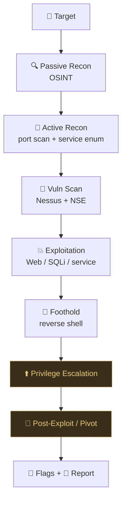

---
tags:
  - home
  - index
---

# OSCP Notes — Home

> [!tip] 🚀 New here? Start with these
> - 📖 [[📖 Start Here — Beginner Guide]] — read this first
> - 🧰 [[🧰 Command Cheat Sheet]] — copy-paste commands
> - 🔣 [[🔣 Encoding Reference]] — URL encoding & filter bypasses
> - ⚠️ [[⚠️ Common Errors & Troubleshooting]] — errors and fixes
> - 🧱 [[Vault Conventions]] — the format standard + how to add a section

## Attack Phases

| Phase | Notes |
|-------|-------|
| 🔍 Recon | [[Passive Information Gathering/_index\|Passive]] · [[Active Information Gathering/_index\|Active]] |
| 🌐 Web | [[Web Applications/_index\|Web Apps]] · [[SQL Injection Attacks/_index\|SQLi]] |
| 🔎 Vuln Scan | [[Vulnerability Scanning/_index\|Nessus / Nmap]] |
| 🎣 Initial Access | [[Phishing Basics/_index\|Phishing]] · [[Client-Side Attacks/_index\|Client-Side]] |
| 📝 Report | [[Report Writing]] |

## Attack Flow (master map)



> [!info] Dashed/gold nodes = sections still to be added (PrivEsc, Post-Exploit/Pivot). They'll slot straight into this flow as you write them.

> [!tip] Using the graph
> - **Local Graph** (right sidebar → ⋮ → *Open local graph*) shows just the current note's neighbours — the fastest way to follow an attack chain.
> - Each section's `_index` is a **Map of Content (MOC)** — open one to see everything in that phase and where it connects.
> - Every note has a **Related** section at the bottom and a backlink to its MOC, so the global Graph View now forms real clusters per phase.

## Most-Used Quick Refs

- [[Active Information Gathering/Port Scanning with Nmap/_index|Nmap]]
- [[Active Information Gathering/SMB Enumeration|SMB]]
- [[Active Information Gathering/DNS Enumeration|DNS]]
- [[Web Applications/Application Assesment Tools/Directory Brute Force with Gobuster|Gobuster]]
- [[Web Applications/Application Assesment Tools/Security Testing with Burp Suite|Burp Suite]]
- [[Web Applications/Common Web Application Attacks/File Inclusion Vulnerabilities/Local file inclusion (LFI)|LFI]]
- [[Web Applications/Common Web Application Attacks/Command Injection|Command Injection]]
- [[SQL Injection Attacks/Manual SQL exploitation/_index|SQLi]]

## External Resources

| Resource | URL |
|----------|-----|
| HackTricks | https://book.hacktricks.xyz |
| PayloadsAllTheThings | https://github.com/swisskyrepo/PayloadsAllTheThings |
| GTFOBins (Linux privesc) | https://gtfobins.github.io |
| LOLBAS (Windows privesc) | https://lolbas-project.github.io |
| RevShells | https://www.revshells.com |
| Exploit-DB | https://www.exploit-db.com |
| PortSwigger Web Academy | https://portswigger.net/web-security |
| CyberChef | https://gchq.github.io/CyberChef |
| IppSec (video search) | https://ippsec.rocks |
| SecLists | https://github.com/danielmiessler/SecLists |

## Exam Day Checklist

```
□ VPN connected
□ Obsidian open on this vault
□ Burp Suite running
□ Terminal with note-taking (screenshots of every flag)
□ Timer set for 23h 45m

For each machine:
□ nmap all ports → service scan → check each service
□ Web? → gobuster + manual enum + burp
□ Screenshot proof.txt + whoami + hostname + IP
□ Document attack chain for report
```
