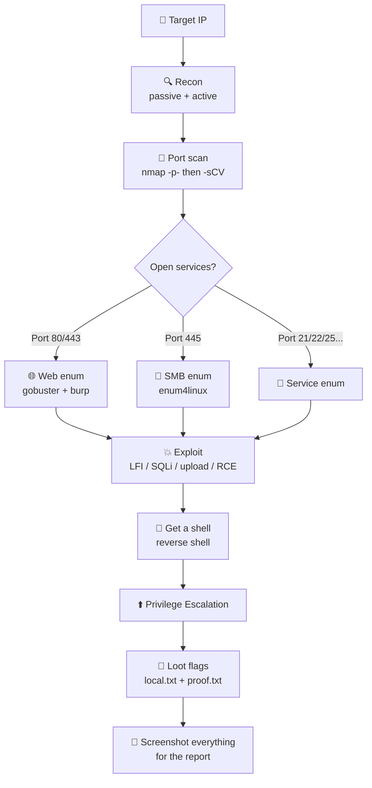

---
tags:
  - guide
  - beginner
  - index
---

# 📖 Start Here — Beginner Guide

> [!abstract] What this vault is
> A self-contained OSCP field manual. Every note has copy-paste commands, an attack flow, and links to the next step. **You do not need internet or AI during the exam — everything you need lives here.**

> [!tip] New here? Read this page top to bottom once. Then use [[🏠 Home]] as your launchpad.

---

## 🎨 How to read the colours (callout legend)

Throughout the vault, coloured boxes mean different things. Learn these once:

> [!tip] TIP (green) — a shortcut, a faster way, or a "do this first".

> [!info] INFO (blue) — background/theory. Useful but not action.

> [!example] EXAMPLE (purple) — a worked command with its real output.

> [!warning] WARNING (orange) — a common mistake or gotcha. Read these!

> [!danger] DANGER / ERROR (red) — an error you'll likely see, and how to fix it.

> [!success] SUCCESS (green) — what a "win" looks like so you know you got it.

> [!note]- SCREENSHOT (collapsed) — click to expand original course screenshots (OCR'd to text so they're searchable).

---

## 🗺️ The OSCP method (the only flow you must memorise)



> [!warning] The #1 beginner mistake
> **Not enumerating enough.** If you're stuck, you haven't enumerated enough. Go back, scan all ports, read every web page, try every service. 90% of "I'm stuck" is a missed service or directory.

---

## 🧭 Your first 15 minutes on any box

> [!example] Copy-paste starting sequence
> ```bash
> # 1. Set a variable so you don't retype the IP
> export IP=10.10.10.10
>
> # 2. Fast scan ALL ports first (find what's open)
> sudo nmap -p- --min-rate 5000 -oA nmap/allports $IP
>
> # 3. Deep scan ONLY the open ports (versions + default scripts)
> sudo nmap -p 22,80,445 -sCV -oA nmap/detail $IP
>
> # 4. If port 80/443 is open → start web enum in another tab
> gobuster dir -u http://$IP -w /usr/share/wordlists/dirb/common.txt
> ```

> [!tip] `-oA nmap/name` saves output in 3 formats into an `nmap/` folder. Make the folder first: `mkdir nmap`.

---

## 📋 What to do for every open port

| Port | Service | Go to note |
|------|---------|-----------|
| 21 | FTP | try `ftp <IP>`, anonymous login |
| 22 | SSH | note version, try creds later |
| 25 | SMTP | [[SMTP Enumeration]] |
| 53 | DNS | [[DNS Enumeration]] |
| 80 / 443 | HTTP(S) | [[Web Applications/_index\|Web Applications]] |
| 139 / 445 | SMB | [[SMB Enumeration]] |
| 161 | SNMP | [[SNMP Enumeration]] |
| 3306 | MySQL | [[SQL Injection Attacks/_index\|SQL Injection]] |

---

## 🆘 When you get stuck (run this checklist)

> [!question] Stuck? Work down this list before giving up
> - [ ] Did I scan **all 65535 ports** (`-p-`), not just the top 1000?
> - [ ] Did I scan **UDP** too? (`sudo nmap -sU --top-ports 20 $IP`)
> - [ ] Did I run a **version scan** (`-sCV`) on every open port?
> - [ ] On web: did I **gobuster** with a bigger wordlist? Check `robots.txt`, page source, `/admin`?
> - [ ] Did I try **default creds** (admin:admin, etc.)?
> - [ ] Did I Google `"<service> <version> exploit"` and check [Exploit-DB](https://www.exploit-db.com)?
> - [ ] Did I read the [[⚠️ Common Errors & Troubleshooting]] note?

---

## 🔗 Essential reference notes

- 🧰 [[🧰 Command Cheat Sheet]] — most-used commands, copy-paste ready
- 🔣 [[🔣 Encoding Reference]] — URL/percent encoding, base64, bypass tricks
- ⚠️ [[⚠️ Common Errors & Troubleshooting]] — errors you'll hit and the fix
- 🏠 [[🏠 Home]] — full dashboard + exam checklist

> [!info] Section: [[🏠 Home]]
